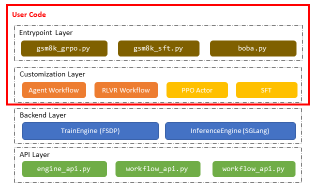

# AReaL-lite Design Doc

## TL;DR

Follow our
[step-by-step code walk-through](https://inclusionai.github.io/AReaL/lite/gsm8k_grpo.html)
to immediately get started with AReaL-lite!

## Motivation

AReaL presents several challenges that make it difficult for AI researchers to adopt,
understand, and develop with effectively. The primary issue stems from its
*system-first* rather than *algorithm-first* architecture and API design. An
*algorithm-first* design aims to provide three key features:

- **Light-weight & easy-to-write customization:** Users can implement their algorithms
  and training workflows with minimal and concentrated code, often in just a few files
  or even a single file.
- **Easy to scale up:** Experiments can be scaled up seamlessly without requiring
  knowledge of underlying system or infrastructure details.
- **Adaptable and plugable:** Users is free to integrate the system with code or APIs
  from other AI libraries, or plug APIs from the system into other frameworks.

We believe that AReaL, as well as other existing RL systems, falls short in fully
delivering these features. For example, the RL training workflow in AReaL is built
around multiple *workers* executing *model function calls* in a *DAG* (Directed Acyclic
Graph). To customize a training workflow, researchers first need to understand these
system-level concepts. Then they are forced to find code to modify, which is scattered
around in the codebase. It is also nearly impossible to exploit packages like `datasets`
since it is not compatible with the workers. This gap is the core motivation behind
AReaL-lite: rebuilding AReaL with an algorithm-first architecture and APIs.

Beyond architectural concerns, AReaL suffers from accumulated technical debt. The
codebase contains substantial legacy code inherited from previous projects that no
longer serves a purpose but significantly increases complexity for both users and
developers. Even experienced core developers sometimes struggle with debugging due to
this accumulated complexity.

The landscape of RL workflow development tools has matured considerably, making it
possible to achieve comparable efficiency with significantly fewer lines of code. This
presents an ideal opportunity to redesign the API and distill the massive codebase into
something clean and maintainable. Rather than pursuing maximum efficiency, our goal is
to deliver 90% of AReaL's functionality while dramatically reducing code complexity and
user burden. This philosophy drives AReaL-lite — the lightweight version of AReaL.

AReaL-lite serves as the first phase in AReaL's broader refactoring initiative. It
functions both as a standalone training library with intuitive interfaces and as the
foundation for AReaL's future core API definitions. The plan is to transform AReaL's
current worker-based architecture into an algorithm-first architecture similar to
AReaL-lite, where AReaL will **extend** AReaL-lite's APIs and implementations to support
additional backends for efficient large-scale training.

## Design Principles

To achieve *algorithm-first* and *light-weight* while maintaining the efficiency, our
design is guided by seven core principles:

1. **Native asynchronous RL training support** — Built from the ground up for
   disentangled generation and training
1. **System-less design** — Minimize exposure to system concepts like "PlacementGroup"
1. **PyTorch-centric approach** — Use raw PyTorch types without unnecessary abstractions
1. **Transparent algorithm orchestration** — Make the flow of operations clear and
   understandable
1. **Developer-friendly navigation** — Enable easy access to implementation details via
   Ctrl+click in IDEs
1. **Ecosystem compatibility** — Integrate smoothly with existing ML/RL tools
1. **Single-file customization** — Allow RL pipeline modifications within a single file

## Architecture

### Core Directory Structure

```
areal/
├── api/           # Abstract interfaces and dataclasses
├── engine/        # Training and inference engines
├── launcher/      # Launcher for different backends
├── tests/         # Standalone test scripts
└── workflow/      # Custom RL rollout workflows
```

### Component Overview

The AReaL-lite codebase is structured into four distinct layers: the API layer, backend
layer, customization layer, and entry point layer. As illustrated in the figure below,
workflow and algorithm customization logic resides in separate layers above the backend.
We prioritize keeping the entry point and customization layers clean and intuitive,
isolating them from the complex backend implementation. With AReaL-lite, users can
define their custom training workflows and algorithms entirely within a single entry
point file.



#### 1. API Layer (`api/`)

The API layer establishes clean contracts between components through abstract interfaces
and data classes:

- **`engine_api.py`**: Defines `TrainEngine` for SPMD-based distributed training
  backends and `InferenceEngine` for streaming LLM inference
- **`workflow.py`**: Defines `RolloutWorkflow` for RL data collection within a unified
  method interface
- **`cli_args.py`**: Contains configuration dataclasses for all system components

The workflow object invokes `InferenceEngine` to complete data collection following
customized patterns, providing flexibility while maintaining consistency.

#### 2. Backend Layer (`engine/`)

The backend layer provides adapters for third-party libraries, ensuring they conform to
the APIs defined in `engine_api.py`. These components deliver core inference and
training capabilities:

- **`fsdp_engine.py`**: FSDP-based training engine utilizing PyTorch FSDP2
- **`sglang_remote.py`**: Client interface for generation with remote SGLang servers

#### 3. Customization Layer (`engine/ppo/`, `workflow/`)

This layer applies backend capabilities to implement specific reinforcement learning
pipelines:

- **`engine/ppo/actor.py`**: PPO algorithm implementation that leverages a `TrainEngine`
- **`workflow/rlvr.py`**: RLVR workflow that utilizes an `InferenceEngine` to sample
  multiple responses for each prompt

#### 4. Entry Point Layer (`examples/`)

The entry point layer composes customization layer implementations to create complete RL
training pipelines. While we provide several reference examples, users have complete
freedom to adapt these to their specific use cases.

Entry points can be launched using launchers from `areal/launcher/`, similar to other
distributed launch tools like `torchrun`:

```bash
python3 -m areal.launcher.ray entrypoint.py --config my-config.yaml
```

## Usage Examples

### Basic RL Training

Users must provide a YAML configuration file, though they can override configuration
parameters for hyperparameter searches or other experimental needs:

```bash
# Launch with Ray launcher: 4 nodes (4 GPUs each), 3 nodes for generation, 1 node for training
python3 -m areal.launcher.ray examples/math/gsm8k_grpo.py \
    --config examples/math/gsm8k_grpo.yaml \
    experiment_name=<your_experiment_name> \
    trial_name=<your_trial_name> \
    allocation_mode=sglang.d12p1t1+d4p1t1 \
    cluster.n_nodes=4 \
    cluster.n_gpus_per_node=4

# Launch with Slurm launcher: 16 nodes (8 GPUs each), 12 nodes for generation, 4 nodes for training
python3 -m areal.launcher.slurm examples/math/gsm8k_grpo.py \
    --config examples/math/gsm8k_grpo.yaml \
    experiment_name=<your_experiment_name> \
    trial_name=<your_trial_name> \
    allocation_mode=sglang.d96p1t1+d32p1t1 \
    cluster.n_nodes=16 \
    cluster.n_gpus_per_node=8
```

## Customization Guide

For detailed customization instructions, please refer to our documentation:

- [Adding new agents](https://inclusionai.github.io/AReaL/customization/agent.html)
- [Adding new datasets](https://inclusionai.github.io/AReaL/customization/dataset.html)
- [Adding new algorithms](https://inclusionai.github.io/AReaL/customization/algorithm.html)

## Implementation Details

### Entry Point Design Philosophy

We considered two primary design patterns for entry points, each with distinct
trade-offs:

#### Single-Controller Pattern

The most modular approach uses a single-controller pattern where only one process in the
cluster executes the main coordination logic:

```python
def my_reward_fn(prompt, completion, prompt_ids, completion_ids, **kwargs):
    return len(completion_ids)

class MyRolloutWorkflow:
    async def arun_episode(self, engine: InferenceEngine,
                           data: Dict[str, Any]) -> Dict[str, Any]:
        message = [
            {"role": "system", "message": ...},
            {"role": "user", "message": ...},
        ]

        for _ in range(self.config.num_turns):
            text = tokenizer.apply_chat_template(message, tools=self.env.list_tools())
            req = ModelRequest(text=text, ...)
            resp = await engine.agenerate(req)
            tool_name, tool_args = parse_tool(resp)
            cur_time = await self.env.aexecute(tool_name, tool_args)
            message += [{"role": "user", "message": f"The current time is {cur_time}"}]

        reward = my_reward_fn(None, None, None, req.input_ids, **data)
        return output

def main_grpo():
    config, _ = load_expr_config(args, GRPOConfig)

    # Create rollout workflow
    workflow = MyRolloutWorkflow()

    # Single-controller mode initialization
    scheduler = SlurmScheduler()
    rollout = RolloutController(SGLangEngine(config.rollout), scheduler)
    actor = TrainController(MegatronGRPOActor(config.actor), scheduler)

    # Training loop
    dataloader = StatefulDataloader(dataset)
    for _ in range(max_steps):
        # Collect trajectories using rollout workflow
        batch = rollout.rollout_batch(next(dataloader), workflow=workflow)
        batch: DistributedBatch

        # Prepare training inputs
        adv_batch = actor.compute_advantages_and_returns(batch)
        batch['advantages'] = adv_batch['advantages']

        # Execute PPO update
        stats = actor.ppo_update(batch)

        # Update inference engine weights (non-blocking to prevent NCCL blocking)
        actor.update_weights(wcfg)
```

**Advantages:**

- Provides maximum flexibility for device allocation, scheduling, and data arrangement

**Disadvantages:**

- Introduces multiple abstractions (`TrainController`, `Scheduler`, `DistributedBatch`)
  that complicate the script

#### SPMD Pattern

Given that AI researchers are more familiar with the SPMD (Single Program, Multiple
Data) pattern used in standard model training, we also provide an entry point following
this approach. With N GPUs dedicated to training, N processes execute the following
code:

```python
def main_grpo():
    config, _ = load_expr_config(args, GRPOConfig)

    # Create rollout workflow
    workflow = MyRolloutWorkflow()

    # SPMD mode initialization
    rollout = RemoteSGLangEngine(config.rollout)
    actor = MegatronGRPOActor(config.actor)

    # Training loop
    dataloader = StatefulDataloader(dataset)
    for _ in range(max_steps):
        # Data collection (only on data parallel head)
        if is_dp_head:
            batch = rollout.rollout_batch(next(dataloader), workflow=workflow)
            batch_list = [batch]
        else:
            batch_list = [None]

        # Broadcast data to all processes
        batch = dist.broadcast(batch_list, src=0, group=model_parallel_group)[0]
        batch: Dict[str, Any]

        # Prepare training inputs
        adv_batch = actor.compute_advantages_and_returns(batch)
        batch['advantages'] = adv_batch['advantages']

        # Execute PPO update
        stats = actor.ppo_update(batch)

        # Update weights (coordinated across processes)
        actor.update_weights(wcfg)
```

The SPMD pattern uses only concepts familiar to AI researchers, though it requires some
control flow branching based on parallelism strategy.

### Training Engine Architecture

The training engine operates at two abstraction levels to balance flexibility with ease
of use.

#### Basic Level: Backend Adapters

The foundational level provides unified interfaces for RL algorithms, handling
computation, parameter management, and weight updates for inference engines. Each RL
training experiment must use one of the implemented backends:

```python
class TrainEngine(abc.ABC):

    def initialize(self, addr: str | None, ft_spec: FinetuneSpec | None):
        """Initialize distributed training environment and load models."""
        raise NotImplementedError()

    def destroy(self):
        """Clean up engine resources and release GPU memory."""
        pass

    def update_weights(self, meta: WeightUpdateMeta):
        """Update weights to inference engine (blocking operation)."""
        raise NotImplementedError()

    def connect_engine(self, engine: "InferenceEngine", meta: WeightUpdateMeta):
        """Connect to an inference engine for online training."""
        raise NotImplementedError()

    def save(self, meta: SaveLoadMeta):
        """Save model weights and optimizer states for checkpointing."""
        raise NotImplementedError()

    def load(self, meta: SaveLoadMeta):
        """Load model weights and optimizer states from checkpoint."""
        raise NotImplementedError()

    def train_batch(
        self,
        input_: Dict[str, Any],
        loss_fn: Callable[[torch.Tensor, Dict[str, Any]], torch.Tensor],
        loss_weight_fn: Callable[[Dict[str, Any]], float],
    ) -> Dict[str, float]:
        """Update model parameters using provided batch and loss function."""
        raise NotImplementedError()

    @torch.no_grad()
    def forward(
        self,
        input_: Dict[str, Any],
        output_seqlens: List[int] | None = None,
        post_hook: Callable[[torch.Tensor, Dict[str, Any]], Any] | None = None,
        aggregate_fn: Callable[[List[Any]], Any] = torch.cat,
    ) -> Any | None:
        """Execute gradient-free forward pass for inference."""
        raise NotImplementedError()
```

#### Algorithm Level: Extended Engines

Extended engines like PPO Actor provide algorithm-specific organization and
computational interfaces. They leverage backend core methods (such as `forward`) to
generate algorithm-required tensors and execute specialized model updates. The produced
objects (e.g., `FSDPPPOActor`) are also instances of `TrainEngine`s, but affiliated with
methods that specially designed for the algorithm (e.g., `ppo_update`).

```python
class PPOActor:

    def __init__(self, config: PPOActorConfig, engine: TrainEngine):
        self.config = config
        self.engine = engine

    @torch.no_grad()
    def compute_logp(
        self,
        data: Dict[str, Any],
        temperature: Optional[float] = None,
    ) -> torch.Tensor | None:

        def calc_logprobs(logits, input_data):
            labels = torch.roll(input_data["input_ids"], shifts=-1, dims=-1)
            logprobs = gather_logprobs(logits, labels, temperature or 1.0)
            return logprobs

        self.engine.eval()
        return self.engine.forward(
            input_=data,
            post_hook=calc_logprobs,
            aggregate_fn=lambda xs: torch.cat(xs, dim=-1),
        )

    def compute_advantages(self, data: Dict[str, Any]) -> None:
        """Compute advantages for PPO training."""
        # Implementation details...
        pass

    def ppo_update(self, data: Dict[str, Any]) -> List[Dict[str, float]]:
        """Execute PPO policy update."""
        # Implementation details...
        pass

class FSDPPPOActor(FSDPEngine):
    """FSDP-backed PPO Actor implementation."""

    def __init__(self, config: PPOActorConfig):
        super().__init__(config)
        self.actor = PPOActor(config, self)

    @torch.no_grad()
    def compute_logp(self, *args, **kwargs) -> torch.Tensor | None:
        return self.actor.compute_logp(*args, **kwargs)

    @torch.no_grad()
    def compute_advantages(self, *args, **kwargs) -> None:
        self.actor.compute_advantages(*args, **kwargs)

    def ppo_update(self, *args, **kwargs) -> List[Dict[str, float]]:
        return self.actor.ppo_update(*args, **kwargs)
```

### Inference Engine Design

The inference engine's core functionality revolves around `generate` and
`update_weights` methods. These methods can interface with HTTP server APIs or invoke
local LLM engines:

```python
class InferenceEngine(abc.ABC):

    def initialize(self, addr: str | None, ft_spec):
        """Initialize distributed inference environment and load models."""
        raise NotImplementedError()

    def destroy(self):
        """Clean up engine resources and release GPU memory."""
        pass

    async def agenerate(self, req: ModelRequest) -> ModelResponse:
        """Generate response asynchronously for the given request."""
        raise NotImplementedError()

    def update_weights(self, meta: WeightUpdateMeta) -> Future:
        """Update inference engine weights asynchronously."""
        raise NotImplementedError()
```

#### Workflow Integration

User-defined rollout workflows utilize the `InferenceEngine` to generate trajectories.
The workflow's `arun_episode` method produces one or more trajectories from a single
prompt. The generation process is streaming rather than batched, with each dataset item
processed independently. Here's a simplified RLVR example:

```python
class RLVRWorkflow(RolloutWorkflow):
    async def arun_episode(self, engine: InferenceEngine, data):
        input_ids = self.tokenizer.apply_chat_template(
            data["messages"],
            tokenize=True,
            add_generation_prompt=True,
            enable_thinking=self.enable_thinking,
        )

        n_samples = self.gconfig.n_samples
        req = ModelRequest(
            rid=uuid.uuid4().hex,
            input_ids=input_ids,
            gconfig=self.gconfig.new(n_samples=1),
        )

        # Generate multiple responses concurrently
        resps = await asyncio.gather(*[engine.agenerate(req) for _ in range(n_samples)])

        results = []
        for resp in resps:
            reward = self.reward_fn(
                prompt=prompt_str,
                completions=completions_str,
                prompt_ids=resp.input_tokens,
                completion_ids=resp.output_tokens,
                **data,
            )

            results.append(res)

        return concat_padded_tensors(results)
```

#### Batch Processing and Asynchronous Operations

While individual trajectory collection is straightforward, batching and asynchronous
execution require additional infrastructure. The `InferenceEngine` provides high-level
methods: `submit`, `wait`, `rollout_batch`, and `prepare_batch`.

The `rollout_batch` method submits multiple `workflow.arun_episode` jobs to an
asynchronous thread pool using `submit`, then waits for completion using `wait`. The
`prepare_batch` method separates submission and waiting to enable asynchronous rollout:

```python
def submit(
    self,
    data: Dict[str, Any],
    workflow: Optional["RolloutWorkflow"] = None,
    workflow_builder: Optional[Callable] = None,
    should_accept: Callable | None = None,
) -> None:
    try:
        if workflow is None:
            workflow = workflow_builder()
        x = _RolloutTaskInput(
            data=data, workflow=workflow, should_accept=should_accept
        )
        self.input_queue.put_nowait(x)
    except queue.Full:
        raise RuntimeError("Input queue full. Please increase queue_size.")

def wait(self, count: int, timeout: float | None = None) -> Dict[str, Any]:
    """Wait for specified number of results with optional filtering."""
    # Implementation details...
    pass

def rollout_batch(
    self,
    data: List[Dict[str, Any]],
    workflow: Optional["RolloutWorkflow"] = None,
    workflow_builder: Optional[Callable] = None,
    should_accept: Callable | None = None,
) -> Dict[str, Any]:
    """Submit a batch of requests to the inference engine and wait for the results."""
    for item in data:
        self.submit(item, workflow, workflow_builder)
    return self.wait(count=len(data))

def prepare_batch(
    self,
    dataloader: StatefulDataLoader,
    workflow: Optional["RolloutWorkflow"] = None,
    workflow_builder: Optional[Callable] = None,
    should_accept: Callable | None = None,
):
    """Prepare batch for asynchronous processing."""
    # Implementation details...
    pass
```

### RolloutWorkflow Interface

The `RolloutWorkflow` class provides the `arun_episode` method with a standardized
signature for collecting agent trajectories:

```python
class MyRolloutWorkflow:
    def __init__(self, config: Any):
        self.config = config
        self.tool_executor = ToolExecutor()
        self.tool_executor.register_tool(get_current_time)

    async def arun_episode(self, engine: InferenceEngine,
                           data: Dict[str, Any]) -> Dict[str, Tensor]:
        req = ModelRequest(input_ids=data['input_ids'], ...)

        for _ in range(self.config.num_turns):
            resp = await engine.agenerate(req)
            res = await self.tool_executor.aexecute_tool(resp.completion)
            req.input_ids += res

        reward = my_reward_fn(None, None, None, req.input_ids, **data)
        return output
```

### Controller Architecture

`RolloutController` and `TrainController` mirror the APIs of `InferenceEngine` and
`TrainEngine` respectively. Controllers handle engine deployment across the cluster and
manage data distribution, invoking engine methods through remote procedure calls (RPCs).
This architecture enables distributed operation while maintaining familiar interfaces
for users.
