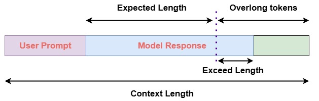

# Decoupled Clip and Dynamic Sampling Policy Optimization (DAPO)

Last updated: Sep 11,2025

Doc Author: [Ziyi ZENG](https://github.com/ZiyiTsang)

Decoupled Clip and Dynamic Sampling Policy Optimization (DAPO) (Yu et al., 2025) is a
reinforcement learning framework designed for training large language models (LLMs) on
complex reasoning tasks. It improves upon conventional methods by introducing
**asymmetric clipping** through decoupled lower and upper bounds $\epsilon\_{\text{low}}$ and $\epsilon\_{\text{high}}$, enabling more adaptive
policy updates.

DAPO further employs a **dynamic sampling strategy**, excluding samples where all
responses are uniformly correct or incorrect, ensuring gradient updates come from
informative, diverse outputs. To promote high-quality reasoning, it applies token-level
losses and reward shaping to discourage overly long or early-terminated responses.

The core objective is:

$$

J_{\text{DAPO}}(\theta) = \mathbb{E}_{\substack{(q,a) \sim \mathcal{D}, \\ \{o_i\}_{i=1}^G \sim \pi_{\theta_{\text{old}}}(o|q)}} \left[ \frac{1}{\sum_{i=1}^G |o_i|} \sum_{i=1}^G \sum_{t=1}^{|o_i|} \min\left( r_{i,t}(\theta) \hat{A}_{i,t}, \text{clip}\left( r_{i,t}(\theta), \textcolor{red}{1-\epsilon_{\text{low}}}, \textcolor{red}{1+\epsilon_{\text{high}}} \right) \hat{A}_{i,t} \right) \right]
$$

where $\hat{A}_{i,t}$ is the group-normalized advantage and $r_{i,t}(\theta)$ is the token-level policy ratio. Compared to GRPO’s symmetric clipping, DAPO’s asymmetric
design allows finer control over exploration and stability during training.

For more details:

- AReal Detail: [Paper of AReal](https://arxiv.org/abs/2505.24298)

- DAPO Detail: [Paper of DAPO](https://arxiv.org/abs/2503.14476)

## Algorithm Core Parameters

We only list the different parameters from GRPO here:

- `actor.overlong_reward_penalty`: Define if overlong_reward_penalty should be used.
- `actor.overlong_tokens`: The threshold of tokens at the tail to be considered as
  overlong.
- `actor.overlong_penalty_factor`: The factor of overlong penalty.
- `actor.eps_clip`: The lower bound of clipping, default is `0.2`.
- `actor.eps_clip_higher`: The higher bound of clipping.
- `actor.dynamic_sampling`: Define if dynamic sampling should be used.

### Overlong Penalty

Here we briefly introduce the implementation details of DAPO.

## Example Usage

> The algorithm is experimental and may not be stable.

We recommend to change the parameter within the configuration file
(i.e.gsm8k_dapo.yaml).

| Backend   | CMD                                                                                                                              |
| --------- | -------------------------------------------------------------------------------------------------------------------------------- |
| **local** | `python3 -m areal.launcher.local examples/math/gsm8k_dapo.py --config examples/math/gsm8k_dapo.yaml --<other_args_to_overwrite>` |
| **ray**   | `python3 -m areal.launcher.ray examples/math/gsm8k_dapo.py --config examples/math/gsm8k_dapo.yaml --<other_args_to_overwrite>`   |
| **slurm** | `python3 -m areal.launcher.slurm examples/math/gsm8k_dapo.py --config examples/math/gsm8k_dapo.yaml --<other_args_to_overwrite>` |

## Baselines

We still lack baseline, welcome to contribute!
