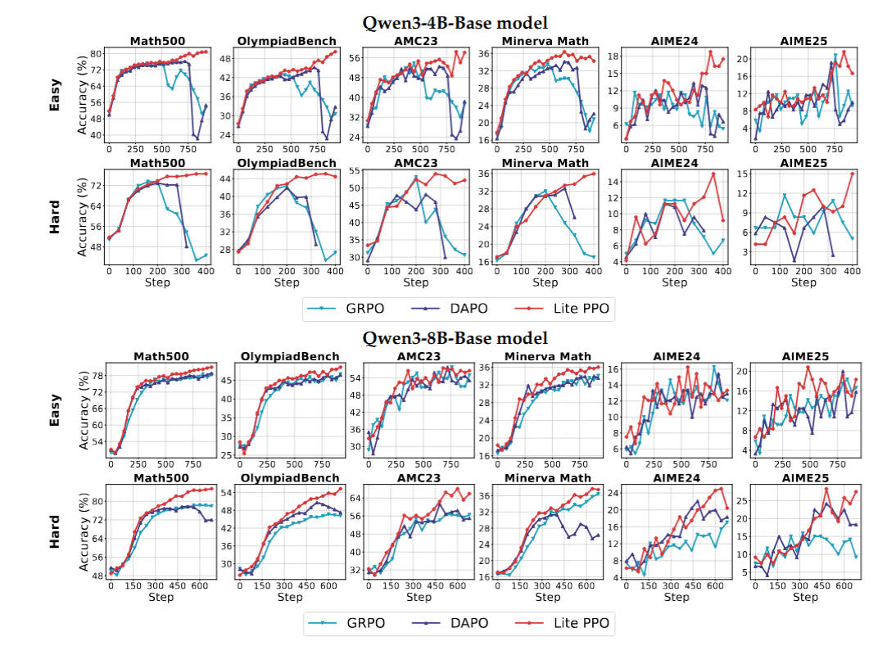

# Lite-PPO

Last updated: Sep 21, 2025

Doc Author: [Ziyi ZENG](https://github.com/ZiyiTsang)

Lite PPO is a minimalist reinforcement learning approach designed for LLM reasoning.
Compared to GRPO, Lite PPO introduces two main changes and advantages. Firstly, it
leverages advantage normalization with group-level mean and batch-level standard
deviation for robust reward shaping, which is particularly effective in handling
homogeneous reward distributions. Secondly, Lite PPO employs token-level loss
aggregation, which has been shown to be more efficient for base model architectures by
ensuring each token contributes equally to the optimization signal. These two combined
techniques allow Lite PPO to achieve a stable upward trend in accuracy and outperform
GRPO, especially on challenging datasets, by effectively addressing issues like reward
interference and efficient gradient updates.

For more details:

- AReal Detail: [Paper of AReal](https://arxiv.org/abs/2505.24298)

- Lite-PPO Detail: [Paper of Lite-PPO](https://arxiv.org/pdf/2508.08221v1)

## Algorithm Core Parameters

We only list the different parameters from GRPO here:

- `actor.adv_norm.mean_level`: The level when calculate the mean of advantage. options:
  `group`,`batch` or `none`. In litePPO, it is set to `group` as default.
- `actor.adv_norm.std_level`: The level when calculate the std of advantage. options:
  `group`,`batch` or `none`. In litePPO, it is set to `batch` as default.

## Example Usage

> The algorithm is experimental and may not be stable.

We recommend to change the parameter within the configuration file
(i.e.gsm8k_liteppo.yaml).

| Backend   | CMD                                                                                                                                    |
| --------- | -------------------------------------------------------------------------------------------------------------------------------------- |
| **local** | `python3 -m areal.launcher.local examples/math/gsm8k_liteppo.py --config examples/math/gsm8k_liteppo.yaml --<other_args_to_overwrite>` |
| **ray**   | `python3 -m areal.launcher.ray examples/math/gsm8k_liteppo.py --config examples/math/gsm8k_liteppo.yaml --<other_args_to_overwrite>`   |
| **slurm** | `python3 -m areal.launcher.slurm examples/math/gsm8k_liteppo.py --config examples/math/gsm8k_liteppo.yaml --<other_args_to_overwrite>` |

## Baseline

We still lack baseline, welcome to contribute!
