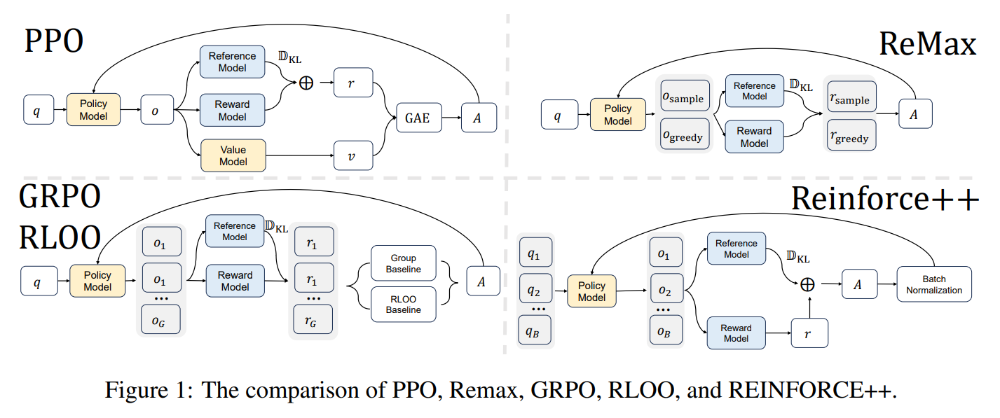

# REINFORCE Leave-One-Out (RLOO)

Last updated: Sep 28, 2025

Author: [Honghua DONG](https://github.com/dhh1995)

REINFORCE Leave One-Out (RLOO), introduced by Ahmadian et al. (2024), is an RL method that removes the need for a value function (critic).
Instead, it estimates the baseline by averaging rewards of other sampled responses for the same prompt within the group.

The overall core objective is:

$$
J_{\text{RLOO}}(\theta) = \mathbb{E}_{\substack{q \sim P(Q),\\ \{o_i\}_{i=1}^G \sim \pi_{\theta_{\text{old}}}(O|q)}} \left[ \frac{1}{G} \sum_{i=1}^G \frac{1}{|o_i|} \sum_{t=1}^{|o_i|} \min\left( r_{i,t}(\theta) \hat{A}_{i,t},\ \text{clip}\left( r_{i,t}(\theta),\ 1-\epsilon,\ 1+\epsilon \right) \hat{A}_{i,t} \right) \right]
$$
where:
$$
\hat{A}_{i,t} = r_{i} - \frac{1}{G-1} \sum_{j\neq i} r_{j}.
$$

For more details:

- AReal Detail: [Paper of AReal](https://arxiv.org/abs/2505.24298)

- RLOO Detail: [Paper of RLOO](https://arxiv.org/abs/2402.14740)

## Algorithm Core Parameters

We only list the different parameters from GRPO here:

- `actor.adv_norm.mean_level`: The level when calculate the mean of advantage. options:
  `group`,`batch` or `none`. In rloo, it is set to `group` by default.
- `actor.adv_norm.mean_leave1out`: Whether to use leave-one-out average. In rloo, it is set to `true` by default.
- `actor.adv_norm.std_level`: The level when calculate the std of advantage. options:
  `group`,`batch` or `none`. In rloo, it is set to `none` by default.

## Example Usage

We recommend to change the parameter within the configuration file
(i.e.gsm8k_rloo.yaml).

| Backend   | CMD                                                                                                                              |
| --------- | -------------------------------------------------------------------------------------------------------------------------------- |
| **local** | `python3 -m areal.launcher.local examples/math/gsm8k_ppo.py --config examples/math/gsm8k_rloo.yaml --<other_args_to_overwrite>` |
| **ray**   | `python3 -m areal.launcher.ray examples/math/gsm8k_ppo.py --config examples/math/gsm8k_rloo.yaml --<other_args_to_overwrite>`   |
| **slurm** | `python3 -m areal.launcher.slurm examples/math/gsm8k_ppo.py --config examples/math/gsm8k_rloo.yaml --<other_args_to_overwrite>` |

## Baselines

We still lack baseline, welcome to contribute!
