# AReaL架构图表总览

本文档包含AReaL系统的完整架构图表，展示AReaLite和Core两个系统的设计对比。

## 整体架构对比

### 高层架构对比图

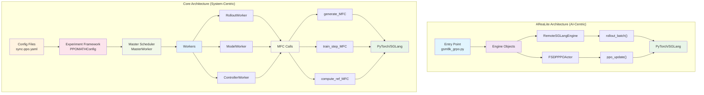

### 详细层次架构对比

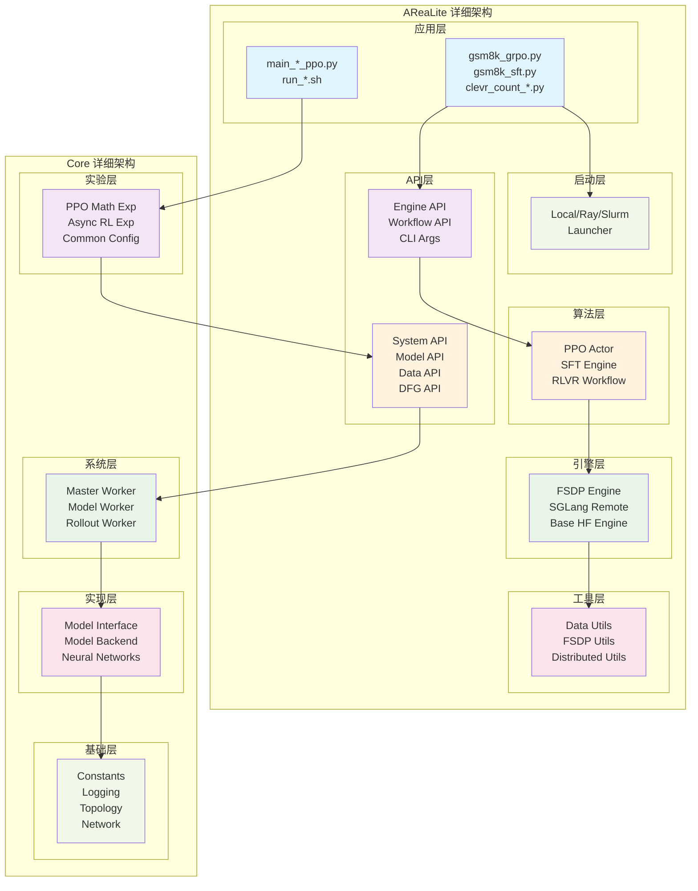

## 代码复杂度对比

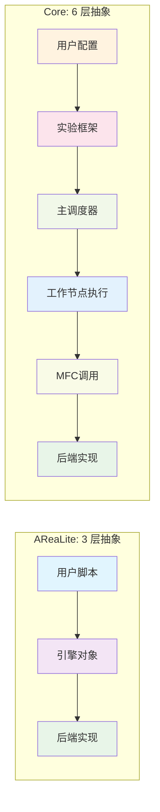

## 共享组件关系图

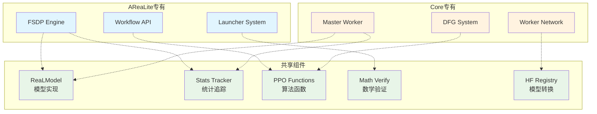

## 数据流对比图

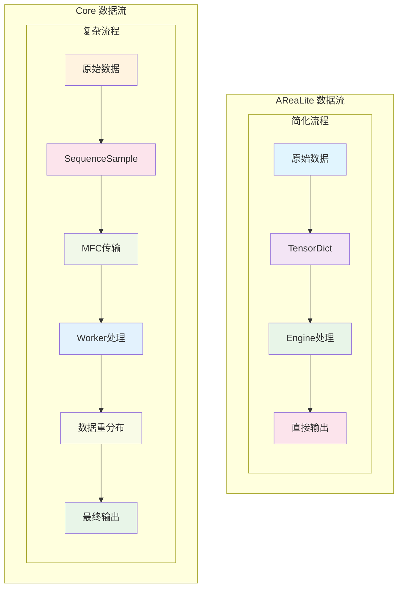

## 扩展性对比图

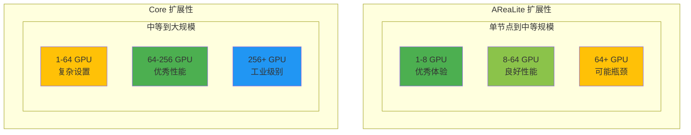

## 训练流程对比

### AReaLite训练流程

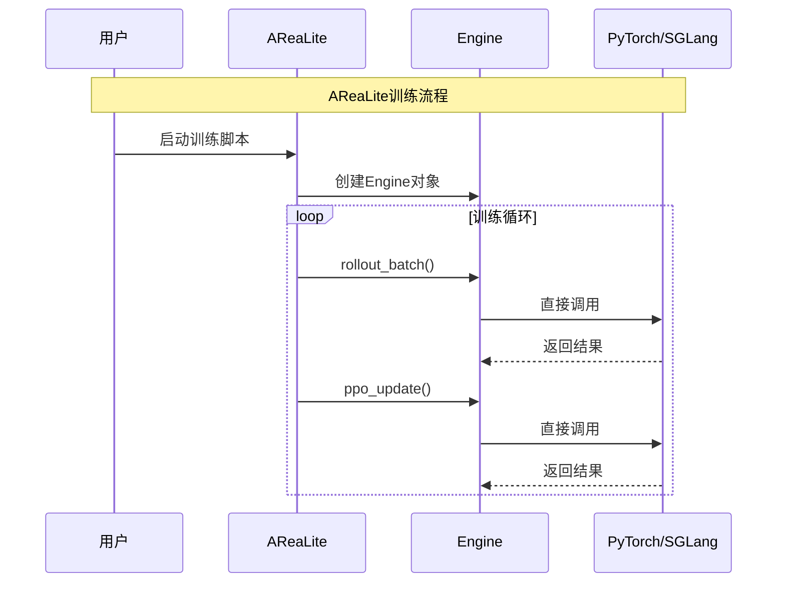

### Core训练流程

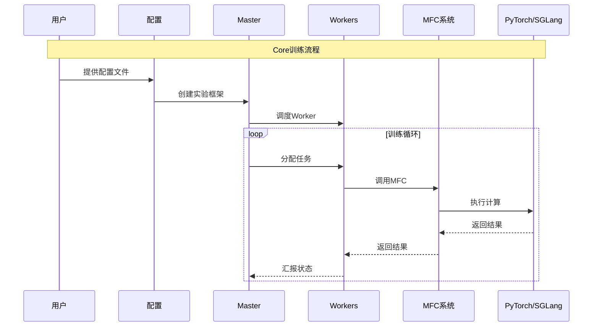

## 系统启动对比

### AReaLite启动流程

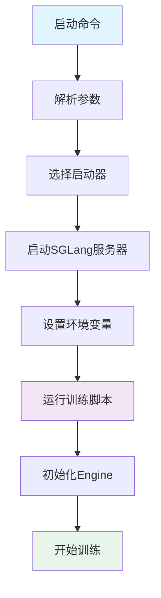

### Core启动流程

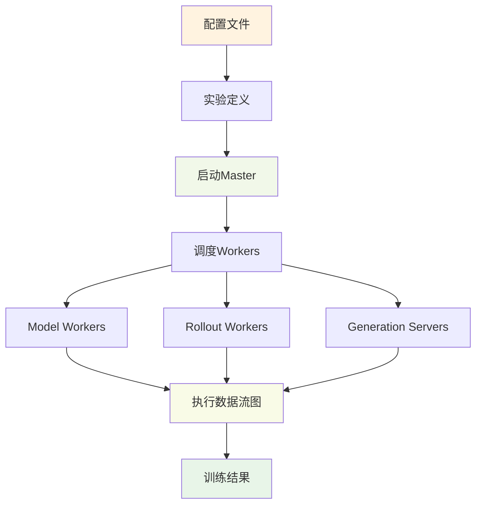

## 架构演进趋势

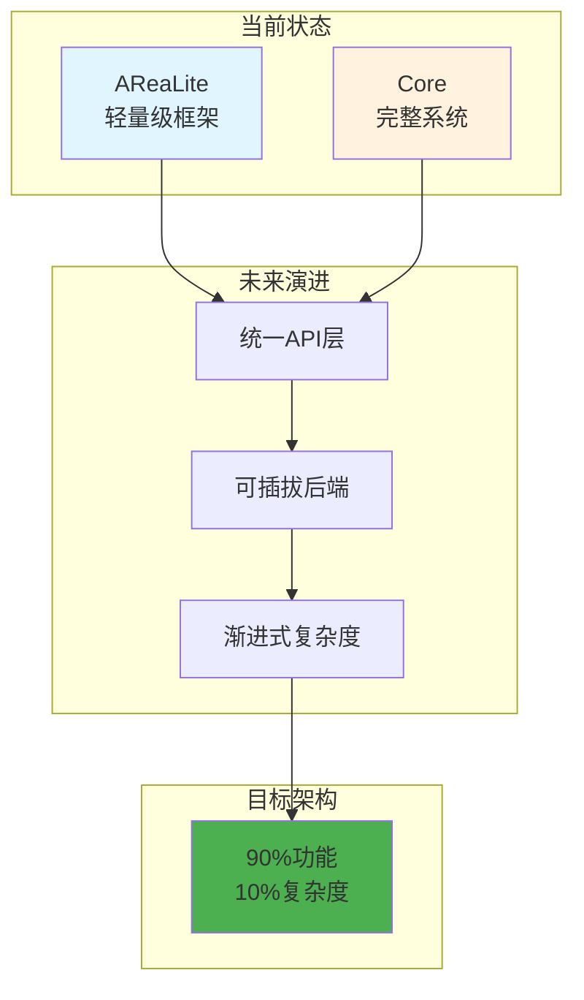
