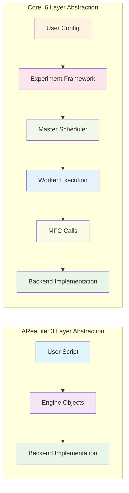
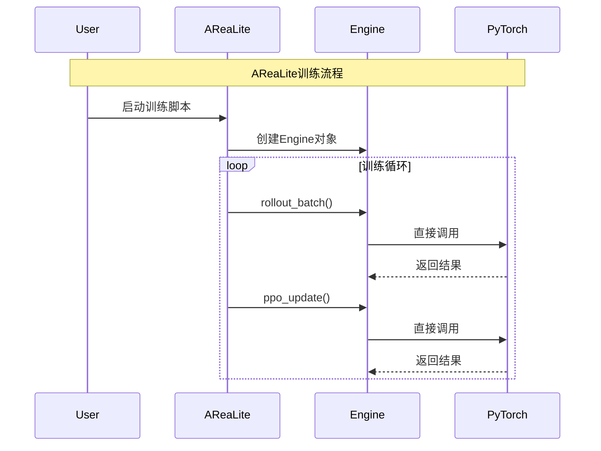
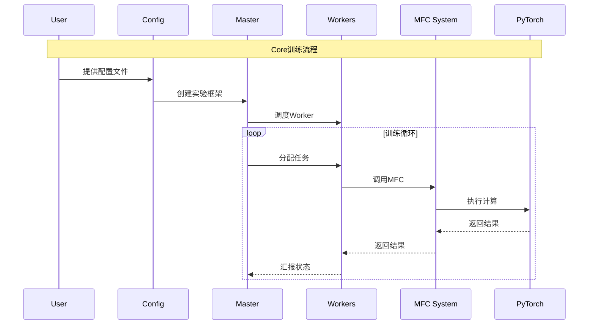

```mermaid
graph TB
    subgraph "AReaLite Architecture (AI-Centric)"
        A1[Entry Point<br/>gsm8k_grpo.py] --> A2[Engine Objects]
        A2 --> A3[RemoteSGLangEngine]
        A2 --> A4[FSDPPPOActor]
        A3 --> A5[rollout_batch()]
        A4 --> A6[ppo_update()]
        A5 --> A7[PyTorch/SGLang]
        A6 --> A7
        
        style A1 fill:#e1f5fe
        style A2 fill:#f3e5f5
        style A7 fill:#e8f5e8
    end
    
    subgraph "Core Architecture (System-Centric)"
        B1[Config Files<br/>sync-ppo.yaml] --> B2[Experiment Framework<br/>PPOMATHConfig]
        B2 --> B3[Master Scheduler<br/>MasterWorker]
        B3 --> B4[Workers]
        B4 --> B5[RolloutWorker]
        B4 --> B6[ModelWorker]
        B4 --> B7[ControllerWorker]
        B5 --> B8[MFC Calls]
        B6 --> B8
        B7 --> B8
        B8 --> B9[generate_MFC]
        B8 --> B10[train_step_MFC]
        B8 --> B11[compute_ref_MFC]
        B9 --> B12[PyTorch/SGLang]
        B10 --> B12
        B11 --> B12
        
        style B1 fill:#fff3e0
        style B2 fill:#fce4ec
        style B3 fill:#f1f8e9
        style B4 fill:#e3f2fd
        style B8 fill:#f9fbe7
        style B12 fill:#e8f5e8
    end
```

## 代码复杂度对比



## 训练流程对比



