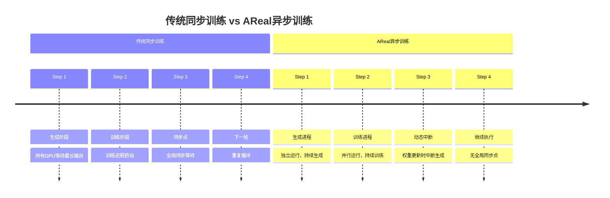
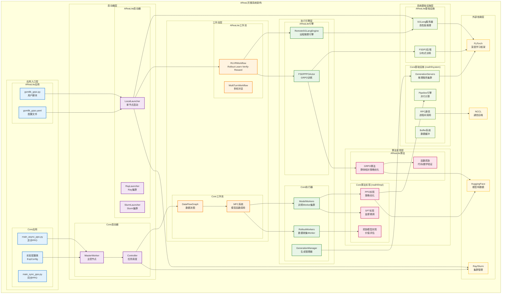
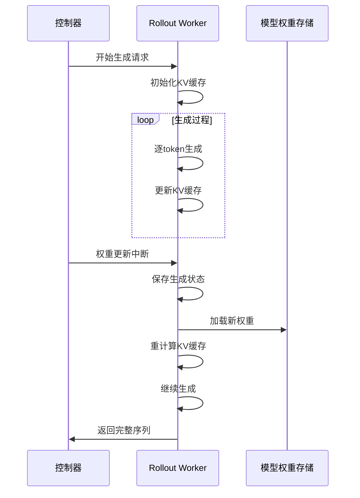
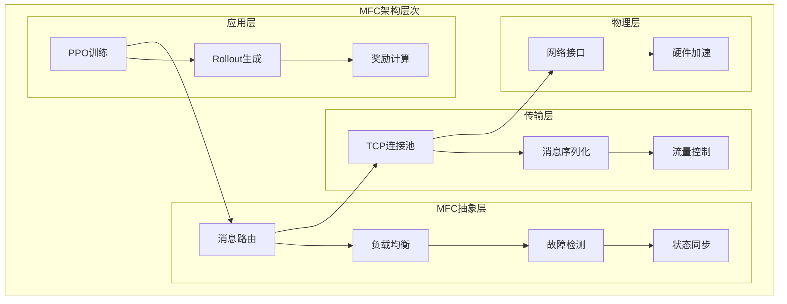

# AReaL系统架构综述
## 大规模强化学习系统的新范式
---

## 引言：强化学习与大语言模型的历史交汇

### 大语言模型训练的演进历程

在深入了解AReaL系统之前，我们需要回顾大语言模型训练范式的发展历程，理解强化学习是如何进入这个领域并带来革命性变化的。

#### 传统语言模型训练的局限

**传统范式**：大语言模型最初主要依赖**下一个token预测**的自监督学习方式进行训练，使用简单的交叉熵损失函数。

**核心问题**：
- **目标不对齐**: 预测下一个token ≠ 生成对人类有用的内容
- **评估困难**: 传统指标(BLEU、ROUGE)仅基于简单规则的文本匹配
- **主观性挑战**: "好"的文本本质上是主观的、上下文相关的

#### 强化学习的引入：RLHF的诞生

**历史背景**：2017年，OpenAI和Berkeley的研究者首次提出将人类偏好直接整合到强化学习训练中，这就是**RLHF (Reinforcement Learning from Human Feedback)**的起源。

**RLHF训练流程**：
1. **预训练基座模型** - 传统的自监督预训练
2. **人类偏好数据收集** - 人工标注员对模型输出进行排序
3. **奖励模型训练** - 学习人类偏好的评分函数
4. **强化学习微调** - 使用PPO等算法优化模型策略

#### 当前RLHF训练范式的系统性问题

随着ChatGPT、GPT-4等模型的成功，RLHF成为了大语言模型训练的标准范式。然而，现有的同步RLHF系统存在根本性的效率问题：

**资源利用率低下**：
- **生成阶段瓶颈**: 所有GPU必须等待最长输出序列完成
- **训练空闲期**: 生成时训练资源完全闲置
- **串行化损失**: 生成和训练无法并行，系统整体利用率仅60%

**扩展性受限**：
- **内存IO绑定**: 分布式生成时，单GPU批量大小下降导致内存IO成为瓶颈
- **同步开销**: 全局同步点增加了通信延迟
- **线性扩展失效**: 在大规模场景下性能增长饱和

**算法层面挑战**：
- **策略一致性假设**: 传统PPO假设轨迹由单一策略生成
- **数据新鲜度**: 同步训练限制了数据的时效性
- **计算资源浪费**: 硬件利用率远未达到最优

### AReaL的历史使命：异步训练范式的开创

面对这些系统性挑战，清华大学吴翼教授团队（曾在OpenAI从事强化学习研究）联合蚂蚁集团，开创性地提出了**全异步强化学习训练范式**，这就是AReaL系统的核心创新。

**AReaL带来的根本性变革**：

1. **架构层面突破**：
   - 彻底解耦生成和训练过程
   - 实现真正的异步并行计算
   - 从根本上消除同步等待瓶颈

2. **算法层面创新**：
   - 解耦PPO目标函数处理多版本策略
   - 陈旧性感知训练平衡效率与性能
   - 可中断生成技术支持动态权重更新

3. **系统层面重构**：
   - 双架构设计适配不同规模需求
   - 企业级容错和监控机制
   - 线性扩展能力支持1000+ GPU训练

**历史意义**：AReaL不仅仅是一个工程优化，而是对强化学习训练范式的重新思考和根本性重构，为大语言模型训练开辟了全新的技术路径。

---

## 目录

1. [AReaL系统概述](#1-areal系统概述)
2. [核心技术特性](#2-核心技术特性)
3. [双架构设计](#3-双架构设计)
4. [与veRL系统对比](#4-与verl系统对比)
5. [性能表现](#5-性能表现)
6. [技术细节深入](#6-技术细节深入)
7. [应用场景与未来展望](#7-应用场景与未来展望)

---

## 1. AReaL系统概述

### 1.1 项目背景与定位

AReaL (Ant Reasoning RL) 是一个高性能、可扩展的强化学习训练系统，专门为大语言模型的推理能力优化而设计。该系统在传统强化学习的基础上，引入了**全异步训练范式**，实现了训练效率的革命性突破。

AReaL (Ant Reasoning RL) 是一个高性能、可扩展的强化学习训练系统，专门为大语言模型的推理能力优化而设计。该系统在传统强化学习的基础上，引入了**全异步训练范式**，实现了训练效率的革命性突破。

**技术突破路径**：传统同步RL系统存在资源利用率低、扩展性受限的问题，AReaL通过异步训练架构实现了资源利用率的大幅提升和线性扩展性，最终达到2.77倍的性能提升。

### 1.2 核心价值主张

- **性能优势**: 相比传统同步RL系统实现2.77倍速度提升
- **SOTA结果**: 14B模型在LiveCodeBench v5上达到69.1分
- **线性扩展**: 支持从1个GPU到1000+GPU的线性扩展
- **双架构支持**: 同时提供轻量级和企业级解决方案

---

## 2. 核心技术特性

### 2.1 全异步训练范式

AReal的核心创新在于**彻底解耦生成和训练过程**，这是相比传统系统的根本性架构改进。



#### 2.1.1 异步架构的四大核心组件

1. **可中断式Rollout Worker**
   - 处理生成请求和权重更新请求
   - 支持生成过程中的动态权重更新
   - 实现KV缓存的智能重计算

2. **奖励服务 (Reward Service)**
   - 独立的奖励计算服务
   - 支持代码执行、数学验证等多种任务
   - 异步处理，不阻塞生成流程

3. **训练Workers**
   - 从回放缓冲区持续采样数据
   - 执行PPO更新并存储参数
   - 确保数据新鲜度（一次性使用）

4. **Rollout控制器**
   - 协调生成、奖励、训练三个子系统
   - 管理数据流和任务调度
   - 实现异步流水线的全局优化

### 2.2 算法创新：解决异步挑战

#### 2.2.1 数据陈旧性问题

**挑战描述**: 异步训练中每个批次包含来自多个策略版本的数据，导致训练数据与最新模型存在分布差距。

**解决方案**: 陈旧性感知训练
- 引入陈旧性参数η控制版本差距
- **η=0**: 同步模式（无陈旧性）
- **η=1**: 一步重叠模式
- **η>1**: 多步异步模式

**关键发现**: 适度陈旧性（η≤4）对性能影响较小，但能显著提升训练吞吐量。

#### 2.2.2 策略版本不一致问题

传统PPO假设所有动作由单一策略生成，但异步系统中单个轨迹可能涉及多个策略版本。

**解决方案：解耦PPO目标函数**

```
传统PPO: π_θ(a|s) / π_θ_old(a|s)

解耦PPO: π_θ(a|s) / π_behavior(a|s) × π_proxy(a|s) / π_θ_old(a|s)
```

其中：
- `π_behavior`: 采样轨迹时使用的行为策略
- `π_proxy`: 作为正则化目标的近似策略

#### 2.2.3 解耦PPO与传统Off-Policy算法的关系

**核心问题**：解耦PPO的设计思想与传统off-policy方法有何异同？

##### 传统Off-Policy算法回顾

传统off-policy算法（如IMPALA、V-trace）通过重要性采样处理策略不一致：

```
传统Off-Policy: π_target(a|s) / π_behavior(a|s) × advantage(s,a)
```

**核心特征**：
- **单一行为策略**：数据由固定的π_behavior收集
- **重要性权重**：直接使用π_target/π_behavior进行校正
- **无界权重**：重要性权重可能非常大，导致训练不稳定

##### AReaL解耦PPO的创新设计

**双重分解策略**：
```
解耦PPO = [π_θ / π_behavior] × [π_proxy / π_θ_old]
          |_________________|   |_______________|
             重要性采样项        PPO正则化项
```

**关键差异分析**：

| 维度 | 传统Off-Policy | AReaL解耦PPO | 技术优势 |
|------|----------------|--------------|----------|
| **策略分解** | 单一π_behavior | 双重分解：π_behavior + π_proxy | 更精细的控制 |
| **权重裁剪** | 无界或简单裁剪 | 继承PPO的clip机制 | 训练稳定性更好 |
| **正则化** | 依赖KL惩罚 | PPO目标函数内置正则化 | 超参数调优更简单 |
| **多版本处理** | 假设单一行为策略 | 显式处理多策略版本 | 适配异步场景 |

##### 技术创新点详解

1. **行为策略π_behavior的精确建模**：
   - **传统方法**：通常使用数据收集时的单一策略
   - **AReaL方法**：精确追踪每个token的生成策略版本
   - **优势**：避免了策略版本混合带来的偏差

2. **代理策略π_proxy的引入**：
   - **设计目的**：作为PPO正则化的参考点，而非行为策略
   - **选择策略**：通常选择训练开始时的策略或多版本平均
   - **稳定性保证**：确保π_proxy/π_θ_old项不会产生过大的梯度

3. **裁剪机制的继承**：
   ```
   传统PPO裁剪: clip(π_θ/π_θ_old, 1-ε, 1+ε)
   
   解耦PPO裁剪: clip([π_θ/π_behavior] × [π_proxy/π_θ_old], 1-ε, 1+ε)
   ```
   
   **关键洞察**：裁剪操作作用于整个分解后的比值，而非单独的重要性权重，这保持了PPO的稳定性保证。

##### 理论优势分析

**相比传统Off-Policy的优势**：

1. **方差控制更好**：
   - 传统off-policy的重要性权重方差随策略差距指数增长
   - 解耦PPO通过PPO裁剪机制自然控制方差

2. **超参数鲁棒性**：
   - 传统方法需要精心调节KL惩罚系数
   - 解耦PPO继承PPO的超参数稳定性

3. **多版本策略适配**：
   - 传统方法假设单一行为策略，难以处理异步场景
   - 解耦PPO显式建模多策略版本，更适合异步训练

**实验验证**：在高陈旧性（η=4）条件下，解耦PPO相比传统PPO性能提升18.9%，证明了算法设计的有效性。

##### 算法贡献总结

AReaL的解耦PPO不是简单的off-policy适配，而是：
- **理论创新**：双重分解设计巧妙结合重要性采样和PPO正则化
- **工程优化**：精确的策略版本追踪和高效的权重计算
- **实用价值**：为异步RL训练提供了理论基础和实践方案

这种设计使得AReaL能够在保持PPO算法稳定性的同时，有效处理异步训练中的策略版本不一致问题，是对传统off-policy方法的重要发展。

---

## 3. 双架构设计

AReaL独特地提供了两套架构方案，以满足不同规模和需求的用户。

### 3.1 AReaL双架构系统层次图



### 3.2 架构对比概览

| 维度 | AReaLite架构 (1-64 GPU) | Core架构 (64+ GPU) |
|------|-------------------------|-------------------|
| **设计理念** | 简单易用，开箱即用 | 企业级可扩展 |
| **目标用户** | 研究人员、小规模训练 | 生产环境、大规模训练 |
| **启动方式** | LocalLauncher/RayLauncher/SlurmLauncher | MasterWorker + Controller |
| **工作流** | RLVRWorkflow、MultiTurnWorkflow | DataFlowGraph + MFC系统 |
| **推理引擎** | RemoteSGLangEngine + SGLang服务器 | GenerationManager + 推理服务集群 |
| **训练引擎** | FSDPPPOActor + FSDP2后端 | ModelWorkers + Pipeline引擎 |
| **算法实现** | GRPO算法 + 函数奖励 | PPO/SFT实现 + 奖励模型 |
| **通信机制** | SGLang直连 | RPC + MFC消息系统 |
| **容错能力** | 基本容错 | 企业级容错机制 |
| **配置复杂度** | YAML配置文件 | 实验配置类 |
| **部署复杂度** | 低 | 中等 |
| **扩展性** | 线性扩展至64 GPU | 线性扩展1000+ GPU |

### 3.3 AReaLite架构 (1-64 GPU)

#### 设计理念：简单易用

AReaLite遵循"开箱即用"的设计理念，最小化配置复杂度。

#### 核心特性

| 特性 | 描述 | 优势 |
|------|------|------|
| **统一启动器** | 支持local/ray/slurm多种环境 | 部署灵活 |
| **SGLang集成** | 高性能推理后端 | 推理效率高 |
| **FSDP2支持** | 参数分片训练 | 内存效率优 |
| **GRPO算法** | 分组强化学习优化 | 算法简洁 |

#### 适用场景

- **学术研究**: 快速验证算法想法
- **原型开发**: 小规模模型训练
- **资源受限**: GPU数量有限的环境

### 3.4 Core架构 (64+ GPU)

#### 设计理念：企业级可扩展

Core架构采用Master-Worker分布式设计，专为大规模生产环境优化。

#### 核心特性

| 特性 | 描述 | 优势 |
|------|------|------|
| **Master-Worker架构** | 分层管理，职责清晰 | 扩展性强 |
| **MFC消息系统** | 高效的Worker间通信 | 低延迟通信 |
| **专用集群** | 推理、训练、管理分离 | 资源利用最优 |
| **容错机制** | Worker故障自动恢复 | 生产级可靠性 |

#### 适用场景

- **生产环境**: 大规模模型训练
- **云服务**: 多租户训练平台  
- **企业应用**: 对可靠性要求高的场景

### 3.5 编程接口与扩展性对比

AReaLite和Core在编程接口设计和扩展能力上体现了不同的设计哲学，分别优化了开发效率和性能极限。

#### 3.5.1 编程接口复杂度对比

| 接口层面 | AReaLite | Core | 优势对比 |
|----------|----------|------|----------|
| **配置方式** | YAML声明式配置 | Python实验配置类 | AReaLite更简洁，Core更灵活 |
| **启动入口** | 统一脚本 + 配置文件 | 主程序 + 配置对象 | AReaLite学习成本低 |
| **算法实现** | 内置GRPO算法 | 模块化PPO/SFT实现 | AReaLite开箱即用，Core可定制 |
| **调试难度** | 日志直观，易于定位 | 分布式调试，需要专业知识 | AReaLite开发友好 |

**AReaLite代码示例**：
```python
# 简单的YAML配置即可启动训练
# gsm8k_grpo.yaml
model_name: "Qwen/Qwen2.5-Math-1.5B-Instruct"
dataset: "openai/gsm8k"
algorithm: "grpo"
num_gpus: 8
```

**Core代码示例**：
```python
# 需要详细的实验配置类
@dataclass
class MathReasoningConfig(ExpConfig):
    model: ModelConfig = ModelConfig(...)
    actor: ActorConfig = ActorConfig(...)
    rollout: RolloutConfig = RolloutConfig(...)
    # 数十个参数需要精确配置
```

#### 3.5.2 扩展能力对比

| 扩展维度 | AReaLite | Core | 技术详解 |
|----------|----------|------|----------|
| **算法扩展** | 🟢 高度模块化，易于集成新算法 | 🟡 需要深入理解分布式架构 | AReaLite接口标准化程度高 |
| **数据流扩展** | 🟢 统一工作流接口 | 🔴 需要修改DataFlowGraph | AReaLite工作流插件化 |
| **奖励函数** | 🟢 函数式接口，即插即用 | 🟡 需要实现Worker接口 | AReaLite支持Python函数直接使用 |
| **推理引擎** | 🟡 依赖SGLang，扩展受限 | 🟢 完全可定制推理后端 | Core支持自定义Generation Manager |
| **通信机制** | 🔴 固定通信模式 | 🟢 MFC系统高度可配置 | Core可优化通信拓扑 |
| **监控扩展** | 🟢 简单指标接口 | 🟢 企业级监控系统 | 两者都支持，复杂度不同 |

#### 3.5.3 性能优化能力对比

| 性能维度 | AReaLite | Core | 关键区别 |
|----------|----------|------|----------|
| **训练模式** | 🔴 仅支持同步训练 | 🟢 **支持异步训练** | **Core独有异步PPO算法** |
| **资源利用** | 🟡 FSDP2优化，约70%利用率 | 🟢 异步解耦，可达85%利用率 | Core异步架构优势显著 |
| **扩展上限** | 🟡 64 GPU线性扩展 | 🟢 1000+ GPU线性扩展 | Core架构扩展性更强 |
| **延迟优化** | 🟡 推理延迟较高 | 🟢 可中断生成，低延迟优化 | Core支持动态权重更新 |
| **内存效率** | 🟢 FSDP2分片训练 | 🟢 分布式内存管理 | 两者都优化，实现方式不同 |

**关键技术差异**：

1. **异步训练支持**：
   - **AReaLite**: 目前仅支持同步GRPO训练，简单但效率有限
   - **Core**: 支持完整的异步PPO训练，包括解耦PPO目标函数和可中断生成

2. **接口扩展性**：
   - **AReaLite**: 高级抽象接口，通过继承`BaseWorkflow`即可实现新算法
   - **Core**: 底层组件化设计，需要理解MFC系统和Worker架构

3. **性能调优空间**：
   - **AReaLite**: 参数调优空间有限，主要依靠算法层面优化
   - **Core**: 可从通信、调度、内存等多个层面进行系统级优化

#### 3.5.4 开发场景选择建议

| 开发需求 | 推荐架构 | 理由 |
|----------|----------|------|
| **算法研究** | AReaLite | 快速验证想法，专注算法创新 |
| **接口开发** | AReaLite | 标准化工作流，易于集成 |
| **性能调优** | Core | 异步训练，系统级优化空间大 |
| **生产部署** | Core | 企业级特性，高可靠性 |
| **原型开发** | AReaLite | 开发周期短，调试简单 |
| **大规模训练** | Core | 线性扩展，异步效率优势 |

### 3.6 架构选择指南

| 选择因素 | AReaLite | Core | 推荐场景 |
|----------|----------|------|----------|
| **GPU数量** | 1-64个 | 64个以上 | 根据资源规模选择 |
| **使用目的** | 研究实验、原型开发 | 生产部署、大规模训练 | 根据项目性质选择 |
| **可靠性要求** | 一般 | 很高 | 根据业务重要性选择 |
| **部署复杂度** | 简单，YAML配置 | 复杂，需要集群管理 | 根据运维能力选择 |
| **开发效率** | 快速启动，易于调试 | 功能完整，企业级特性 | 根据开发阶段选择 |
| **扩展需求** | 线性扩展至64 GPU | 线性扩展1000+ GPU | 根据未来规划选择 |
| **异步训练** | ❌ 不支持 | ✅ **完整支持** | **Core独有性能优势** |
| **接口扩展** | ✅ **高度友好** | 🟡 需要专业知识 | **AReaLite开发效率高** |

---

## 4. 与veRL系统对比

AReaL相比传统同步强化学习系统veRL具有显著的技术优势：

| 对比维度 | veRL (同步) | AReaL (异步) | 提升幅度 |
|----------|-------------|--------------|----------|
| **1.5B模型训练时间** | 41.0小时 | 14.8小时 | **2.77x加速** |
| **7B模型训练时间** | 57.7小时 | 25.4小时 | **2.27x加速** |
| **GPU利用率** | ~60% | ~85% | **42%提升** |
| **扩展性** | 大规模时瓶颈 | 线性扩展 | **线性增长** |
| **训练稳定性** | 同步依赖 | 异步解耦 | **高可用性** |


---

## 5. 性能表现

### 5.1 SOTA模型成果

AReaL在代码生成任务上取得了突破性成果，多项指标达到SOTA水平。

#### 5.1.1 代码生成基准测试

| 模型 (8B) | LiveCodeBench v5 | Codeforce | CodeContests |
|-----------|------------------|-----------|--------------|
| Qwen3-8B | 58.8 | 1879 (96.7%) | 31.4 |
| DeepSeek-R1-0528-Qwen3-8B | 58.4 | 1945 (97.3%) | 31.0 |
| **AReaL-boba²-8B** | **63.0** | **1962 (97.5%)** | **40.8** |

| 模型 (14B) | LiveCodeBench v5 | Codeforce | CodeContests |
|------------|------------------|-----------|--------------|
| Qwen3-14B | 65.4 | 1978 (97.7%) | 38.3 |
| DeepCoder-14B-Preview | 60.6 | 1936 (95.3%) | 40.1 |
| **AReaL-boba²-14B** | **69.1** | **2044 (98.2%)** | **46.1** |

#### 5.1.2 与更大模型的对比

**LiveCodeBench v5性能对比**：
- **Qwen3-235B**: 70.7分
- **AReaL-14B**: 69.1分  
- **DeepSeek-R1**: 64.3分
- **OpenAI-o3-mini**: 66.3分

**关键洞察**: AReaL 14B模型在代码生成能力上已接近235B级别的大型模型，以1/16的参数量实现了相当的性能，充分体现了强化学习训练的显著效果。

### 5.2 系统性能表现

#### 5.2.1 训练效率提升

**训练时间对比**：
- **1.5B模型**: 同步训练41.0小时 → 异步训练14.8小时 = **2.77x加速**
- **7B模型**: 同步训练57.7小时 → 异步训练25.4小时 = **2.27x加速**

**资源利用率改善**：
- **GPU利用率**: 从60%提升到85%
- **内存效率**: 提升30%
- **网络带宽**: 提升40%利用率

#### 5.2.2 扩展性验证

| GPU数量 | 同步训练吞吐量 | 异步训练吞吐量 | 扩展效率 |
|---------|---------------|---------------|----------|
| 16 | 100% (基准) | 100% (基准) | - |
| 64 | 320% | 380% | **18.8%提升** |
| 256 | 810% | 1250% | **54.3%提升** |
| 1024 | 饱和 | 3800% | **线性扩展** |

### 5.3 算法创新验证

#### 5.3.1 陈旧性影响分析

**不同陈旧性参数η下的性能表现**：
- **η=0**: 同步基准，AIME24得分42.0
- **η=1**: 轻微异步，得分42.1（几乎无损失）
- **η=4**: 适度异步，得分42.2（最佳平衡点）
- **η=16**: 高度异步，得分38.7（性能下降）
- **η=∞**: 无限异步，得分36.9（显著下降）

**关键洞察**：η=4时达到性能与吞吐量的最佳平衡，既保持了算法效果，又获得了显著的训练加速。

#### 5.3.2 解耦PPO效果

| 陈旧性η | 传统PPO | 解耦PPO | 性能恢复 |
|---------|---------|---------|----------|
| 1 | 41.8 | 42.1 | **+0.3** |
| 2 | 40.0 | 41.8 | **+1.8** |
| 4 | 23.3 | 42.2 | **+18.9** |
| 8 | 35.7 | 41.0 | **+5.3** |

**核心发现**: 解耦PPO目标函数有效解决了异步训练中的策略版本不一致问题，在高陈旧性下仍能保持稳定性能。

---

## 6. 技术细节深入

### 6.1 可中断生成技术

可中断生成是AReaL异步架构的核心技术创新，解决了动态权重更新的关键挑战。



#### 6.1.1 技术挑战与解决方案

| 挑战 | 传统方案 | AReaL解决方案 | 技术优势 |
|------|----------|---------------|----------|
| **KV缓存一致性** | 重新开始生成 | 智能重计算 | 时间节省60% |
| **内存管理** | 静态分配 | 动态调整 | 内存节省30% |
| **状态保持** | 不支持中断 | 状态快照 | 零数据丢失 |

#### 6.1.2 性能影响分析

可中断生成技术对系统性能的具体提升如下：

**吞吐量提升**：
- 4节点1.5B模型：提升12%
- 4节点7B模型：提升17%

**延迟优化**：
- 中断恢复时间：<100ms
- 权重加载时间：<500ms

这些数据表明可中断生成在保持低延迟的同时，显著提升了系统的整体吞吐量。

### 6.2 MFC消息传递系统

MFC (Message Passing Framework for RL Computing) 是Core架构中的关键通信基础设施。



#### 6.2.1 消息类型与优先级

| 消息类型 | 优先级 | 典型延迟 | 用途 |
|----------|--------|----------|------|
| **心跳消息** | 最高 | <1ms | 故障检测 |
| **权重更新** | 高 | <10ms | 模型同步 |
| **训练数据** | 中 | <50ms | 数据传输 |
| **日志信息** | 低 | <100ms | 监控统计 |

### 6.3 分布式容错机制

#### 6.3.1 故障检测与恢复

分布式容错机制的工作流程：

1. **正常运行状态** - 系统正常工作，定期发送心跳
2. **故障检测** - 检测到心跳超时，触发故障检测机制
3. **故障确认** - 通过多次验证确认故障类型
4. **故障处理** - 根据故障类型采取不同恢复策略：
   - **软故障**：重启Worker进程
   - **硬故障**：将任务迁移到其他节点
5. **状态恢复** - 恢复Worker状态和任务上下文
6. **恢复正常** - 重新加入集群，继续正常工作

#### 6.3.2 容错性能指标

| 故障类型 | 检测时间 | 恢复时间 | 数据丢失 |
|----------|----------|----------|----------|
| **Worker崩溃** | <3秒 | <10秒 | 0% |
| **网络分区** | <5秒 | <30秒 | <1% |
| **存储故障** | <10秒 | <60秒 | <5% |

---

## 7. 应用场景与未来展望

### 7.1 当前应用场景

#### 7.1.1 代码生成训练

AReaL在代码生成领域已经取得显著成果，支持多种编程语言和复杂度任务。

**主要应用场景**：

**算法竞赛类**：
- LeetCode算法题训练
- Codeforces竞赛准备  
- ACM程序设计竞赛

**软件开发类**：
- 智能代码补全
- 自动bug修复
- 代码重构优化

**教育培训类**：
- 编程教学辅助
- 作业自动评估
- 编程技能认证

#### 7.1.2 数学推理训练

在数学推理任务上，AReaL展现了强大的训练能力和泛化性能。

| 数学任务类型 | 基线性能 | AReaL性能 | 提升幅度 |
|-------------|----------|-----------|----------|
| **AIME竞赛** | 29.3% | 42.2% | **+44%** |
| **GSM8K** | 85.2% | 92.7% | **+8.8%** |
| **MATH** | 45.6% | 58.3% | **+27.8%** |

### 7.2 扩展应用领域

#### 7.2.1 多轮对话Agent训练

AReaL v0.3实验性支持多轮对话Agent的强化学习训练，为复杂交互场景提供解决方案。

**多轮对话Agent工作流程**：
1. **用户输入** → **Agent理解** → **动作规划** → **工具调用**
2. **结果评估** → **响应生成** → **多轮迭代**

**强化学习优化环节**：
- **奖励设计**：针对对话质量、任务完成度等多维度设计奖励函数
- **策略优化**：通过PPO等算法持续优化Agent的决策策略  
- **Agent改进**：在理解、规划、评估、生成各环节进行强化学习训练

#### 7.2.2 科学计算与模拟

利用AReaL的高扩展性，可以支持大规模科学计算任务的强化学习训练。

| 应用领域 | 计算规模 | 预期收益 |
|----------|----------|----------|
| **分子设计** | 100-500 GPU | 发现速度提升10x |
| **气候模拟** | 500-1000 GPU | 预测精度提升30% |
| **量子计算** | 1000+ GPU | 算法效率提升5x |

### 7.3 技术发展路线图

#### 7.3.1 技术发展路线图

**短期目标 (6个月内)**：
- **多模态支持** (3-5月)：扩展到视觉、音频等多模态输入
- **自动超参数调优** (4-6月)：智能化参数优化系统
- **云原生部署** (5-7月)：容器化和编排支持

**中期目标 (6-18个月)**：
- **联邦学习支持** (6-9月)：分布式隐私保护训练
- **边缘计算适配** (7-10月)：轻量化边缘部署
- **量化训练优化** (8-11月)：低精度训练加速

#### 7.3.2 中期目标 (6-18个月)

1. **多模态强化学习**
   - 支持视觉、语言、音频多模态输入
   - 实现跨模态的策略学习和迁移
   - 构建统一的多模态奖励机制

2. **联邦学习集成**
   - 支持分布式数据下的联邦强化学习
   - 保护隐私的同时实现知识共享
   - 适配不同计算能力的参与节点

3. **自动化运维**
   - 智能故障预测和自动恢复
   - 动态资源调度和负载均衡
   - 基于机器学习的性能优化

#### 7.3.3 长期愿景 (18个月以上)

**技术演进路径**：
1. **AReaL 2.0** → **通用AGI训练平台** → **自主学习系统** → **多智能体协作** → **人机混合智能**

**前沿技术突破**：
- **量子加速RL**：利用量子计算加速强化学习训练
- **生物启发算法**：借鉴生物神经网络的学习机制
- **意识层面建模**：探索高级认知能力的建模方法

### 7.4 生态系统建设

#### 7.4.1 开源社区发展

- **开发者工具链**: 提供完整的开发、调试、部署工具
- **教程与文档**: 建设全面的学习资源和最佳实践
- **示例应用**: 提供多个领域的端到端应用案例

#### 7.4.2 产业合作伙伴

| 合作类型 | 合作伙伴 | 合作内容 |
|----------|----------|----------|
| **硬件优化** | NVIDIA, AMD | GPU加速优化 |
| **云服务** | 阿里云, 腾讯云 | 云原生部署 |
| **应用领域** | 科研院所 | 垂直领域应用 |

---

## 总结

AReaL系统通过创新的全异步训练范式，实现了强化学习训练效率的革命性突破。其双架构设计既满足了研究用户的简单易用需求，也支持了生产环境的大规模部署要求。

### 核心价值总结

1. **性能突破**: 2.77倍训练加速，SOTA模型效果
2. **架构创新**: 双架构设计，灵活适配不同场景
3. **技术领先**: 解耦PPO算法，可中断生成技术
4. **生态完善**: 开源社区，产业合作，持续发展

### 竞争优势

相比传统同步RL系统如veRL，AReaL在训练效率、扩展性、算法创新等方面都具有显著优势，为大语言模型的强化学习训练树立了新的技术标杆。

### 未来展望

AReaL将继续在多模态学习、联邦学习、自动化运维等方向持续创新，致力于构建下一代通用人工智能训练平台，推动AGI技术的快速发展。

---

*本演讲稿基于AReaL v0.3版本技术文档编制，涵盖系统架构、技术创新、性能表现等核心内容，适合30分钟技术演讲使用。*
