# AReaLite 架构文档

## 高层功能层次视图

### 系统层次结构

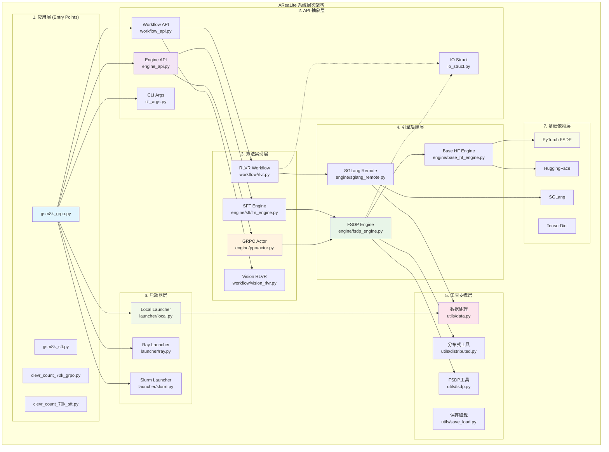

### 层次职责说明

1. **应用层 (Entry Points)**: 用户直接使用的训练脚本，组合下层组件实现完整的训练流程
2. **API 抽象层**: 定义统一的接口规范，解耦各层之间的依赖关系
3. **算法实现层**: 实现具体的RL算法(GRPO)和工作流(RLVR)
4. **引擎后端层**: 提供训练和推理的底层实现，对接第三方库
5. **工具支撑层**: 提供通用的工具函数和实用程序
6. **启动器层**: 管理分布式启动和资源分配
7. **基础依赖层**: 外部依赖库和框架

### 反向依赖说明

AReaLite中存在以下反向依赖情况（用虚线表示）：
- **IO Struct反向依赖**: `fsdp_engine.py`和`rlvr.py`需要引用`io_struct.py`中定义的数据结构，这是为了类型安全和数据传递的需要
- 这种反向依赖是设计上的合理选择，因为数据结构定义需要在整个系统中保持一致

## 典型场景动态流程图

### GRPO训练场景序列图

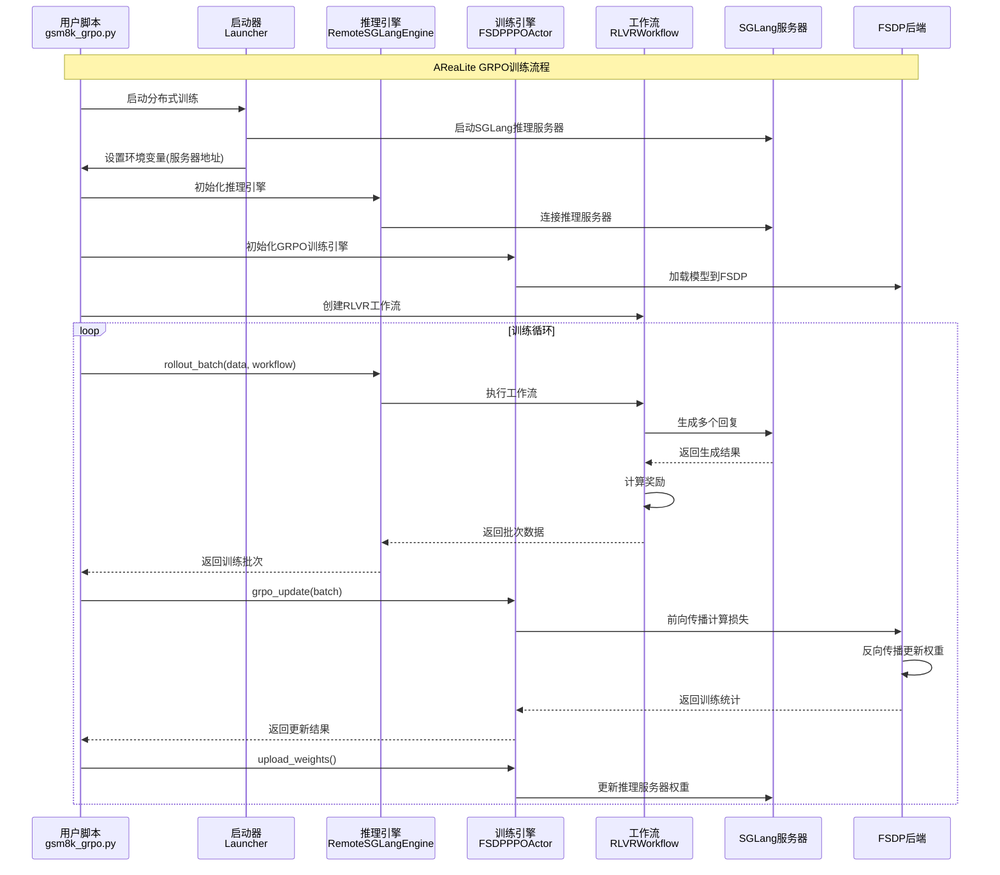

### SFT训练场景序列图

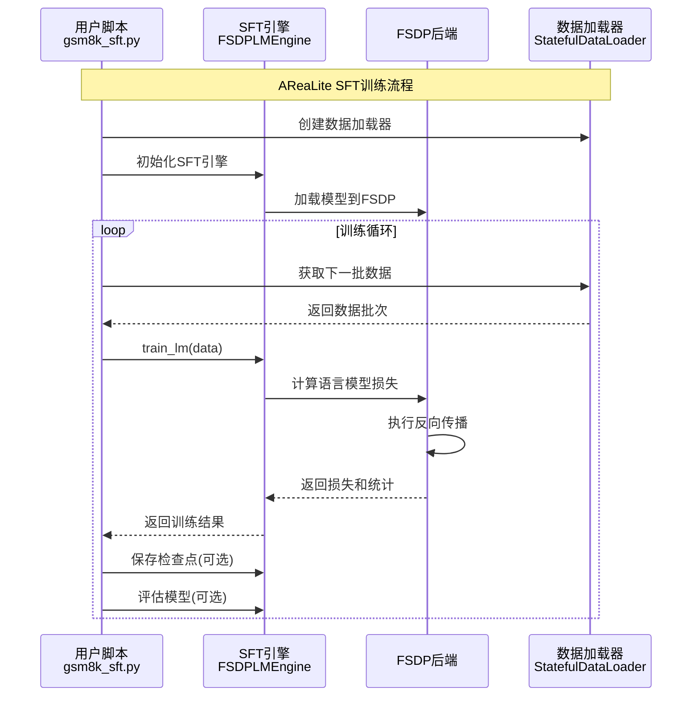

## 层次详细展开 

### 1. 应用层 (Entry Points) 详细架构

#### 静态结构图

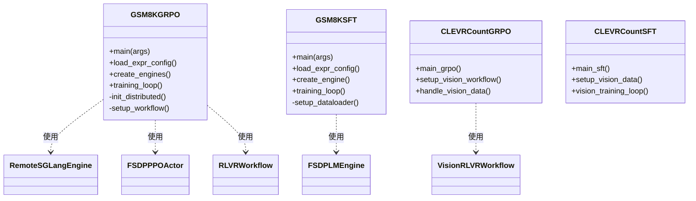

#### 应用层动态交互图

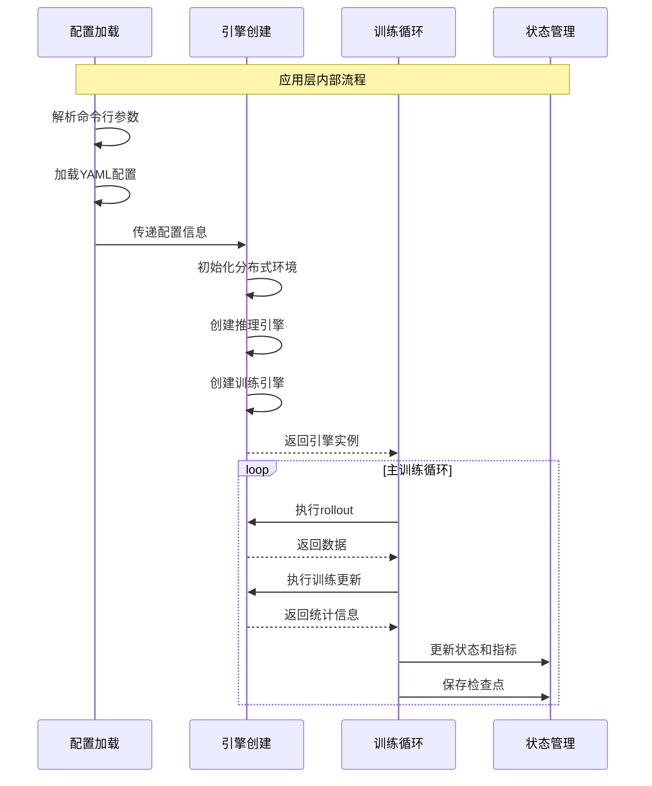

### 2. API 抽象层详细架构

#### 静态结构图

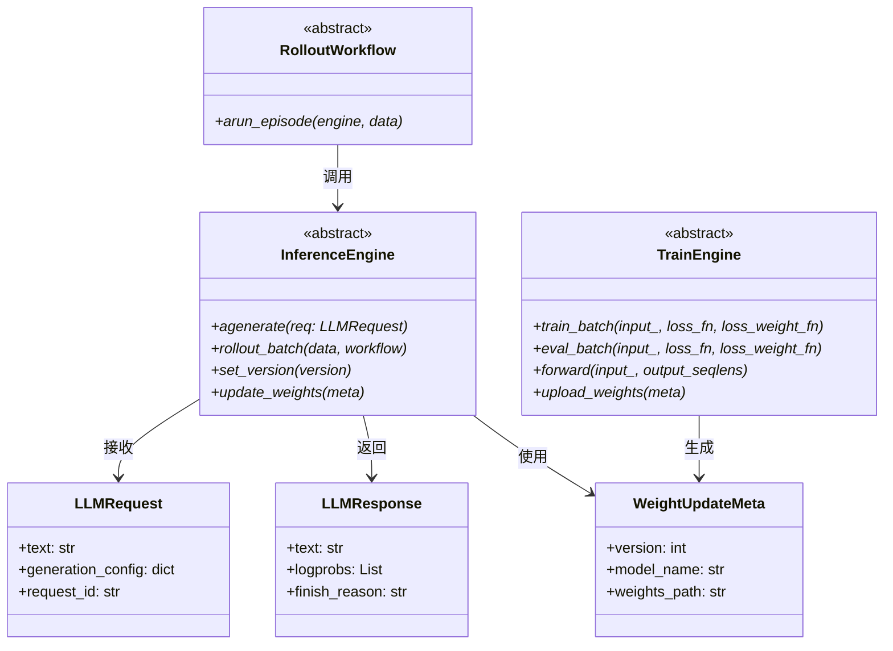

#### API层动态交互图

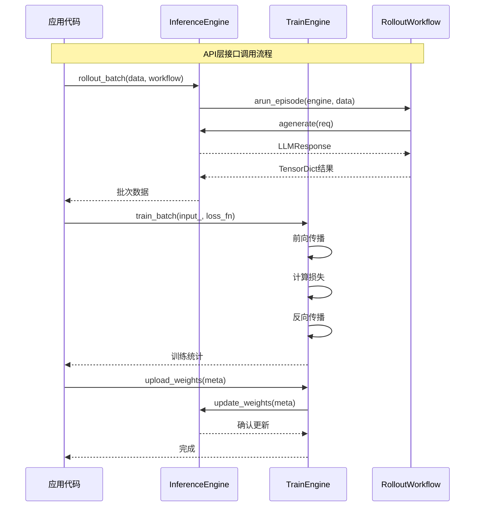

### 3. 算法实现层详细架构

#### 静态结构图

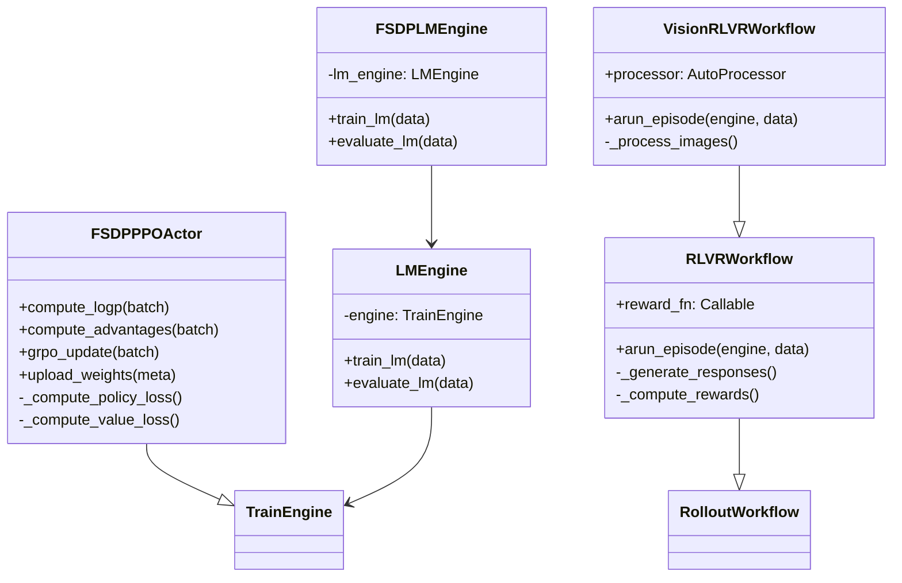

#### 算法层动态交互图

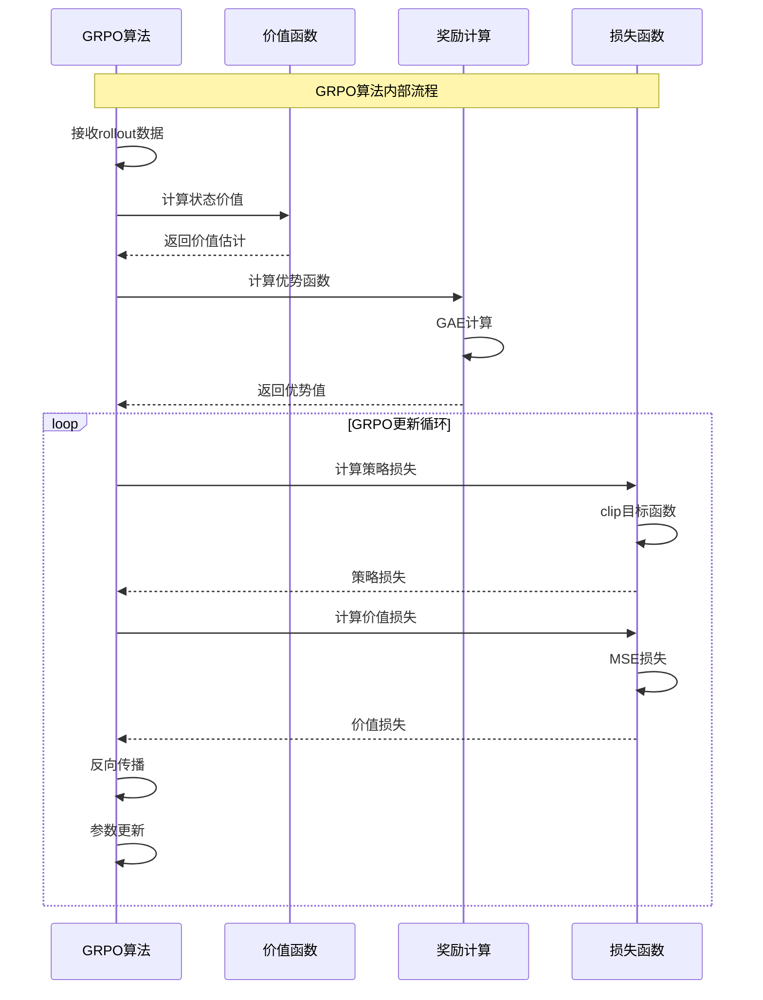

### 4. 引擎后端层详细架构

#### 静态结构图

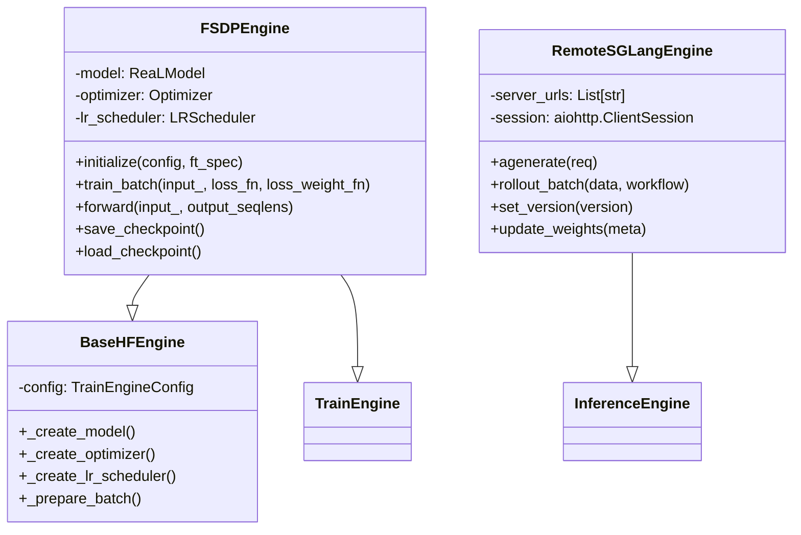

#### 引擎层动态交互图

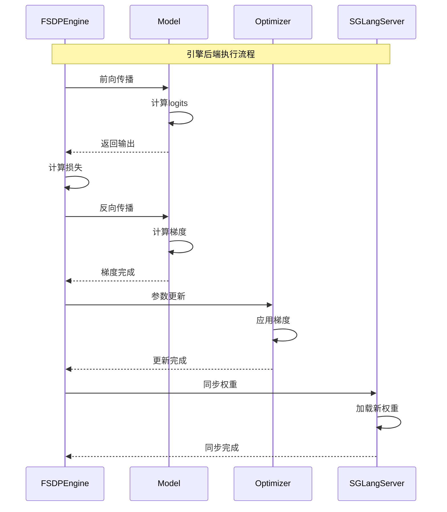

### 5. 工具支撑层详细架构

#### 静态结构图

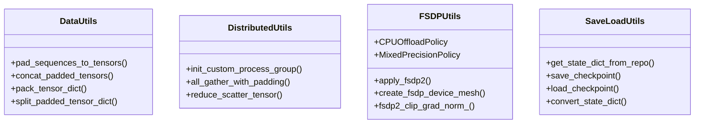

### 6. 启动器层详细架构

#### 静态结构图

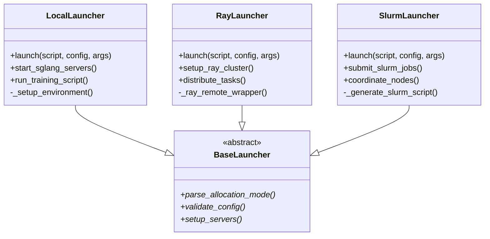

#### 启动器动态交互图

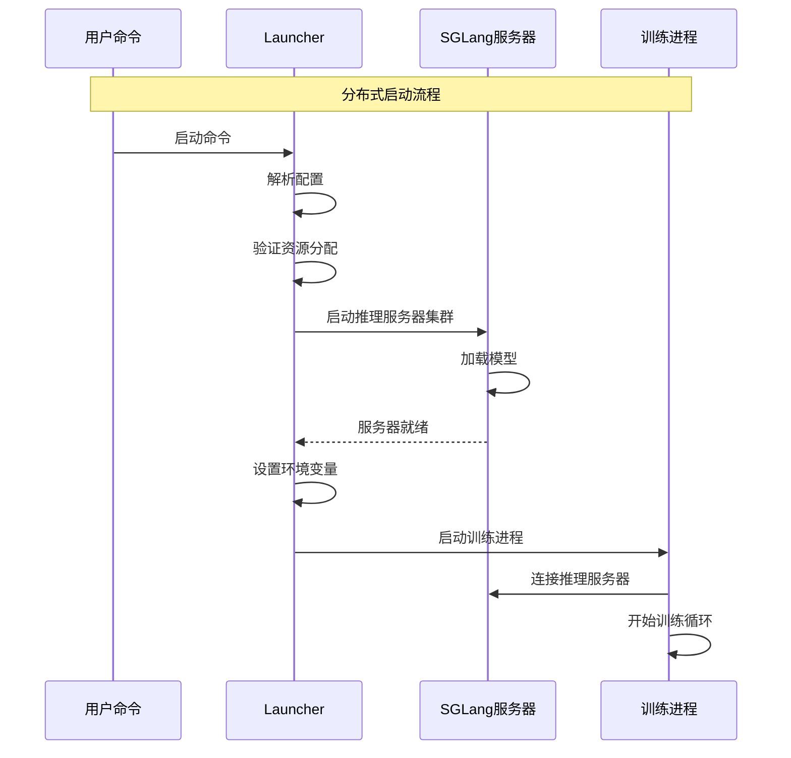

## 算法实现说明

### GRPO vs PPO

**重要声明**: AReaLite实际实现的是**GRPO (Group Relative Policy Optimization)**算法，而不是标准的PPO算法，这是一个关键的技术细节：

#### GRPO算法特点
- **Group-based设计**: 支持group_size配置，对多个样本进行分组优化
- **GRPO损失函数**: 使用专门的`grpo_loss_fn`函数 (位于`arealite/engine/ppo/actor.py`第286行)
- **配置差异**: 包含group_reward_norm、group_adv_norm等GRPO特有参数

#### 代码实现证据
```python
# 文件：arealite/engine/ppo/actor.py
def grpo_loss_fn(
    logits: torch.Tensor,
    input_data: Dict,
    temperature: float,
    eps_clip: float,
    c_clip: float | None,
    behav_imp_weight_cap: float | None,
):
    """GRPO算法的实际损失函数实现"""
    
# 文件：arealite/api/cli_args.py  
class GRPOConfig:
    """GRPO专用配置类"""
```

#### 为什么存在命名混淆
1. **历史原因**: 代码中的类名`PPOActor`和文件路径`engine/ppo/`保持了早期PPO实现的命名
2. **兼容性**: 保持了与Core系统中PPO接口的兼容性
3. **实际算法**: 尽管命名为PPO相关，但AReaLite实际执行的是GRPO算法逻辑

#### 示例文件确认
- `examples/arealite/gsm8k_grpo.py` - GSM8K的GRPO训练示例
- `examples/arealite/clevr_count_70k_grpo.py` - CLEVR的GRPO训练示例

这种设计确保了AReaLite在保持简单易用的同时，提供了比标准PPO更适合群组优化的GRPO算法实现。
