# Core 架构文档

## 高层功能层次视图

### 系统层次结构

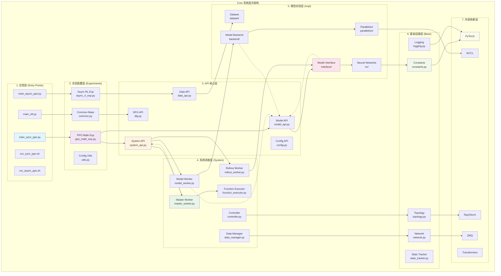
```mermaid
graph TB
    subgraph "Core 系统层次架构"
        subgraph "1. 应用层 (Entry Points)"
            APP1[main_sync_ppo.py]
            APP2[main_async_ppo.py]
            APP3[main_sft.py]
            APP4[run_sync_ppo.sh]
            APP5[run_async_ppo.sh]
        end
        
        subgraph "2. 实验配置层 (Experiments)"
            EXP1[PPO Math Exp<br/>ppo_math_exp.py]
            EXP2[Async RL Exp<br/>async_rl_exp.py]
            EXP3[Common Base<br/>common.py]
            EXP4[Config Utils<br/>utils.py]
        end
        
        subgraph "3. API 核心层"
            API1[System API<br/>system_api.py]
            API2[Model API<br/>model_api.py]
            API3[Data API<br/>data_api.py]
            API4[DFG API<br/>dfg.py]
            API5[Config API<br/>config.py]
        end
        
        subgraph "4. 系统调度层 (System)"
            SYS1[Master Worker<br/>master_worker.py]
            SYS2[Model Worker<br/>model_worker.py]
            SYS3[Rollout Worker<br/>rollout_worker.py]
            SYS4[Controller<br/>controller.py]
            SYS5[Data Manager<br/>data_manager.py]
            SYS6[Function Executor<br/>function_executor.py]
        end
        
        subgraph "5. 模型实现层 (Impl)"
            IMPL1[Model Interface<br/>interface/]
            IMPL2[Model Backend<br/>backend/]
            IMPL3[Neural Networks<br/>nn/]
            IMPL4[Parallelism<br/>parallelism/]
            IMPL5[Dataset<br/>dataset/]
        end
        
        subgraph "6. 基础设施层 (Base)"
            BASE1[Constants<br/>constants.py]
            BASE2[Logging<br/>logging.py]
            BASE3[Topology<br/>topology.py]
            BASE4[Network<br/>network.py]
            BASE5[Stats Tracker<br/>stats_tracker.py]
        end
        
        subgraph "7. 外部依赖层"
            DEP1[PyTorch]
            DEP2[Transformers]
            DEP3[Ray/Slurm]
            DEP4[ZMQ]
            DEP5[NCCL]
        end
    end
    
    %% 正向依赖关系
    APP1 --> EXP1
    APP2 --> EXP2
    APP3 --> EXP3
    
    EXP1 --> API1
    EXP1 --> API2
    EXP2 --> API3
    EXP3 --> API4
    
    API1 --> SYS1
    API1 --> SYS2
    API1 --> SYS3
    API2 --> IMPL1
    API3 --> IMPL5
    
    SYS1 --> SYS6
    SYS2 --> IMPL2
    SYS3 --> IMPL1
    SYS4 --> BASE3
    SYS5 --> BASE4
    
    IMPL1 --> IMPL3
    IMPL2 --> IMPL4
    IMPL3 --> BASE1
    IMPL4 --> DEP5
    
    BASE1 --> DEP1
    BASE2 --> DEP1
    BASE3 --> DEP3
    BASE4 --> DEP4
    
    %% 反向依赖 (双向依赖)
    SYS1 -.-> API1
    SYS2 -.-> API2
    IMPL1 -.-> API2
    IMPL2 -.-> API2
    
    style APP1 fill:#e1f5fe
    style EXP1 fill:#f3e5f5
    style API1 fill:#fff3e0
    style SYS1 fill:#e8f5e8
    style IMPL1 fill:#fce4ec
    style BASE1 fill:#f1f8e9
    style DEP1 fill:#f9fbe7
```

### 层次职责说明

1. **应用层**: 用户入口脚本，主要负责参数解析和启动实验
2. **实验配置层**: 定义具体实验的配置和数据流图(DFG)
3. **API 核心层**: 定义系统的核心抽象接口和数据结构
4. **系统调度层**: 实现分布式调度、工作节点管理和资源协调
5. **模型实现层**: 提供模型、数据集和算法的具体实现
6. **基础设施层**: 提供系统运行的基础工具和实用程序
7. **外部依赖层**: 第三方库和框架依赖

### 双向依赖说明

Core系统存在显著的双向依赖关系（用虚线表示）：
- **System-API双向依赖**: Worker实现需要同时实现API接口并调用API功能
- **Impl-API双向依赖**: 模型实现需要符合API规范，同时API需要知道具体实现细节
- 这种双向依赖体现了Core系统的复杂性，是分布式系统设计的权衡结果

## 典型场景动态流程图

### 同步PPO训练场景序列图

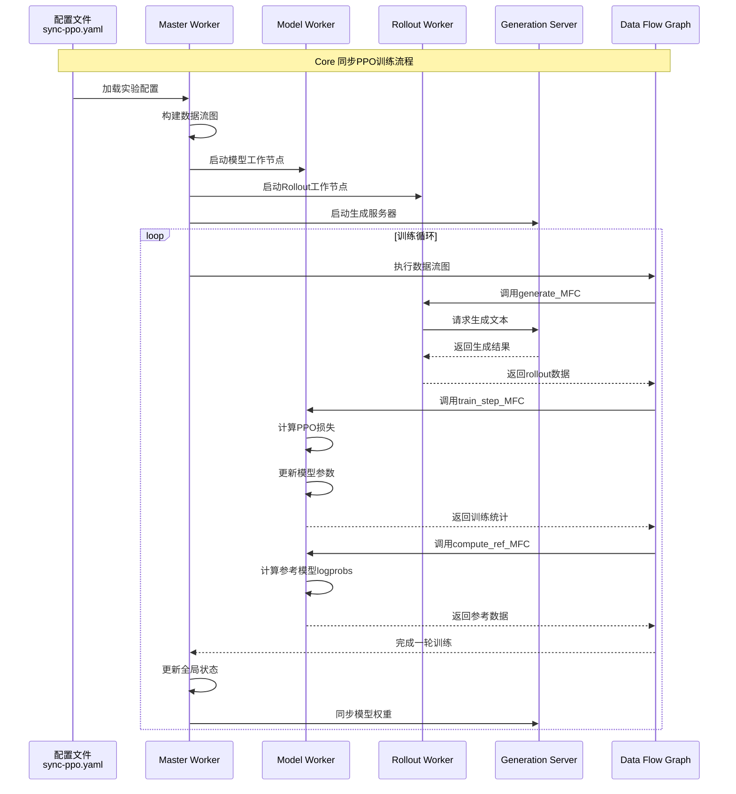
```mermaid
sequenceDiagram
    participant C as 配置文件<br/>sync-ppo.yaml
    participant M as Master Worker
    participant MW as Model Worker
    participant RW as Rollout Worker
    participant GS as Generation Server
    participant DF as Data Flow Graph
    
    Note over C,DF: Core 同步PPO训练流程
    
    C->>M: 加载实验配置
    M->>M: 构建数据流图
    M->>MW: 启动模型工作节点
    M->>RW: 启动Rollout工作节点
    M->>GS: 启动生成服务器
    
    loop 训练循环
        M->>DF: 执行数据流图
        DF->>RW: 调用generate_MFC
        RW->>GS: 请求生成文本
        GS-->>RW: 返回生成结果
        RW-->>DF: 返回rollout数据
        
        DF->>MW: 调用train_step_MFC
        MW->>MW: 计算PPO损失
        MW->>MW: 更新模型参数
        MW-->>DF: 返回训练统计
        
        DF->>MW: 调用compute_ref_MFC
        MW->>MW: 计算参考模型logprobs
        MW-->>DF: 返回参考数据
        
        DF-->>M: 完成一轮训练
        M->>M: 更新全局状态
        M->>GS: 同步模型权重
    end
```

### 异步PPO训练场景序列图

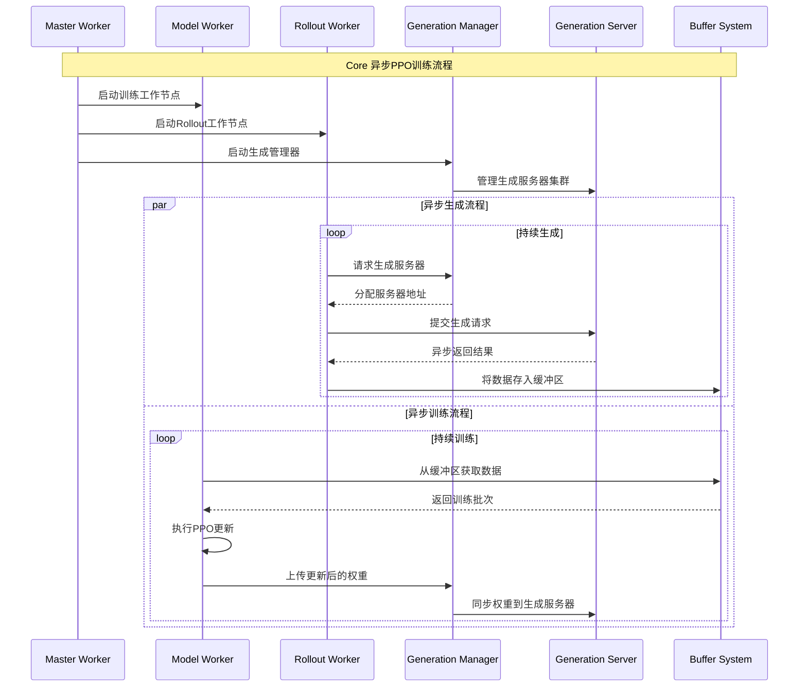
```mermaid
sequenceDiagram
    participant M as Master Worker
    participant MW as Model Worker
    participant RW as Rollout Worker
    participant GM as Generation Manager
    participant GS as Generation Server
    participant B as Buffer System
    
    Note over M,B: Core 异步PPO训练流程
    
    M->>MW: 启动训练工作节点
    M->>RW: 启动Rollout工作节点
    M->>GM: 启动生成管理器
    GM->>GS: 管理生成服务器集群
    
    par 异步生成流程
        loop 持续生成
            RW->>GM: 请求生成服务器
            GM-->>RW: 分配服务器地址
            RW->>GS: 提交生成请求
            GS-->>RW: 异步返回结果
            RW->>B: 将数据存入缓冲区
        end
    and 异步训练流程  
        loop 持续训练
            MW->>B: 从缓冲区获取数据
            B-->>MW: 返回训练批次
            MW->>MW: 执行PPO更新
            MW->>GM: 上传更新后的权重
            GM->>GS: 同步权重到生成服务器
        end
    end
```

## 层次详细展开

### 1. 应用层 (Entry Points) 详细架构

#### 静态结构图

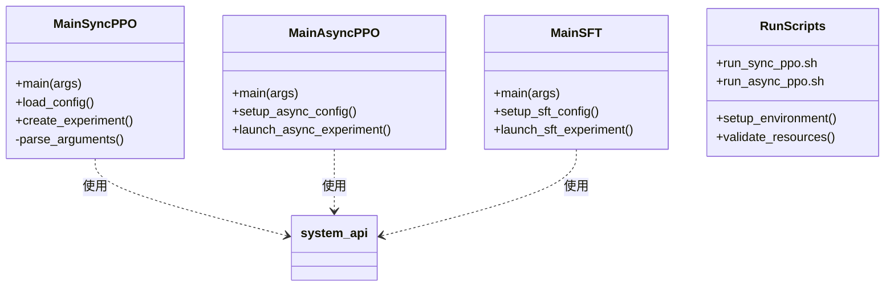
```mermaid
classDiagram
    class MainSyncPPO {
        +main(args)
        +load_config()
        +create_experiment()
        -parse_arguments()
    }
    
    class MainAsyncPPO {
        +main(args) 
        +setup_async_config()
        +launch_async_experiment()
    }
    
    class MainSFT {
        +main(args)
        +setup_sft_config()
        +launch_sft_experiment()
    }
    
    class RunScripts {
        +run_sync_ppo.sh
        +run_async_ppo.sh
        +setup_environment()
        +validate_resources()
    }
    
    MainSyncPPO ..> system_api : 使用
    MainAsyncPPO ..> system_api : 使用  
    MainSFT ..> system_api : 使用
```

#### 应用层动态交互图

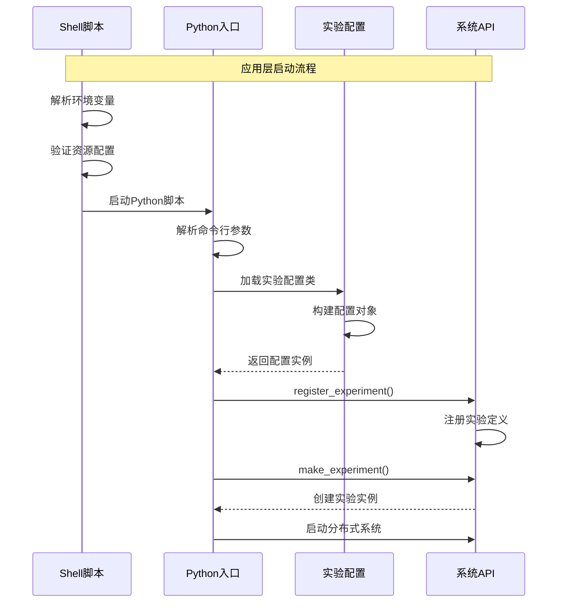
```mermaid
sequenceDiagram
    participant S as Shell脚本
    participant P as Python入口
    participant E as 实验配置
    participant A as 系统API
    
    Note over S,A: 应用层启动流程
    
    S->>S: 解析环境变量
    S->>S: 验证资源配置
    S->>P: 启动Python脚本
    
    P->>P: 解析命令行参数
    P->>E: 加载实验配置类
    E->>E: 构建配置对象
    E-->>P: 返回配置实例
    
    P->>A: register_experiment()
    A->>A: 注册实验定义
    P->>A: make_experiment()
    A-->>P: 创建实验实例
    
    P->>A: 启动分布式系统
```

### 2. 实验配置层详细架构

#### 静态结构图  

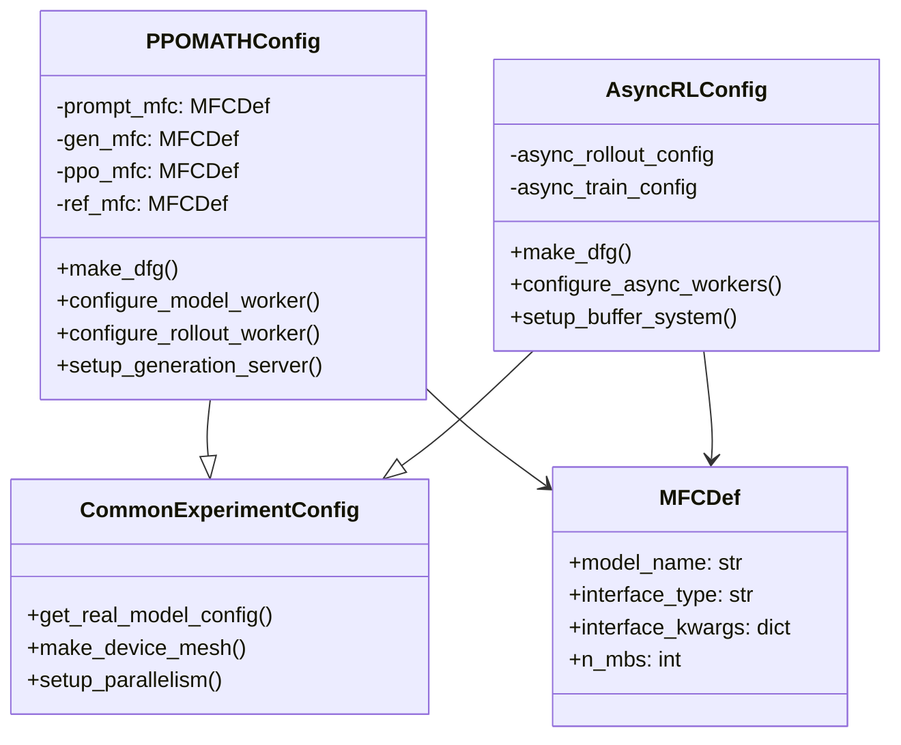
```mermaid
classDiagram
    class PPOMATHConfig {
        +make_dfg()
        +configure_model_worker()
        +configure_rollout_worker()
        +setup_generation_server()
        -prompt_mfc: MFCDef
        -gen_mfc: MFCDef  
        -ppo_mfc: MFCDef
        -ref_mfc: MFCDef
    }
    
    class AsyncRLConfig {
        +make_dfg()
        +configure_async_workers()
        +setup_buffer_system()
        -async_rollout_config
        -async_train_config
    }
    
    class CommonExperimentConfig {
        +get_real_model_config()
        +make_device_mesh()
        +setup_parallelism()
    }
    
    class MFCDef {
        +model_name: str
        +interface_type: str  
        +interface_kwargs: dict
        +n_mbs: int
    }
    
    PPOMATHConfig --|> CommonExperimentConfig
    AsyncRLConfig --|> CommonExperimentConfig
    PPOMATHConfig --> MFCDef
    AsyncRLConfig --> MFCDef
```

#### 实验配置层动态交互图

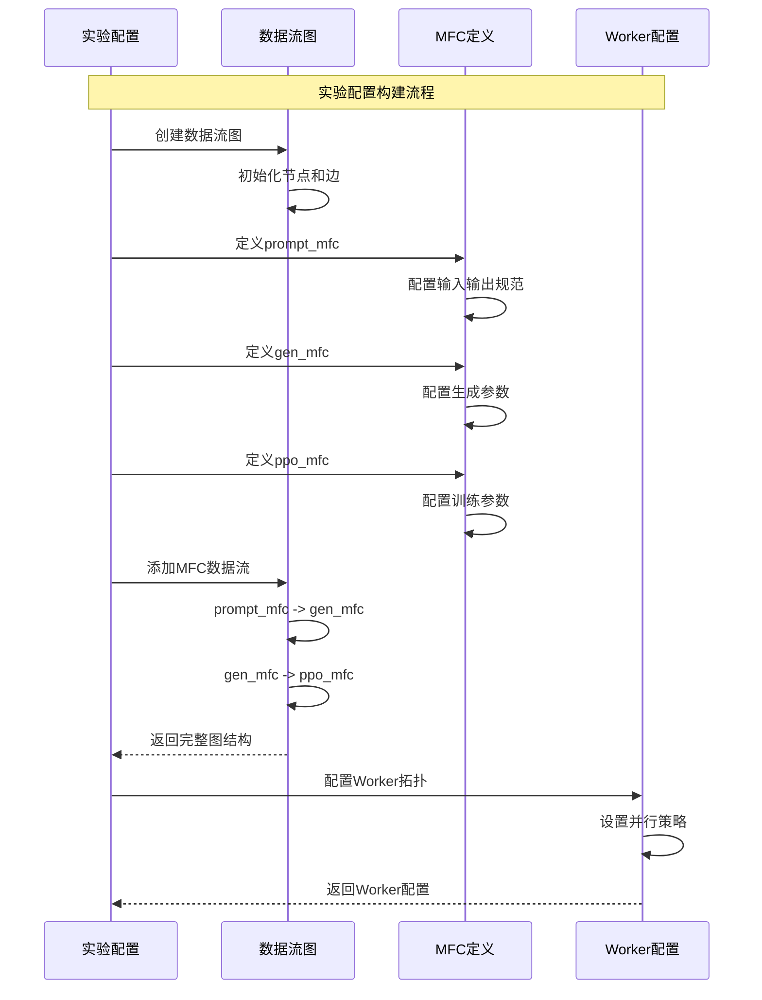
```mermaid
sequenceDiagram
    participant E as 实验配置
    participant D as 数据流图
    participant M as MFC定义
    participant W as Worker配置
    
    Note over E,W: 实验配置构建流程
    
    E->>D: 创建数据流图
    D->>D: 初始化节点和边
    
    E->>M: 定义prompt_mfc
    M->>M: 配置输入输出规范
    E->>M: 定义gen_mfc
    M->>M: 配置生成参数
    E->>M: 定义ppo_mfc  
    M->>M: 配置训练参数
    
    E->>D: 添加MFC数据流
    D->>D: prompt_mfc -> gen_mfc
    D->>D: gen_mfc -> ppo_mfc
    D-->>E: 返回完整图结构
    
    E->>W: 配置Worker拓扑
    W->>W: 设置并行策略
    W-->>E: 返回Worker配置
```

### 3. API 核心层详细架构

#### 静态结构图

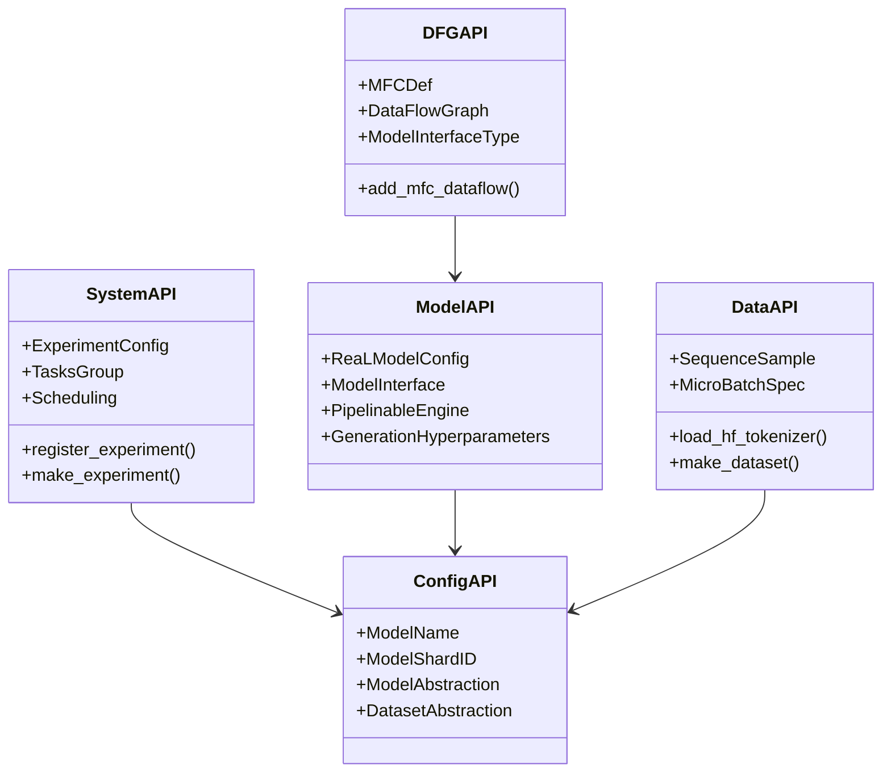
```mermaid
classDiagram
    class SystemAPI {
        +register_experiment()
        +make_experiment()
        +ExperimentConfig
        +TasksGroup
        +Scheduling
    }
    
    class ModelAPI {
        +ReaLModelConfig
        +ModelInterface
        +PipelinableEngine
        +GenerationHyperparameters
    }
    
    class DataAPI {
        +SequenceSample
        +MicroBatchSpec
        +load_hf_tokenizer()
        +make_dataset()
    }
    
    class DFGAPI {
        +MFCDef
        +DataFlowGraph
        +add_mfc_dataflow()
        +ModelInterfaceType
    }
    
    class ConfigAPI {
        +ModelName
        +ModelShardID
        +ModelAbstraction
        +DatasetAbstraction
    }
    
    SystemAPI --> ConfigAPI
    ModelAPI --> ConfigAPI  
    DataAPI --> ConfigAPI
    DFGAPI --> ModelAPI
```

#### API核心层动态交互图

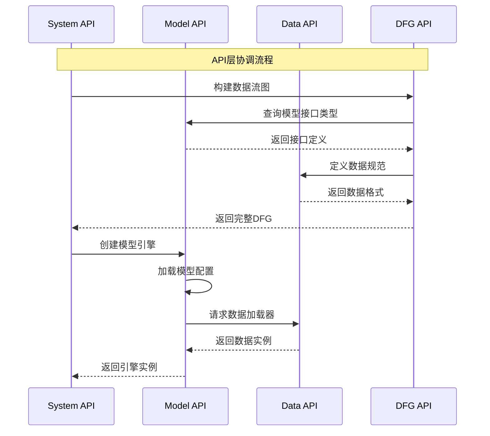
```mermaid
sequenceDiagram
    participant S as System API
    participant M as Model API
    participant D as Data API  
    participant F as DFG API
    
    Note over S,F: API层协调流程
    
    S->>F: 构建数据流图
    F->>M: 查询模型接口类型
    M-->>F: 返回接口定义
    F->>D: 定义数据规范
    D-->>F: 返回数据格式
    F-->>S: 返回完整DFG
    
    S->>M: 创建模型引擎
    M->>M: 加载模型配置
    M->>D: 请求数据加载器
    D-->>M: 返回数据实例
    M-->>S: 返回引擎实例
```

### 4. 系统调度层详细架构

#### 静态结构图

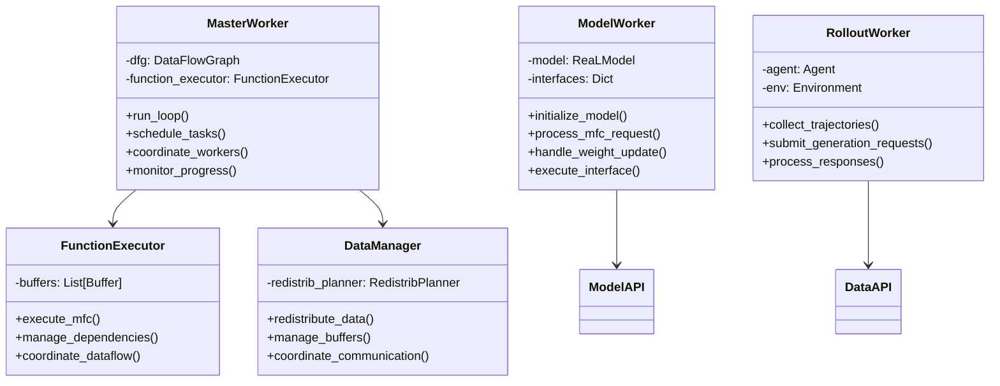
```mermaid
classDiagram
    class MasterWorker {
        +run_loop()
        +schedule_tasks()
        +coordinate_workers()
        +monitor_progress()
        -dfg: DataFlowGraph
        -function_executor: FunctionExecutor
    }
    
    class ModelWorker {
        +initialize_model()
        +process_mfc_request()
        +handle_weight_update()
        +execute_interface()
        -model: ReaLModel
        -interfaces: Dict
    }
    
    class RolloutWorker {
        +collect_trajectories()
        +submit_generation_requests()
        +process_responses()
        -agent: Agent
        -env: Environment
    }
    
    class DataManager {
        +redistribute_data()
        +manage_buffers()
        +coordinate_communication()
        -redistrib_planner: RedistribPlanner
    }
    
    class FunctionExecutor {
        +execute_mfc()
        +manage_dependencies()
        +coordinate_dataflow()
        -buffers: List[Buffer]
    }
    
    MasterWorker --> FunctionExecutor
    MasterWorker --> DataManager
    ModelWorker --> ModelAPI
    RolloutWorker --> DataAPI
```

#### 系统调度层动态交互图

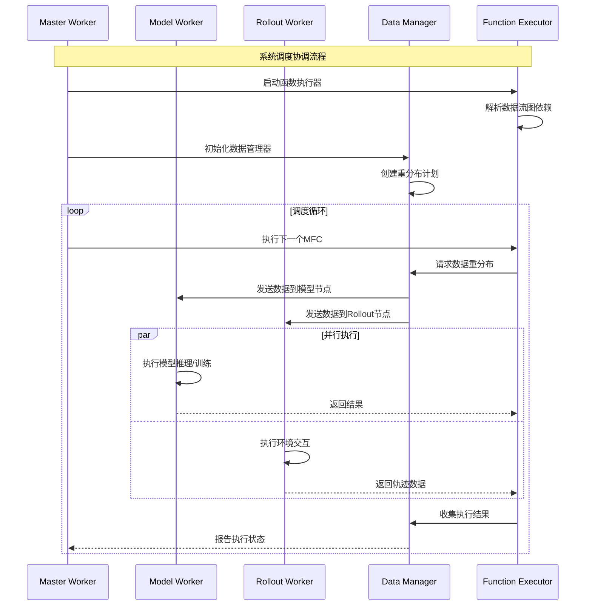
```mermaid
sequenceDiagram
    participant M as Master Worker
    participant MW as Model Worker
    participant RW as Rollout Worker
    participant DM as Data Manager
    participant FE as Function Executor
    
    Note over M,FE: 系统调度协调流程
    
    M->>FE: 启动函数执行器
    FE->>FE: 解析数据流图依赖
    
    M->>DM: 初始化数据管理器
    DM->>DM: 创建重分布计划
    
    loop 调度循环
        M->>FE: 执行下一个MFC
        FE->>DM: 请求数据重分布
        DM->>MW: 发送数据到模型节点
        DM->>RW: 发送数据到Rollout节点
        
        par 并行执行
            MW->>MW: 执行模型推理/训练
            MW-->>FE: 返回结果
        and
            RW->>RW: 执行环境交互
            RW-->>FE: 返回轨迹数据  
        end
        
        FE->>DM: 收集执行结果
        DM-->>M: 报告执行状态
    end
```

### 5. 模型实现层详细架构

#### 静态结构图

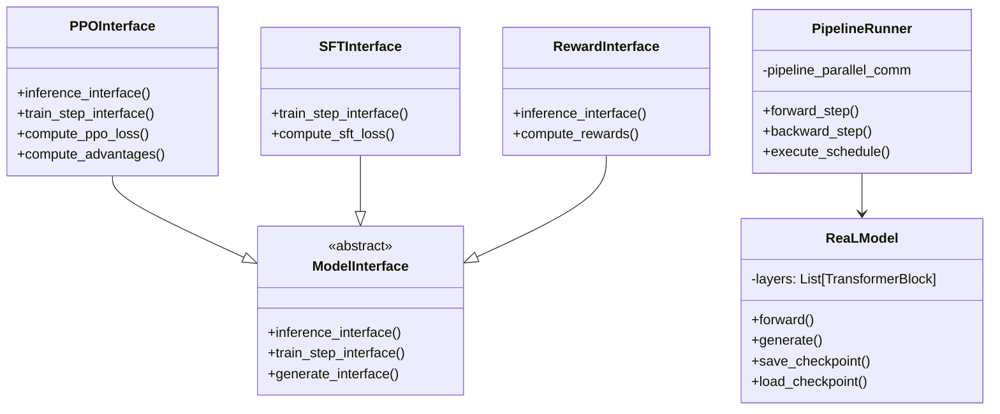
```mermaid
classDiagram
    class ModelInterface {
        <<abstract>>
        +inference_interface()
        +train_step_interface()
        +generate_interface()
    }
    
    class PPOInterface {
        +inference_interface()
        +train_step_interface()
        +compute_ppo_loss()
        +compute_advantages()
    }
    
    class SFTInterface {
        +train_step_interface()
        +compute_sft_loss()
    }
    
    class RewardInterface {
        +inference_interface() 
        +compute_rewards()
    }
    
    class PipelineRunner {
        +forward_step()
        +backward_step()
        +execute_schedule()
        -pipeline_parallel_comm
    }
    
    class ReaLModel {
        +forward()
        +generate()
        +save_checkpoint()
        +load_checkpoint()
        -layers: List[TransformerBlock]
    }
    
    PPOInterface --|> ModelInterface
    SFTInterface --|> ModelInterface
    RewardInterface --|> ModelInterface
    PipelineRunner --> ReaLModel
```

#### 模型实现层动态交互图

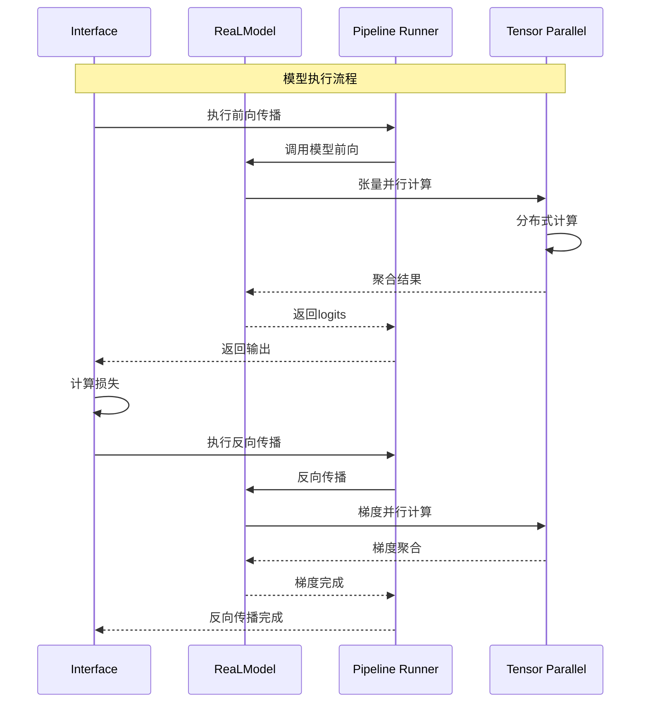
```mermaid
sequenceDiagram
    participant I as Interface
    participant M as ReaLModel
    participant P as Pipeline Runner
    participant T as Tensor Parallel
    
    Note over I,T: 模型执行流程
    
    I->>P: 执行前向传播
    P->>M: 调用模型前向
    M->>T: 张量并行计算
    T->>T: 分布式计算
    T-->>M: 聚合结果
    M-->>P: 返回logits
    P-->>I: 返回输出
    
    I->>I: 计算损失
    I->>P: 执行反向传播
    P->>M: 反向传播
    M->>T: 梯度并行计算
    T-->>M: 梯度聚合
    M-->>P: 梯度完成
    P-->>I: 反向传播完成
```

### 6. 基础设施层详细架构

#### 静态结构图

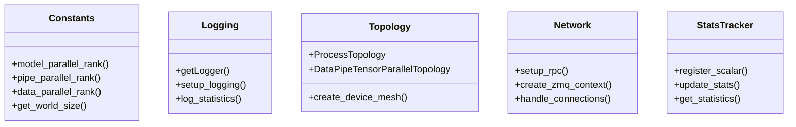
```mermaid
classDiagram
    class Constants {
        +model_parallel_rank()
        +pipe_parallel_rank()
        +data_parallel_rank()
        +get_world_size()
    }
    
    class Logging {
        +getLogger()
        +setup_logging()
        +log_statistics()
    }
    
    class Topology {
        +ProcessTopology
        +DataPipeTensorParallelTopology
        +create_device_mesh()
    }
    
    class Network {
        +setup_rpc()
        +create_zmq_context()
        +handle_connections()
    }
    
    class StatsTracker {
        +register_scalar()
        +update_stats()
        +get_statistics()
    }
```

#### 基础设施层动态交互图

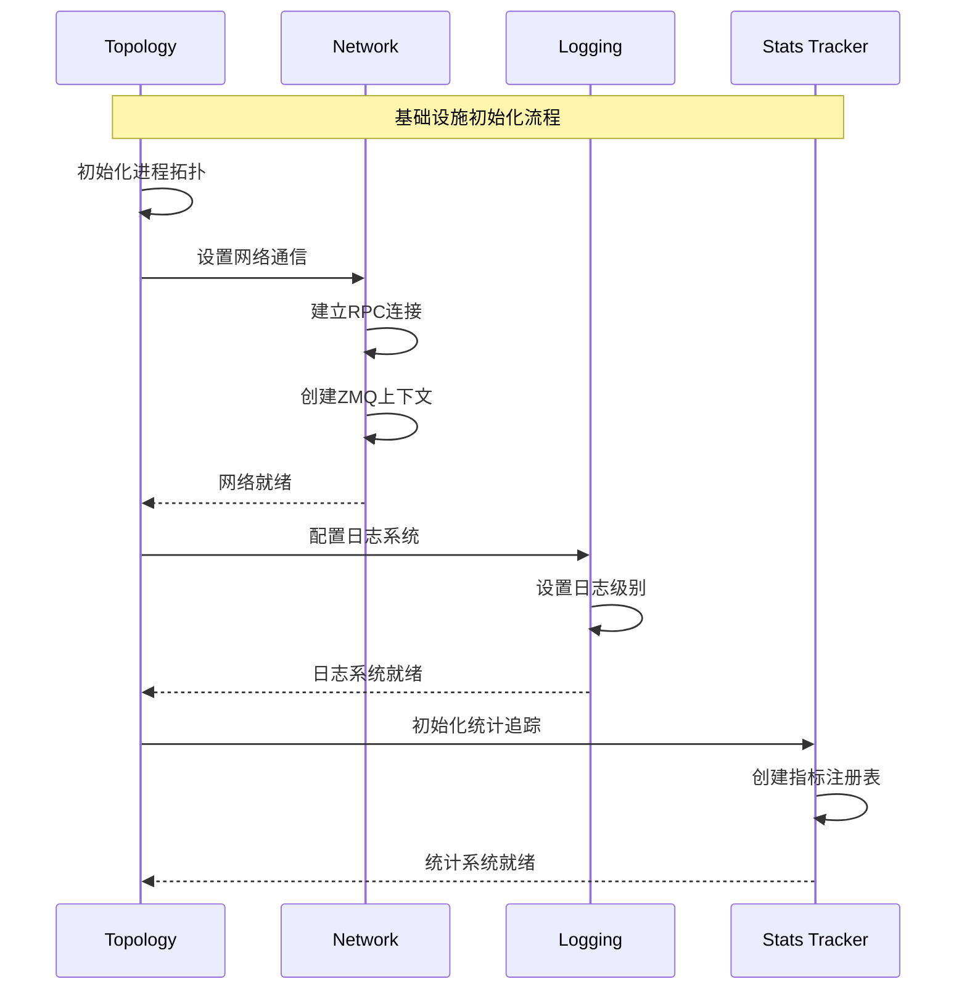
```mermaid
sequenceDiagram
    participant T as Topology
    participant N as Network
    participant L as Logging
    participant S as Stats Tracker
    
    Note over T,S: 基础设施初始化流程
    
    T->>T: 初始化进程拓扑
    T->>N: 设置网络通信
    N->>N: 建立RPC连接
    N->>N: 创建ZMQ上下文
    N-->>T: 网络就绪
    
    T->>L: 配置日志系统
    L->>L: 设置日志级别
    L-->>T: 日志系统就绪
    
    T->>S: 初始化统计追踪
    S->>S: 创建指标注册表
    S-->>T: 统计系统就绪
```
