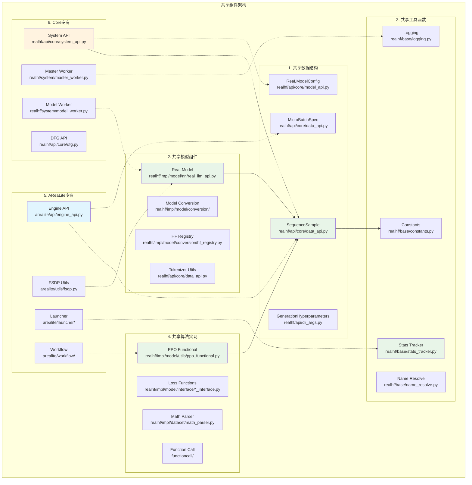
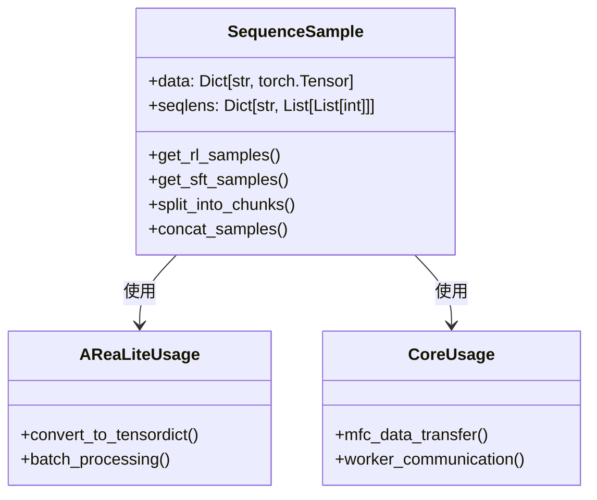
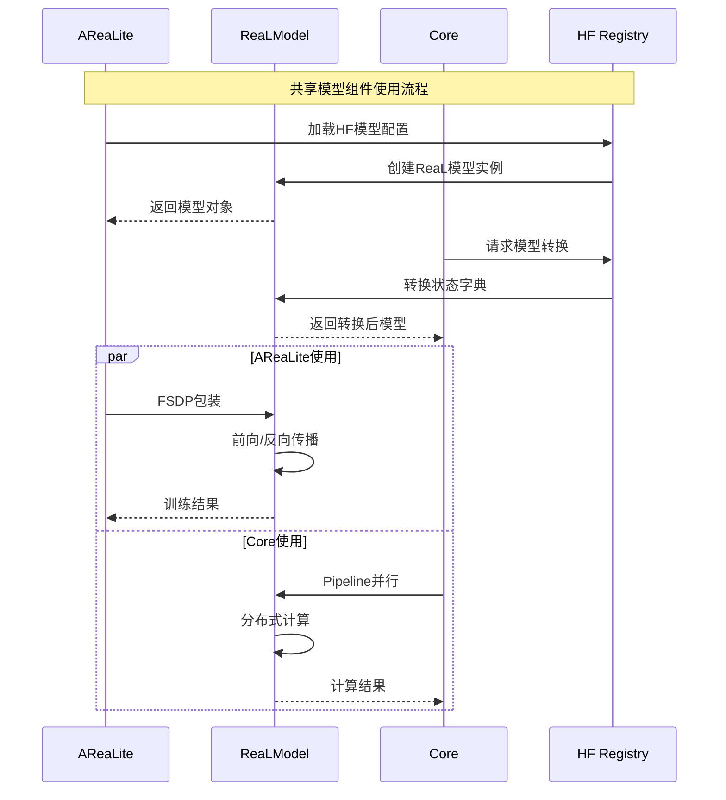
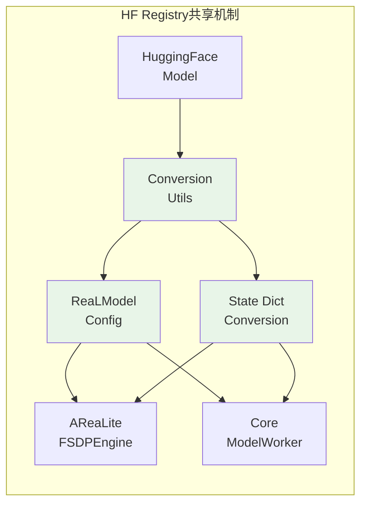
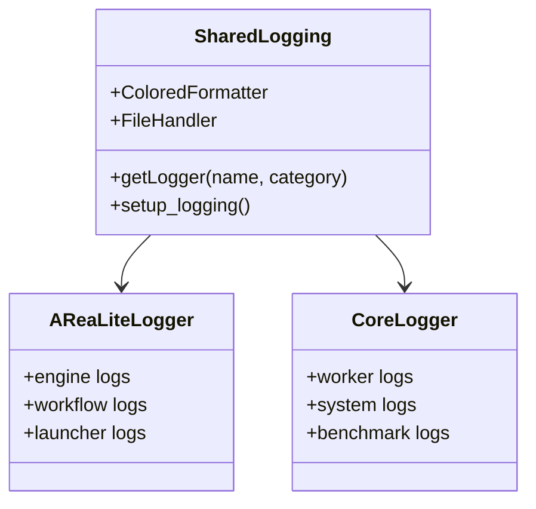
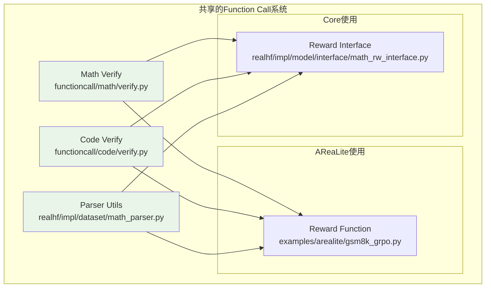
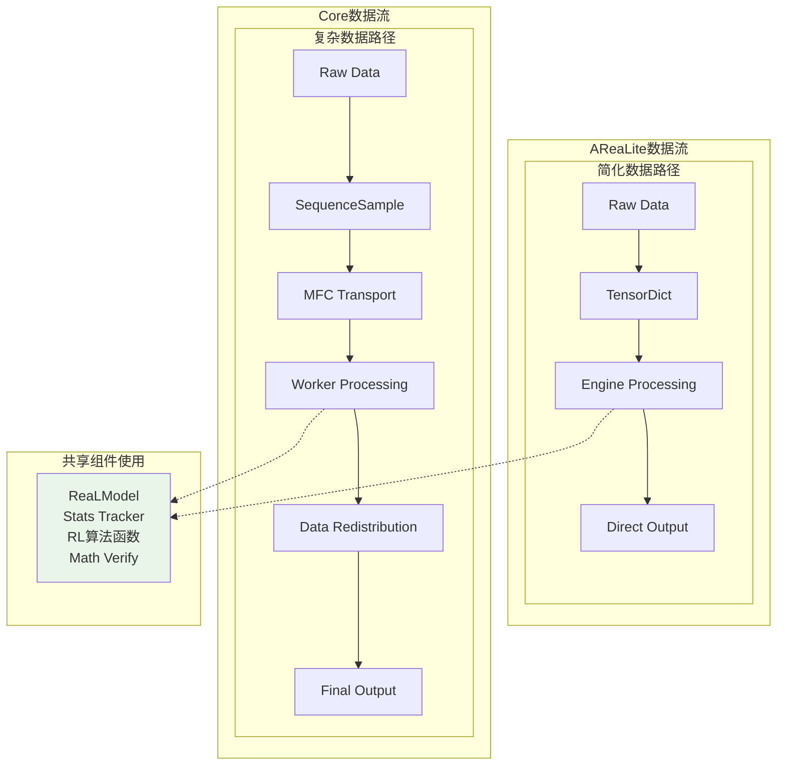
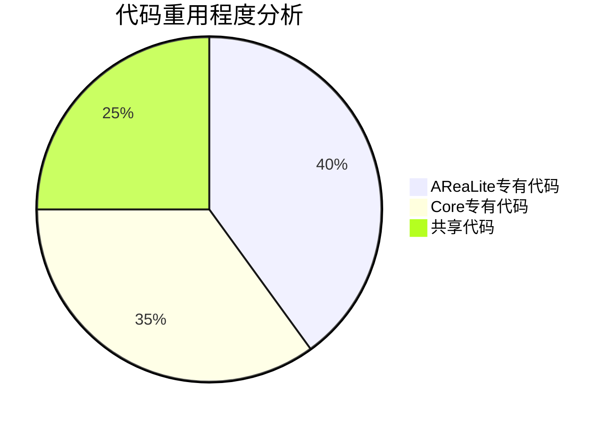
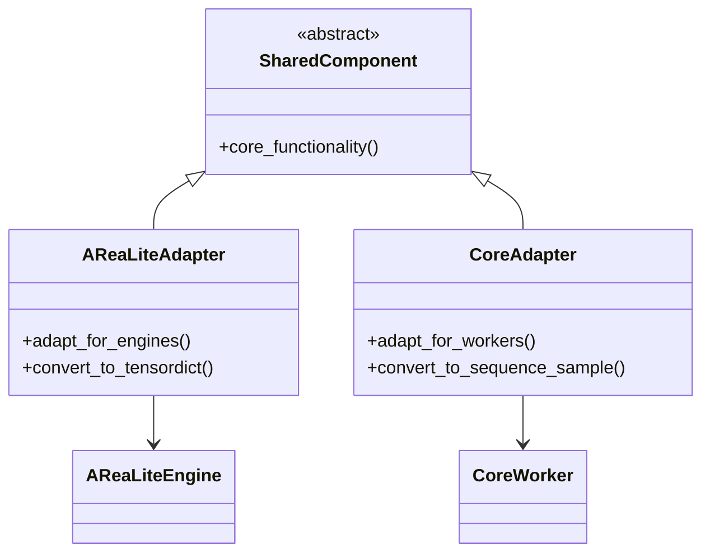

# AReaLite 与 Core 共享组件架构文档

## 概述

AReaLite和Core系统虽然在架构设计上有显著差异，但在某些底层实现和功能模块上存在共享。本文档详细分析两个系统之间的重叠部分，包括共享的代码模块、数据结构和工具函数。

## 共享组件总览



## 详细共享组件分析

### 1. 共享数据结构

#### SequenceSample - 统一序列数据格式



**使用差异**：
- **AReaLite**: 主要用于Engine之间的数据传递，通常转换为TensorDict格式
- **Core**: 用于Worker之间的MFC调用，保持原始SequenceSample格式

#### MicroBatchSpec - 微批次规范

```python
# 共享的微批次规范定义
@dataclasses.dataclass
class MicroBatchSpec:
    mbs: int  # 微批次大小
    n_mbs: int  # 微批次数量
    
# AReaLite中的使用
def train_batch(self, input_: TensorDict, loss_fn, loss_weight_fn):
    mb_spec = MicroBatchSpec(mbs=self.config.micro_batch_size, n_mbs=...)
    return self._train_batch_impl(input_, mb_spec, loss_fn, loss_weight_fn)

# Core中的使用  
def process_mfc_request(self, request):
    mb_spec = request.mb_spec
    return self.interface.run_interface(request.data, mb_spec)
```

### 2. 共享模型组件

#### ReaLModel - 统一模型实现



**使用差异分析**：

| 维度 | AReaLite | Core |
|------|----------|------|
| **包装方式** | FSDP2包装 | Pipeline + Tensor并行 |
| **初始化** | 直接在Engine中创建 | 通过ModelWorker管理 |
| **权重同步** | 手动上传到SGLang | 自动通过Worker系统 |
| **内存管理** | FSDP CPU卸载 | Pipeline分块加载 |

#### 模型转换工具



### 3. 共享工具函数

#### Stats Tracker - 统计追踪系统

```python
# 共享的统计追踪接口
from realhf.base import stats_tracker

# AReaLite中的使用
def grpo_update(self, batch):
    with stats_tracker.time("grpo_update"):
        loss = self.compute_loss(batch)
        stats_tracker.register_scalar("grpo_loss", loss.item())
        return {"loss": loss}

# Core中的使用  
def train_step_interface(self, data, mb_spec):
    with stats_tracker.time("train_step"):
        result = self.model.forward(data)
        stats_tracker.register_scalar("train_loss", result.loss)
        return result
```

#### Logging系统



### 4. 共享算法实现

#### GRPO算法核心函数

```python
# 共享的算法计算函数 (文件命名仍为ppo_functional但AReaLite实现GRPO)
from realhf.impl.model.utils import ppo_functional

# AReaLite中的使用 (实际是GRPO算法)
class FSDPPPOActor:
    def compute_advantages(self, batch):
        return ppo_functional.compute_gae(
            values=batch["values"],
            rewards=batch["rewards"], 
            gamma=self.config.gamma,
            lam=self.config.lam
        )
    
    def grpo_update(self, batch):
        # 注意：AReaLite实际使用GRPO算法，虽然调用相同的函数
        return ppo_functional.compute_ppo_loss(
            logprobs=batch["logprobs"],
            old_logprobs=batch["old_logprobs"],
            advantages=batch["advantages"],
            clip_ratio=self.config.clip_ratio
        )

# Core中的使用 (标准PPO算法)
class PPOInterface:
    def train_step_interface(self, data, mb_spec):
        advantages = ppo_functional.compute_gae(...)
        loss = ppo_functional.compute_ppo_loss(...)
        return SequenceSample(data={"loss": loss})
```

#### 数学验证函数



### 5. 架构差异对比

#### 数据流对比



#### 代码重用程度分析



**共享度分析**：
- **高度共享** (90%+): 基础模型实现、数学函数、工具类
- **部分共享** (50-90%): 数据结构定义、算法接口  
- **独立实现** (0-50%): 系统架构、启动器、工作流

### 6. 共享组件的设计模式

#### 适配器模式



#### 策略模式

```python
# 共享接口，不同实现策略
class ModelLoadStrategy:
    def load_model(self, config): pass

class AReaLiteFSDPStrategy(ModelLoadStrategy):
    def load_model(self, config):
        model = create_real_model(config)
        return apply_fsdp2(model)

class CorePipelineStrategy(ModelLoadStrategy):  
    def load_model(self, config):
        model = create_real_model(config)
        return setup_pipeline_parallel(model)
```

## 共享组件演进建议

### 1. 增强共享度
- 提取更多通用算法到shared模块
- 统一数据格式转换接口
- 共享更多工具函数

### 2. 减少耦合
- 通过接口而非具体实现依赖
- 使用依赖注入模式
- 增加配置驱动的组件选择

### 3. 向前兼容
- 保持共享接口的稳定性
- 提供版本兼容层
- 渐进式重构策略

这种共享设计体现了代码复用的价值，同时允许两个系统在架构层面保持各自的设计哲学和优化目标。
