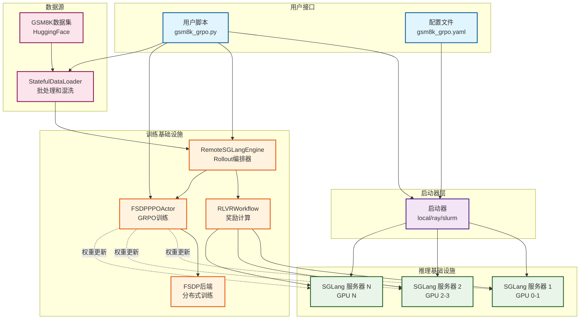
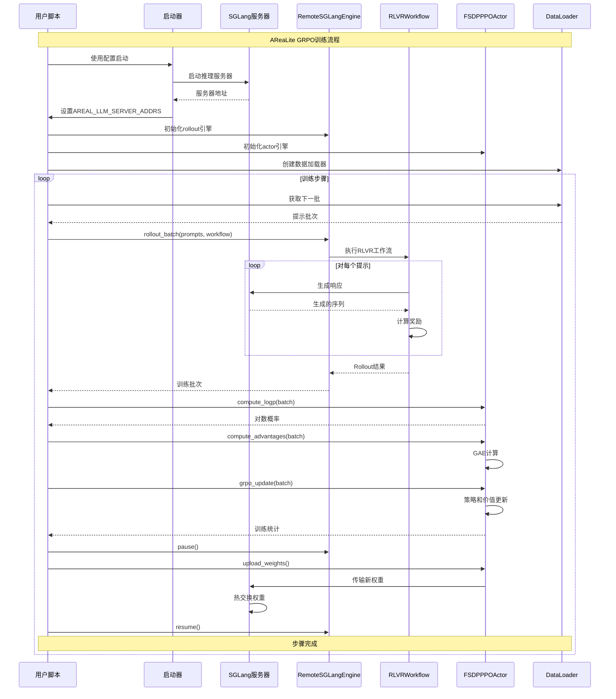

# AReaLite 架构概览

AReaLite是一个轻量级、以AI为中心的RLHF（人类反馈强化学习）实现，专为1-64 GPU规模设计。本文档提供AReaLite的全面架构概览，包括其核心组件、数据流和交互模式。

## 系统架构图

下图展示了完整的AReaLite系统架构，显示了典型GRPO训练工作流程中关键组件之间的交互：

## 核心组件

### 1. 启动器层
启动器管理分布式训练的完整生命周期：
- **本地启动器**: 使用子进程进行单节点训练
- **Ray启动器**: 使用Ray进行多节点分布式训练  
- **Slurm启动器**: 与Slurm作业调度器集成

**主要职责:**
- 以适当的资源分配启动SGLang推理服务器
- 设置环境变量用于服务器发现
- 以正确的分布式配置启动训练进程

### 2. 推理基础设施  
SGLang服务器提供高吞吐量文本生成：
- **分布式部署**: 跨可用GPU的多个服务器
- **张量并行**: 每个服务器内部可以使用多个GPU
- **版本管理**: 支持来自训练进程的权重更新

**主要特性:**
- 为RLVR工作流提供流式生成
- 跨服务器自动负载均衡
- 训练期间热权重交换

### 3. 训练基础设施
训练端编排GRPO算法执行：

#### RemoteSGLangEngine
- 充当rollout编排器
- 管理到多个SGLang服务器的连接
- 实现批处理和队列以实现高效推理

#### RLVRWorkflow  
- 执行Rollout-Learning-Verify-Reward工作流
- 为每个提示生成多个响应
- 使用可配置的奖励函数计算奖励

#### FSDPPPOActor
- 实现GRPO（群体相对策略优化）算法
- 使用FSDP2进行分布式参数和梯度管理
- 处理优势计算和策略更新

### 4. 数据管道
高效的数据加载和预处理：
- **HuggingFace集成**: 直接从HuggingFace数据集加载
- **分布式拆分**: 跨rank自动数据分区
- **有状态DataLoader**: 支持检查点和恢复

## 训练流程序列

## 关键设计原则

### 1. 简单易用
- **单脚本入口**: 用户只需编写一个训练脚本
- **统一配置**: 所有设置通过YAML文件管理
- **最少样板代码**: 高级API抽象复杂的分布式操作

### 2. 异步效率  
- **解耦推理**: Rollout和训练可以独立运行
- **管道并行**: 推理和训练可以重叠
- **批次优化**: 动态批处理实现最大吞吐量

### 3. 可扩展性和灵活性
- **多尺度支持**: 从单GPU到64+ GPU集群
- **启动器无关**: 适用于本地、Ray或Slurm环境
- **模块化架构**: 易于扩展自定义工作流和奖励函数

### 4. 资源效率
- **FSDP2集成**: 先进的内存和通信优化
- **SGLang后端**: 具有KV缓存优化的高性能推理
- **热权重更新**: 无需重启推理服务器

## 算法实现：GRPO

AReaLite实现的是**GRPO（群体相对策略优化）**而不是标准PPO：

### GRPO关键特性
- **基于群体的优化**: 在群体中处理样本进行相对比较
- **增强稳定性**: 在多响应场景中比标准PPO更稳定
- **灵活的群体大小**: 不同任务可配置的group_size参数

### GRPO vs PPO差异

| 方面 | 标准PPO | GRPO (AReaLite) |
|------|---------|-----------------|
| 样本处理 | 单独样本 | 基于群体的批次 |
| 优势计算 | 单独优势 | 群体相对优势 |
| 损失函数 | 标准截断损失 | 群体相对截断损失 |
| 奖励归一化 | 全局归一化 | 群体内归一化 |
| 配置 | eps_clip, c_clip | group_size, group_reward_norm, group_adv_norm |

### 实现位置
- **核心算法**: `arealite/engine/ppo/actor.py` - `grpo_loss_fn()` 函数
- **配置**: `arealite/api/cli_args.py` - `GRPOConfig` 类  
- **示例**: `examples/arealite/gsm8k_grpo.py`, `examples/arealite/clevr_count_70k_grpo.py`

## 性能特征

### 吞吐量优化
- **并发推理**: 多个SGLang服务器减少推理瓶颈
- **批次聚合**: 动态批处理最大化GPU利用率
- **流式生成**: 减少多轮对话延迟

### 内存效率
- **FSDP2分片**: 参数和梯度跨GPU分片
- **梯度检查点**: 在大型模型中用计算换内存
- **KV缓存管理**: SGLang优化注意力缓存使用

### 通信优化
- **减少All-Reduce**: FSDP2最小化通信开销
- **异步权重更新**: 非阻塞权重同步
- **本地梯度累积**: 减少通信频率

## 扩展点

### 自定义工作流
- 扩展`RolloutWorkflow`以实现自定义奖励函数
- 实现特定领域的响应处理
- 添加工具调用和智能体能力

### 自定义引擎
- 实现替代推理后端
- 添加对不同模型架构的支持
- 与其他分布式训练框架集成

### 自定义算法
- 扩展到GRPO之外的其他RL算法  
- 实现自定义损失函数
- 添加算法改进和研究功能

这种架构为可扩展的RLHF训练提供了坚实的基础，同时为研究人员和从业者保持了简单性。
