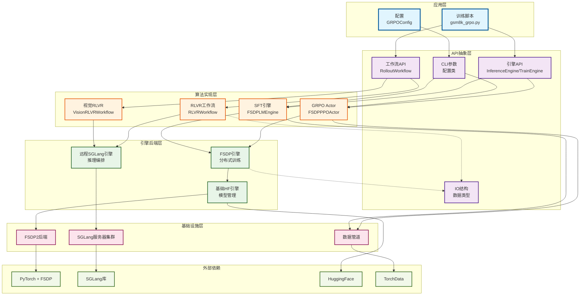
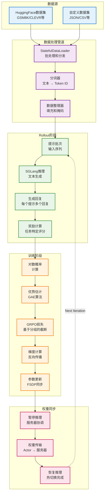
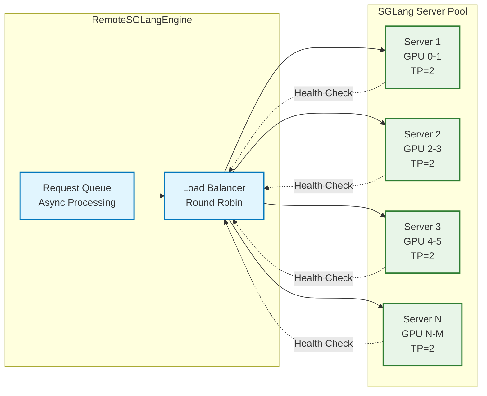

# AReaLite 组件架构

本文档提供AReaLite核心组件及其交互的详细架构视图，旨在为开发者提供对系统内部结构的清晰理解。

## 组件交互架构



## 核心组件详情

### 1. FSDPPPOActor (GRPO实现)

```mermaid
classDiagram
    class FSDPPPOActor {
        +config: PPOActorConfig
        +engine: TrainEngine
        +reward_bias: float
        +reward_scaling: float
        +group_size: int
        +kl_ctl: float
        
        +compute_logp(data: TensorDict) torch.Tensor
        +compute_advantages(data: TensorDict) void
        +grpo_update(data: TensorDict) List[Dict]
        +upload_weights(meta: WeightUpdateMeta) void
        +set_version(version: int) void
        
        -_compute_rewards() torch.Tensor
        -_compute_gae() torch.Tensor
        -_apply_group_normalization() void
    }
    
    class GRPOConfig {
        +eps_clip: float
        +c_clip: Optional[float]
        +group_size: int
        +group_reward_norm: bool  
        +group_adv_norm: bool
        +reward_bias: float
        +reward_scaling: float
        +kl_ctl: float
        +adv_norm: bool
        +discount: float
        +gae_lambda: float
    }
    
    class TrainEngine {
        <<interface>>
        +train_batch(input_, loss_fn, loss_weight_fn)*
        +forward(input_, output_seqlens)*
        +upload_weights(meta)*
        +save_checkpoint()*
        +load_checkpoint()*
    }
    
    FSDPPPOActor --> GRPOConfig : 使用
    FSDPPPOActor --> TrainEngine : 实现
    
    note for FSDPPPOActor : "实现GRPO算法\n基于分组的优化"
```

### 2. RemoteSGLangEngine (推理编排)

```mermaid
classDiagram
    class RemoteSGLangEngine {
        +server_urls: List[str]
        +session: aiohttp.ClientSession
        +version: int
        
        +agenerate(req: LLMRequest) LLMResponse
        +rollout_batch(data, workflow) TensorDict
        +update_weights(meta: WeightUpdateMeta) Future
        +set_version(version: int) void
        +pause() void
        +resume() void
        
        -_load_balance_request() str
        -_aggregate_responses() List[LLMResponse]
        -_handle_server_error() void
    }
    
    class LLMRequest {
        +text: str
        +generation_config: dict
        +request_id: str
        +stream: bool
    }
    
    class LLMResponse {
        +text: str
        +logprobs: List[float]
        +finish_reason: str
        +usage: dict
    }
    
    class WeightUpdateMeta {
        +version: int
        +model_name: str
        +weights_path: str
        +metadata: dict
    }
    
    RemoteSGLangEngine --> LLMRequest : processes
    RemoteSGLangEngine --> LLMResponse : returns
    RemoteSGLangEngine --> WeightUpdateMeta : handles
    
    note for RemoteSGLangEngine : "Orchestrates multiple\nSGLang server instances"
```

### 3. RLVRWorkflow (Rollout-Learning-Verify-Reward)

```mermaid
classDiagram
    class RLVRWorkflow {
        +reward_fn: Callable
        +n_generations: int
        +temperature: float
        +max_tokens: int
        
        +arun_episode(engine, data) TensorDict
        
        -_generate_responses(engine, prompts) List[str]
        -_compute_rewards(responses, references) torch.Tensor
        -_format_output() TensorDict
    }
    
    class VisionRLVRWorkflow {
        +processor: AutoProcessor
        +image_token: str
        
        +arun_episode(engine, data) TensorDict
        
        -_process_images(data) torch.Tensor
        -_format_vision_prompt() str
    }
    
    class MathRLVRWorkflow {
        +math_verifier: MathVerifier
        +use_tool: bool
        
        +arun_episode(engine, data) TensorDict
        
        -_verify_math_solution() bool
        -_compute_math_reward() float
    }
    
    RLVRWorkflow <|-- VisionRLVRWorkflow
    RLVRWorkflow <|-- MathRLVRWorkflow
    
    note for RLVRWorkflow : "Base workflow for RLHF\nwith customizable rewards"
```

## 数据流架构



## Memory and Communication Patterns

### FSDP2 Sharding Strategy

```mermaid
graph TB
    subgraph "GPU 0"
        P0[Parameters Shard 0<br/>Layers 0-7] 
        G0[Gradients Shard 0]
        O0[Optimizer State 0]
    end
    
    subgraph "GPU 1" 
        P1[Parameters Shard 1<br/>Layers 8-15]
        G1[Gradients Shard 1] 
        O1[Optimizer State 1]
    end
    
    subgraph "GPU 2"
        P2[Parameters Shard 2<br/>Layers 16-23]
        G2[Gradients Shard 2]
        O2[Optimizer State 2] 
    end
    
    subgraph "GPU 3"
        P3[Parameters Shard 3<br/>Layers 24-31]
        G3[Gradients Shard 3]
        O3[Optimizer State 3]
    end
    
    %% All-Gather for Forward Pass
    P0 <-.->|All-Gather| P1
    P1 <-.->|All-Gather| P2  
    P2 <-.->|All-Gather| P3
    P3 <-.->|All-Gather| P0
    
    %% Reduce-Scatter for Backward Pass
    G0 <-.->|Reduce-Scatter| G1
    G1 <-.->|Reduce-Scatter| G2
    G2 <-.->|Reduce-Scatter| G3  
    G3 <-.->|Reduce-Scatter| G0
    
    classDef gpu fill:#e8f5e8,stroke:#2e7d32,stroke-width:2px
    classDef param fill:#e3f2fd,stroke:#1565c0,stroke-width:2px
    classDef grad fill:#fff3e0,stroke:#ef6c00,stroke-width:2px
    classDef opt fill:#fce4ec,stroke:#ad1457,stroke-width:2px
    
    class P0,P1,P2,P3 param
    class G0,G1,G2,G3 grad  
    class O0,O1,O2,O3 opt
```

### SGLang Server Load Balancing



## Configuration Architecture

```mermaid
classDiagram
    class GRPOConfig {
        +actor: PPOActorConfig
        +ref: PPOActorConfig
        +rollout: RolloutConfig  
        +train_dataset: DatasetConfig
        +eval_dataset: DatasetConfig
        +sglang: SGLangConfig
        +allocation_mode: str
        +async_training: bool
    }
    
    class PPOActorConfig {
        +path: str
        +eps_clip: float
        +c_clip: Optional[float]
        +group_size: int
        +group_reward_norm: bool
        +kl_ctl: float
        +lr: float
        +weight_decay: float
        +max_grad_norm: float
    }
    
    class RolloutConfig {
        +n_generations: int
        +temperature: float
        +max_tokens: int
        +batch_size: int
        +reward_fn: str
    }
    
    class SGLangConfig {
        +tp_size: int
        +attention_backend: str
        +trust_remote_code: bool
        +max_total_tokens: int
    }
    
    class DatasetConfig {
        +name: str
        +split: str
        +batch_size: int
        +shuffle: bool
        +num_workers: int
    }
    
    GRPOConfig --> PPOActorConfig : contains
    GRPOConfig --> RolloutConfig : contains  
    GRPOConfig --> SGLangConfig : contains
    GRPOConfig --> DatasetConfig : contains
    
    note for GRPOConfig : "Unified configuration\nfor entire training pipeline"
```

This component architecture provides developers with a clear understanding of how AReaLite's various parts interact, enabling easier debugging, extension, and customization of the system.
