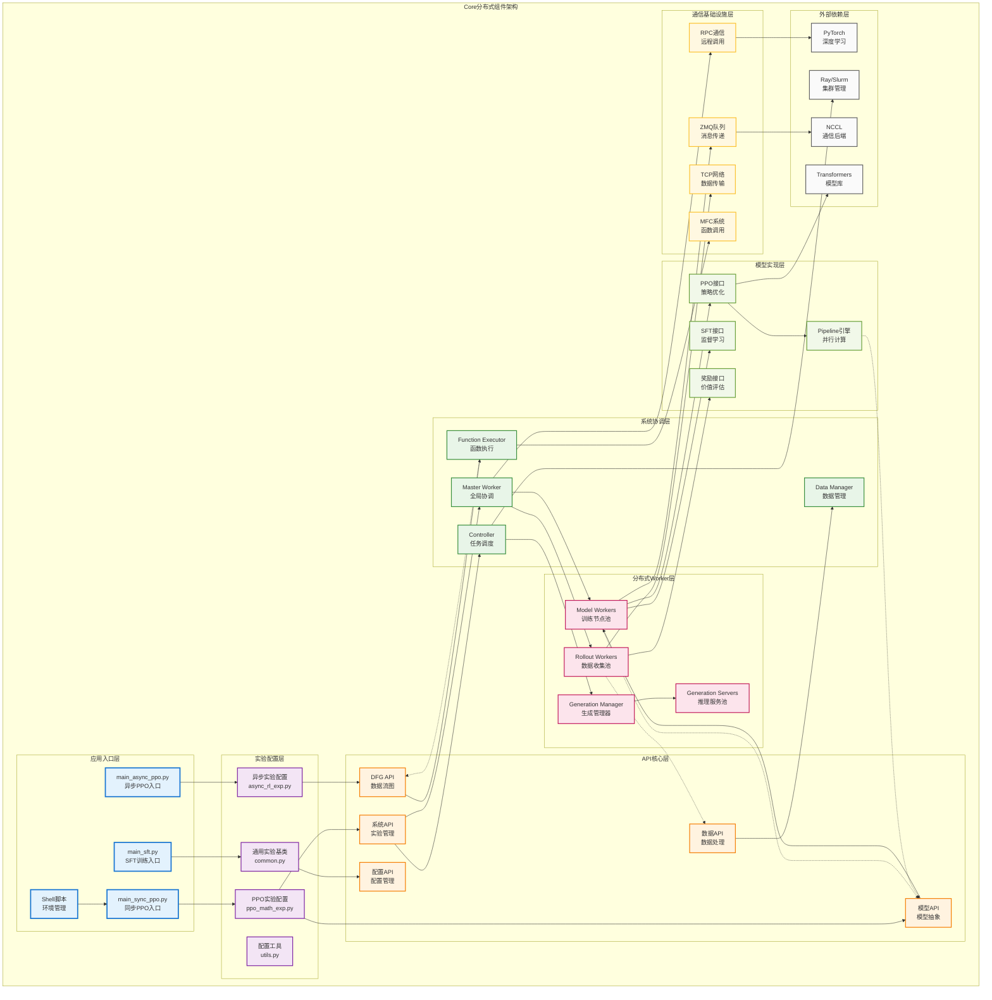
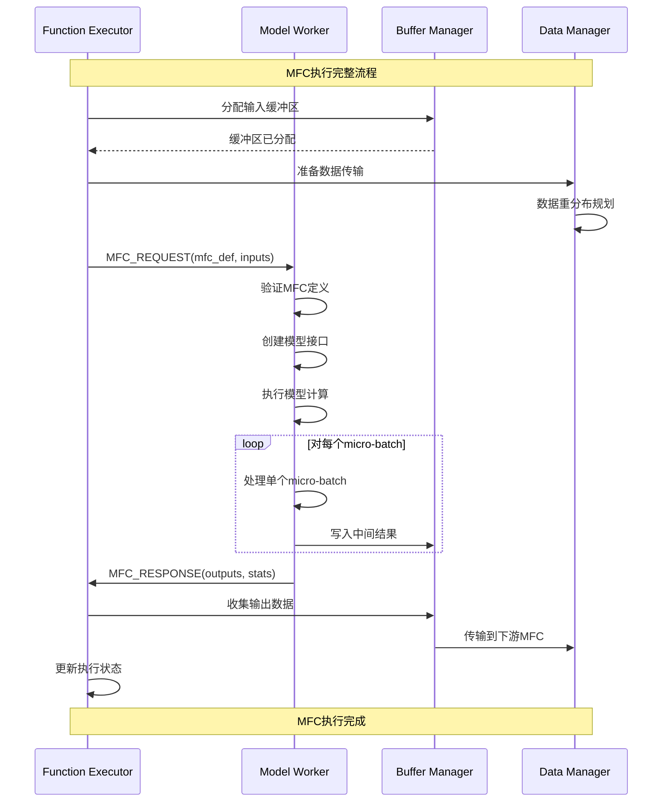
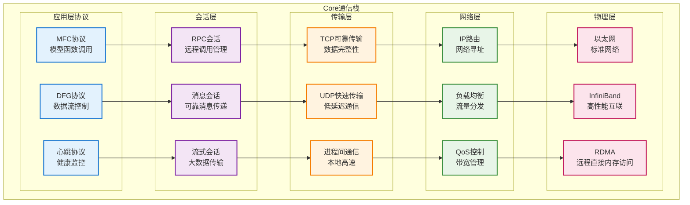
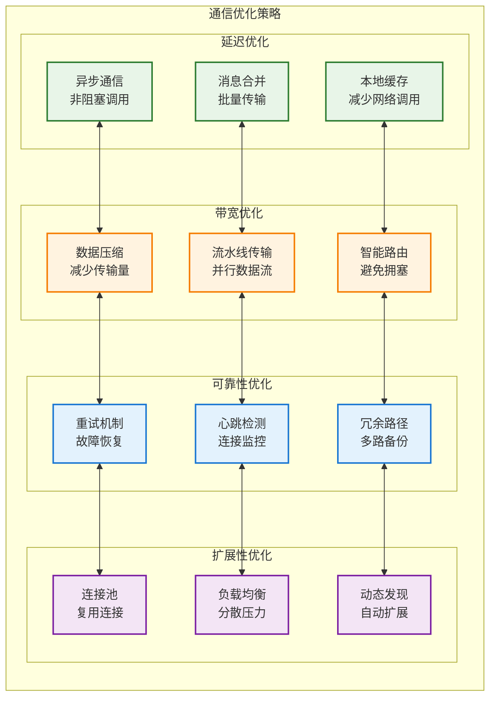
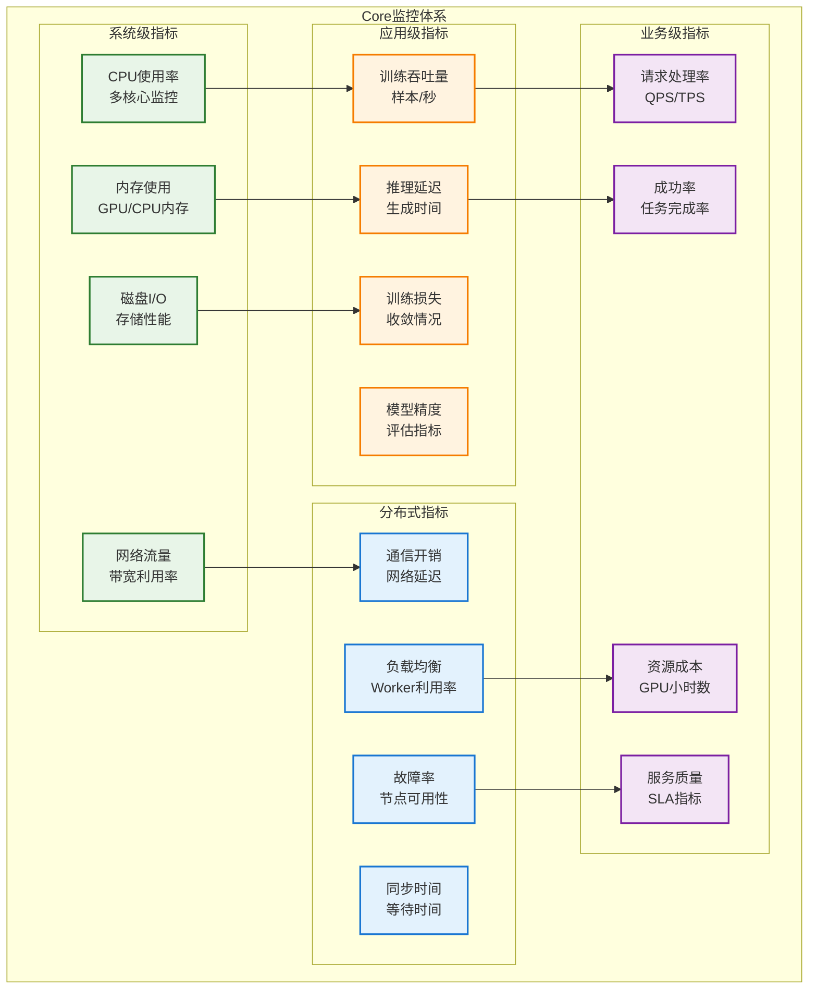

# Core组件架构

本文档提供AReaL Core系统核心组件及其交互的详细架构视图，重点展示其分布式系统的内部结构和复杂的组件关系。

## 组件交互架构



## 核心组件详情

### 1. Master Worker (全局协调器)

```mermaid
classDiagram
    class MasterWorker {
        +experiment_config: ExperimentConfig
        +dfg: DataFlowGraph
        +function_executor: FunctionExecutor
        +worker_registry: Dict[str, WorkerInfo]
        +task_scheduler: TaskScheduler
        
        +run_loop() void
        +schedule_tasks() void
        +coordinate_workers() void
        +monitor_progress() void
        +handle_worker_failure() void
        +synchronize_global_state() void
        
        -_update_worker_status() void
        -_balance_workload() void
        -_manage_resources() void
    }
    
    class WorkerInfo {
        +worker_id: str
        +worker_type: WorkerType
        +status: WorkerStatus
        +load: float
        +last_heartbeat: datetime
        +capabilities: List[str]
    }
    
    class TaskScheduler {
        +pending_tasks: Queue[Task]
        +running_tasks: Dict[str, Task]
        +completed_tasks: List[Task]
        
        +submit_task(task: Task) str
        +get_task_status(task_id: str) TaskStatus
        +cancel_task(task_id: str) bool
        +rebalance_tasks() void
    }
    
    MasterWorker --> WorkerInfo : 管理多个
    MasterWorker --> TaskScheduler : 使用
    
    note for MasterWorker : "全局协调器，管理整个分布式系统"
```

### 2. Model Worker (训练节点)

```mermaid
classDiagram
    class ModelWorker {
        +worker_id: str
        +model: ReaLModel
        +interfaces: Dict[str, ModelInterface]
        +device_mesh: DeviceMesh
        +parallel_config: ParallelConfig
        
        +initialize_model() void
        +process_mfc_request(request: MFCRequest) MFCResponse
        +handle_weight_update(weights: Dict) void
        +execute_interface(interface_type: str, inputs: Any) Any
        +save_checkpoint(path: str) void
        +load_checkpoint(path: str) void
        
        -_setup_parallelism() void
        -_sync_gradients() void
        -_apply_optimizer_step() void
    }
    
    class PPOInterface {
        +config: PPOConfig
        +optimizer: Optimizer
        +lr_scheduler: LRScheduler
        
        +train_step_interface(data: TensorDict) TrainStepOutput
        +compute_ppo_loss(data: TensorDict) torch.Tensor
        +compute_advantages(rewards: torch.Tensor) torch.Tensor
        +update_policy(loss: torch.Tensor) Dict[str, float]
    }
    
    class ReaLModel {
        +config: ModelConfig
        +layers: nn.ModuleList
        +embeddings: nn.Embedding
        +lm_head: nn.Linear
        
        +forward(input_ids: torch.Tensor) torch.Tensor
        +generate(prompts: List[str]) List[str]
        +get_logprobs(input_ids: torch.Tensor) torch.Tensor
        +save_pretrained(path: str) void
    }
    
    ModelWorker --> PPOInterface : 实现多种接口
    ModelWorker --> ReaLModel : 包含模型实例
    PPOInterface --> ReaLModel : 操作模型
    
    note for ModelWorker : "训练节点\n执行模型训练和推理"
```

### 3. Rollout Worker (数据收集节点)

```mermaid
classDiagram
    class RolloutWorker {
        +worker_id: str
        +agent: Agent
        +environment: Environment
        +reward_function: RewardFunction
        +data_buffer: DataBuffer
        
        +collect_trajectories(n_episodes: int) List[Trajectory]
        +submit_generation_requests(prompts: List[str]) List[str]
        +process_responses(responses: List[str]) List[float]
        +compute_rewards(trajectories: List[Trajectory]) List[float]
        +format_training_data(trajectories: List[Trajectory]) TensorDict
        
        -_interact_with_environment() Trajectory
        -_calculate_returns() torch.Tensor
        -_apply_reward_shaping() torch.Tensor
    }
    
    class Agent {
        +policy: Policy
        +value_function: ValueFunction
        
        +act(observation: torch.Tensor) torch.Tensor
        +evaluate(observation: torch.Tensor) torch.Tensor
        +update_policy(loss: torch.Tensor) void
    }
    
    class Environment {
        +task_config: TaskConfig
        
        +reset() torch.Tensor
        +step(action: torch.Tensor) Tuple[torch.Tensor, float, bool, dict]
        +get_observation() torch.Tensor
        +is_done() bool
    }
    
    class RewardFunction {
        +reward_model: Optional[ReaLModel]
        +scoring_config: ScoringConfig
        
        +compute_reward(prompt: str, response: str) float
        +batch_compute_rewards(pairs: List[Tuple[str, str]]) List[float]
        +load_reward_model(path: str) void
    }
    
    RolloutWorker --> Agent : 包含智能体
    RolloutWorker --> Environment : 交互环境
    RolloutWorker --> RewardFunction : 使用奖励函数
    
    note for RolloutWorker : "数据收集节点\n生成训练数据"
```

### 4. Generation Manager & Servers

```mermaid
classDiagram
    class GenerationManager {
        +server_pool: List[GenerationServer]
        +load_balancer: LoadBalancer
        +model_registry: ModelRegistry
        +health_monitor: HealthMonitor
        
        +start_servers(n_servers: int) void
        +stop_servers() void
        +distribute_requests(requests: List[GenerationRequest]) List[GenerationResponse]
        +update_model_weights(weights: Dict) void
        +monitor_server_health() Dict[str, ServerStatus]
        +scale_servers(target_count: int) void
        
        -_assign_request_to_server(request: GenerationRequest) str
        -_handle_server_failure(server_id: str) void
        -_rebalance_load() void
    }
    
    class GenerationServer {
        +server_id: str
        +model: ReaLModel
        +generation_config: GenerationConfig
        +request_queue: Queue[GenerationRequest]
        +response_cache: Dict[str, GenerationResponse]
        
        +start_server() void
        +stop_server() void
        +process_request(request: GenerationRequest) GenerationResponse
        +update_model(weights: Dict) void
        +get_status() ServerStatus
        
        -_generate_text(prompt: str) str
        -_batch_generate(prompts: List[str]) List[str]
        -_cache_response(request: str, response: str) void
    }
    
    class LoadBalancer {
        +balancing_strategy: BalancingStrategy
        +server_metrics: Dict[str, ServerMetrics]
        
        +select_server(request: GenerationRequest) str
        +update_server_metrics(server_id: str, metrics: ServerMetrics) void
        +get_least_loaded_server() str
    }
    
    GenerationManager --> GenerationServer : 管理多个服务器
    GenerationManager --> LoadBalancer : 使用负载均衡
    GenerationServer --> ReaLModel : 包含生成模型
    
    note for GenerationManager : "生成服务管理器\n协调多个推理服务器"
```

## 数据流架构

```mermaid
flowchart TD
    subgraph "Core数据流管道"
        %% 数据源
        subgraph "数据源"
            HF_DS[HuggingFace数据集<br/>GSM8K/MATH等]
            CUSTOM_DS[自定义数据集<br/>JSON/Parquet格式]
            STREAM_DS[流式数据<br/>实时数据源]
        end
        
        %% 数据预处理
        subgraph "数据预处理管道"
            TOKENIZER[分词器<br/>文本→Token转换]
            FORMATTER[数据格式化<br/>统一数据格式]
            VALIDATOR[数据验证<br/>质量检查]
            SPLITTER[数据分片<br/>分布式存储]
        end
        
        %% 分布式缓冲
        subgraph "分布式缓冲系统"
            MASTER_BUFFER[主缓冲区<br/>全局数据池]
            WORKER_BUFFERS[Worker缓冲区<br/>本地数据缓存]
            SYNC_MANAGER[同步管理器<br/>数据一致性]
        end
        
        %% Rollout数据流
        subgraph "Rollout数据流"
            PROMPT_GEN[提示生成<br/>任务提示构建]
            TEXT_GEN[文本生成<br/>模型推理]
            REWARD_COMP[奖励计算<br/>质量评分]
            TRAJ_FORMAT[轨迹格式化<br/>训练数据打包]
        end
        
        %% 训练数据流
        subgraph "训练数据流"
            BATCH_SAMPLE[批次采样<br/>训练批次构建]
            LOGP_COMP[对数概率计算<br/>策略评估]
            LOSS_COMP[损失计算<br/>PPO损失]
            GRAD_COMP[梯度计算<br/>反向传播]
            PARAM_UPDATE[参数更新<br/>优化器步骤]
        end
        
        %% 模型同步
        subgraph "模型同步流"
            WEIGHT_EXTRACT[权重提取<br/>训练模型权重]
            WEIGHT_TRANSFER[权重传输<br/>网络传输]
            WEIGHT_LOAD[权重加载<br/>推理模型更新]
            VERSION_SYNC[版本同步<br/>一致性保证]
        end
    end
    
    %% 数据流连接
    HF_DS --> TOKENIZER
    CUSTOM_DS --> FORMATTER
    STREAM_DS --> VALIDATOR
    
    TOKENIZER --> SPLITTER
    FORMATTER --> SPLITTER
    VALIDATOR --> SPLITTER
    SPLITTER --> MASTER_BUFFER
    
    MASTER_BUFFER --> WORKER_BUFFERS
    WORKER_BUFFERS --> SYNC_MANAGER
    SYNC_MANAGER --> PROMPT_GEN
    
    PROMPT_GEN --> TEXT_GEN
    TEXT_GEN --> REWARD_COMP
    REWARD_COMP --> TRAJ_FORMAT
    TRAJ_FORMAT --> MASTER_BUFFER
    
    MASTER_BUFFER --> BATCH_SAMPLE
    BATCH_SAMPLE --> LOGP_COMP
    LOGP_COMP --> LOSS_COMP
    LOSS_COMP --> GRAD_COMP
    GRAD_COMP --> PARAM_UPDATE
    
    PARAM_UPDATE --> WEIGHT_EXTRACT
    WEIGHT_EXTRACT --> WEIGHT_TRANSFER
    WEIGHT_TRANSFER --> WEIGHT_LOAD
    WEIGHT_LOAD --> VERSION_SYNC
    VERSION_SYNC --> TEXT_GEN
    
    %% 样式定义
    classDef source fill:#e8f5e8,stroke:#2e7d32,stroke-width:2px
    classDef process fill:#fff3e0,stroke:#f57c00,stroke-width:2px
    classDef buffer fill:#e3f2fd,stroke:#1976d2,stroke-width:2px
    classDef rollout fill:#f3e5f5,stroke:#7b1fa2,stroke-width:2px
    classDef train fill:#fce4ec,stroke:#c2185b,stroke-width:2px
    classDef sync fill:#f1f8e9,stroke:#689f38,stroke-width:2px
    
    class HF_DS,CUSTOM_DS,STREAM_DS source
    class TOKENIZER,FORMATTER,VALIDATOR,SPLITTER process
    class MASTER_BUFFER,WORKER_BUFFERS,SYNC_MANAGER buffer
    class PROMPT_GEN,TEXT_GEN,REWARD_COMP,TRAJ_FORMAT rollout
    class BATCH_SAMPLE,LOGP_COMP,LOSS_COMP,GRAD_COMP,PARAM_UPDATE train
    class WEIGHT_EXTRACT,WEIGHT_TRANSFER,WEIGHT_LOAD,VERSION_SYNC sync
```



## MFC系统深度解析

### MFC执行引擎

```mermaid
classDiagram
    class FunctionExecutor {
        +mfc_registry: Dict[str, MFCDef]
        +execution_graph: ExecutionGraph
        +buffer_manager: BufferManager
        +dependency_resolver: DependencyResolver
        
        +register_mfc(mfc_def: MFCDef) void
        +execute_mfc(mfc_name: str, inputs: Dict) Dict
        +coordinate_dataflow() void
        +handle_dependencies() void
        +monitor_execution() ExecutionStats
        
        -_validate_inputs(mfc_def: MFCDef, inputs: Dict) bool
        -_route_to_worker(mfc_def: MFCDef) str
        -_collect_outputs(execution_id: str) Dict
    }
    
    class MFCDef {
        +mfc_name: str
        +model_name: str
        +interface_type: ModelInterfaceType
        +interface_kwargs: Dict
        +input_spec: DataSpec
        +output_spec: DataSpec
        +n_mbs: int
        +worker_requirements: WorkerRequirements
        
        +validate_definition() bool
        +create_interface() ModelInterface
        +estimate_resources() ResourceEstimate
    }
    
    class ExecutionGraph {
        +nodes: List[MFCNode]
        +edges: List[ExecutionEdge]
        +execution_order: List[str]
        
        +add_node(mfc_def: MFCDef) void
        +add_edge(from_node: str, to_node: str) void
        +compute_execution_order() List[str]
        +detect_cycles() List[List[str]]
        +optimize_graph() void
    }
    
    class BufferManager {
        +input_buffers: Dict[str, DataBuffer]
        +output_buffers: Dict[str, DataBuffer]
        +intermediate_buffers: Dict[str, DataBuffer]
        
        +allocate_buffer(name: str, spec: DataSpec) DataBuffer
        +transfer_data(from_buffer: str, to_buffer: str) void
        +cleanup_buffers() void
        +get_buffer_stats() BufferStats
    }
    
    FunctionExecutor --> MFCDef : 管理多个MFC定义
    FunctionExecutor --> ExecutionGraph : 使用执行图
    FunctionExecutor --> BufferManager : 使用缓冲管理
    
    note for FunctionExecutor : "MFC执行引擎\n协调分布式函数调用"
```

### MFC通信协议



## 通信基础设施详解

### 多层通信架构



### 通信性能优化



## 性能监控与调试

### 监控指标体系



## Core系统特色优势

### 1. 企业级架构
- **分层设计**: 清晰的架构分层，便于维护和扩展
- **模块化**: 高度模块化的组件设计，支持灵活组合
- **标准化**: 统一的接口规范和通信协议
- **可观测性**: 全面的监控、日志和调试支持

### 2. 分布式能力
- **水平扩展**: 支持动态增加计算节点
- **容错处理**: 自动故障检测和恢复机制
- **负载均衡**: 智能的任务分配和资源调度
- **一致性保证**: 分布式状态的强一致性

### 3. 算法灵活性
- **多算法支持**: PPO、SFT、奖励建模等多种算法
- **接口抽象**: 标准化的模型接口，便于算法扩展
- **实验管理**: 复杂的实验配置和版本管理
- **A/B测试**: 支持多版本并行实验

### 4. 生产就绪
- **性能优化**: 多维度的性能优化策略
- **稳定性**: 经过大规模生产环境验证
- **安全性**: 完善的权限控制和审计机制
- **可维护性**: 丰富的运维工具和故障排查支持

这个Core组件架构文档展示了一个成熟的工业级分布式RLHF系统的复杂性和强大功能，为理解系统内部工作机制提供了详细的技术视图。
