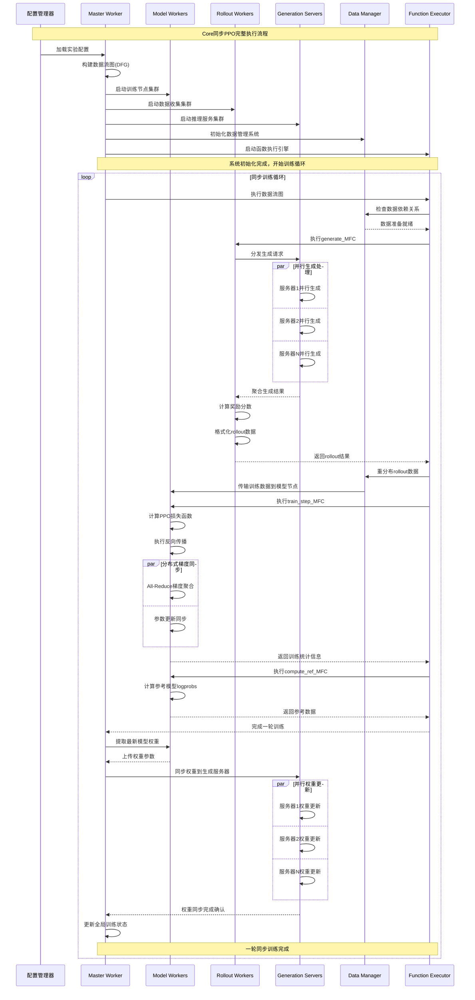
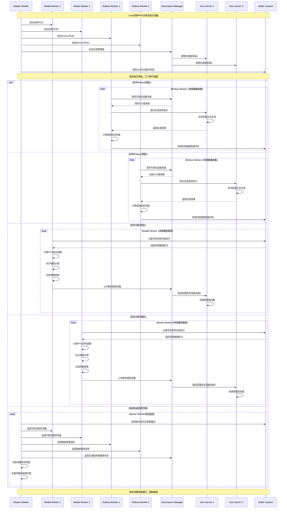
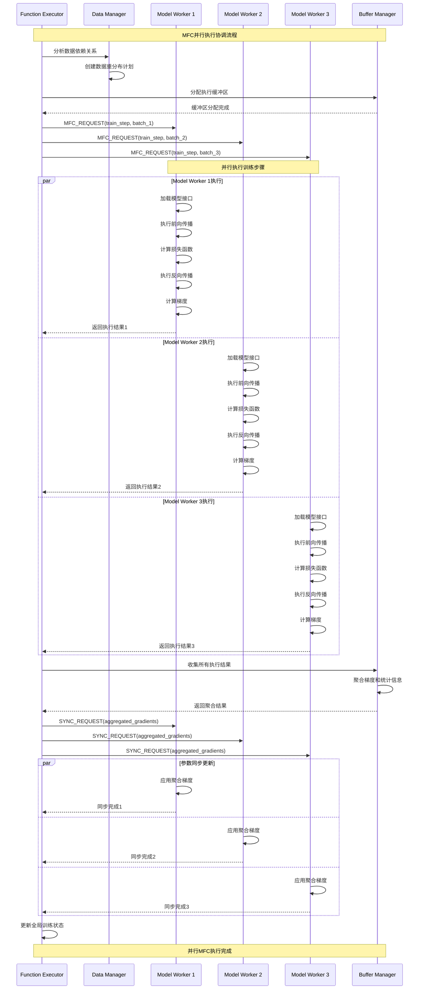
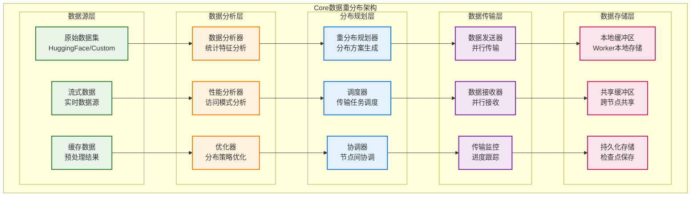
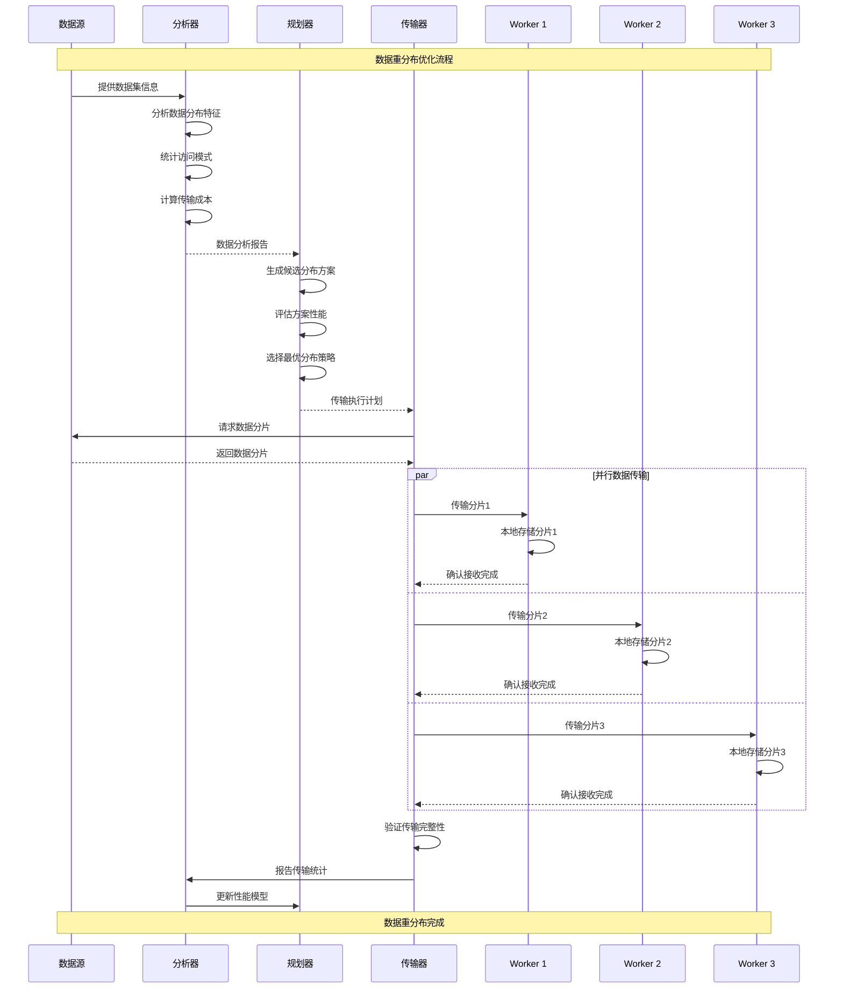
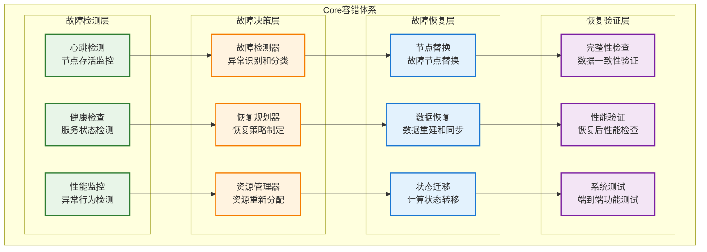
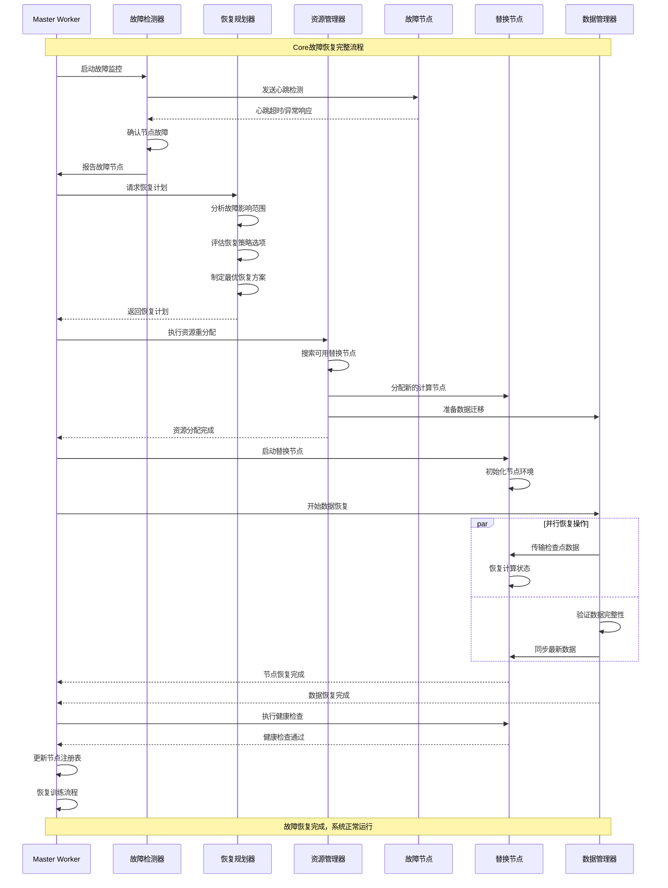
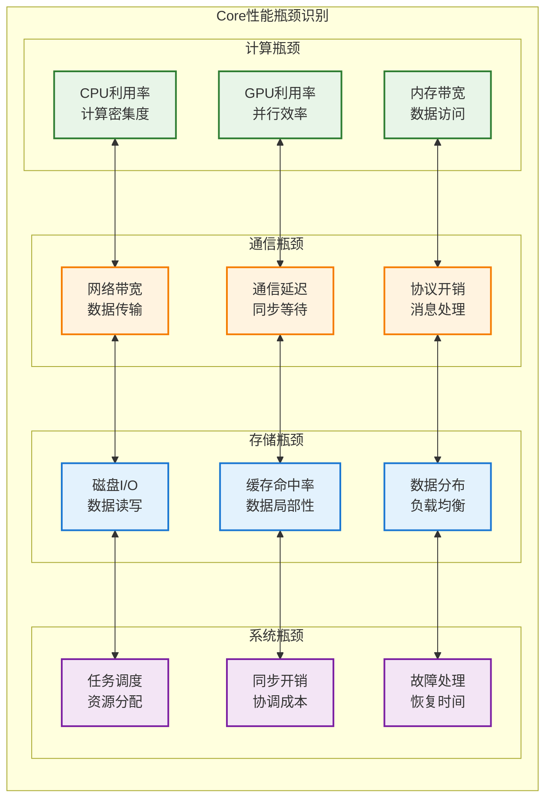

# Core执行流程和系统管道

本文档提供AReaL Core系统执行流程的详细视图，展示其复杂的分布式训练管道和系统协调机制。

## 完整分布式训练流程

```mermaid
flowchart TD
    subgraph "Core分布式训练全流程"
        %% 系统初始化阶段
        subgraph "系统初始化阶段"
            START([启动Core系统])
            PARSE_CONFIG[解析实验配置<br/>ExperimentConfig]
            BUILD_DFG[构建数据流图<br/>DataFlowGraph]
            INIT_CLUSTER[初始化集群<br/>Ray/Slurm启动]
            START_MASTER[启动Master Worker<br/>全局协调器]
            DEPLOY_WORKERS[部署Worker节点<br/>分布式部署]
        end
        
        %% Worker初始化阶段
        subgraph "Worker初始化阶段"
            INIT_MODEL_W[初始化Model Workers<br/>训练节点池]
            INIT_ROLLOUT_W[初始化Rollout Workers<br/>数据收集池]
            INIT_GEN_MGR[初始化Generation Manager<br/>推理管理器]
            START_GEN_SERVERS[启动Generation Servers<br/>推理服务集群]
            SETUP_COMM[建立通信连接<br/>RPC/ZMQ/TCP]
        end
        
        %% 主训练循环
        subgraph "主训练循环"
            LOOP_START([训练循环开始])
            SCHEDULE_TASKS[任务调度<br/>Master调度]
            
            %% 数据收集阶段
            subgraph "数据收集阶段"
                EXECUTE_ROLLOUT[执行Rollout MFC<br/>数据收集]
                GEN_REQUESTS[生成请求分发<br/>负载均衡]
                PARALLEL_GEN[并行文本生成<br/>多服务器]
                COMPUTE_REWARDS[计算奖励分数<br/>质量评估]
                COLLECT_DATA[收集训练数据<br/>格式化存储]
            end
            
            %% 训练更新阶段
            subgraph "训练更新阶段"
                EXECUTE_TRAIN[执行训练MFC<br/>模型更新]
                COMPUTE_LOSS[计算PPO损失<br/>策略优化]
                BACKWARD_PASS[反向传播<br/>梯度计算]
                SYNC_GRADIENTS[梯度同步<br/>All-Reduce]
                UPDATE_PARAMS[参数更新<br/>优化器步骤]
            end
            
            %% 模型同步阶段
            subgraph "模型同步阶段"
                EXTRACT_WEIGHTS[提取模型权重<br/>训练节点]
                BROADCAST_WEIGHTS[广播权重更新<br/>分发到推理节点]
                UPDATE_GEN_MODELS[更新生成模型<br/>热更新权重]
                VERIFY_SYNC[验证同步完成<br/>版本一致性]
            end
        end
        
        %% 监控和调试
        subgraph "监控和调试"
            HEALTH_CHECK[健康检查<br/>节点状态监控]
            PERF_MONITOR[性能监控<br/>指标收集]
            LOG_COLLECT[日志收集<br/>分布式日志]
            ALERT_SYSTEM[告警系统<br/>异常处理]
        end
    end
    
    %% 流程连接
    START --> PARSE_CONFIG
    PARSE_CONFIG --> BUILD_DFG
    BUILD_DFG --> INIT_CLUSTER
    INIT_CLUSTER --> START_MASTER
    START_MASTER --> DEPLOY_WORKERS
    
    DEPLOY_WORKERS --> INIT_MODEL_W
    DEPLOY_WORKERS --> INIT_ROLLOUT_W
    DEPLOY_WORKERS --> INIT_GEN_MGR
    INIT_GEN_MGR --> START_GEN_SERVERS
    START_GEN_SERVERS --> SETUP_COMM
    
    SETUP_COMM --> LOOP_START
    LOOP_START --> SCHEDULE_TASKS
    SCHEDULE_TASKS --> EXECUTE_ROLLOUT
    
    EXECUTE_ROLLOUT --> GEN_REQUESTS
    GEN_REQUESTS --> PARALLEL_GEN
    PARALLEL_GEN --> COMPUTE_REWARDS
    COMPUTE_REWARDS --> COLLECT_DATA
    
    COLLECT_DATA --> EXECUTE_TRAIN
    EXECUTE_TRAIN --> COMPUTE_LOSS
    COMPUTE_LOSS --> BACKWARD_PASS
    BACKWARD_PASS --> SYNC_GRADIENTS
    SYNC_GRADIENTS --> UPDATE_PARAMS
    
    UPDATE_PARAMS --> EXTRACT_WEIGHTS
    EXTRACT_WEIGHTS --> BROADCAST_WEIGHTS
    BROADCAST_WEIGHTS --> UPDATE_GEN_MODELS
    UPDATE_GEN_MODELS --> VERIFY_SYNC
    
    VERIFY_SYNC --> LOOP_START
    
    %% 监控连接
    SCHEDULE_TASKS --> HEALTH_CHECK
    EXECUTE_ROLLOUT --> PERF_MONITOR
    EXECUTE_TRAIN --> LOG_COLLECT
    VERIFY_SYNC --> ALERT_SYSTEM
    
    %% 样式定义
    classDef init fill:#e8f5e8,stroke:#2e7d32,stroke-width:2px
    classDef worker_init fill:#fff3e0,stroke:#f57c00,stroke-width:2px
    classDef rollout fill:#e3f2fd,stroke:#1976d2,stroke-width:2px
    classDef train fill:#f3e5f5,stroke:#7b1fa2,stroke-width:2px
    classDef sync fill:#fce4ec,stroke:#c2185b,stroke-width:2px
    classDef monitor fill:#f1f8e9,stroke:#689f38,stroke-width:2px
    classDef control fill:#fff8e1,stroke:#fbc02d,stroke-width:3px
    
    class START,PARSE_CONFIG,BUILD_DFG,INIT_CLUSTER,START_MASTER,DEPLOY_WORKERS init
    class INIT_MODEL_W,INIT_ROLLOUT_W,INIT_GEN_MGR,START_GEN_SERVERS,SETUP_COMM worker_init
    class EXECUTE_ROLLOUT,GEN_REQUESTS,PARALLEL_GEN,COMPUTE_REWARDS,COLLECT_DATA rollout
    class EXECUTE_TRAIN,COMPUTE_LOSS,BACKWARD_PASS,SYNC_GRADIENTS,UPDATE_PARAMS train
    class EXTRACT_WEIGHTS,BROADCAST_WEIGHTS,UPDATE_GEN_MODELS,VERIFY_SYNC sync
    class HEALTH_CHECK,PERF_MONITOR,LOG_COLLECT,ALERT_SYSTEM monitor
    class LOOP_START,SCHEDULE_TASKS control
```

## 同步PPO详细执行序列

## 异步PPO详细执行流程

## MFC系统执行深度解析

### MFC调用完整生命周期

```mermaid
flowchart TD
    subgraph "MFC执行生命周期"
        %% MFC定义阶段
        subgraph "MFC定义阶段"
            DEFINE_MFC[定义MFC<br/>MFCDef创建]
            VALIDATE_DEF[验证定义<br/>输入输出规范]
            REGISTER_MFC[注册MFC<br/>添加到注册表]
        end
        
        %% MFC调度阶段
        subgraph "MFC调度阶段"
            SCHEDULE_REQ[调度请求<br/>函数执行器]
            RESOLVE_DEPS[解析依赖<br/>数据依赖关系]
            SELECT_WORKER[选择Worker<br/>负载均衡]
        end
        
        %% MFC执行阶段
        subgraph "MFC执行阶段"
            PREPARE_DATA[准备数据<br/>输入格式化]
            SEND_REQUEST[发送请求<br/>网络传输]
            WORKER_EXEC[Worker执行<br/>模型计算]
            COLLECT_RESULT[收集结果<br/>输出聚合]
        end
        
        %% MFC完成阶段
        subgraph "MFC完成阶段"
            VALIDATE_OUTPUT[验证输出<br/>结果检查]
            UPDATE_BUFFER[更新缓冲区<br/>数据存储]
            NOTIFY_DEPS[通知依赖<br/>下游MFC]
            LOG_STATS[记录统计<br/>性能指标]
        end
    end
    
    DEFINE_MFC --> VALIDATE_DEF
    VALIDATE_DEF --> REGISTER_MFC
    REGISTER_MFC --> SCHEDULE_REQ
    
    SCHEDULE_REQ --> RESOLVE_DEPS
    RESOLVE_DEPS --> SELECT_WORKER
    SELECT_WORKER --> PREPARE_DATA
    
    PREPARE_DATA --> SEND_REQUEST
    SEND_REQUEST --> WORKER_EXEC
    WORKER_EXEC --> COLLECT_RESULT
    
    COLLECT_RESULT --> VALIDATE_OUTPUT
    VALIDATE_OUTPUT --> UPDATE_BUFFER
    UPDATE_BUFFER --> NOTIFY_DEPS
    NOTIFY_DEPS --> LOG_STATS
    
    classDef define fill:#e8f5e8,stroke:#2e7d32,stroke-width:2px
    classDef schedule fill:#fff3e0,stroke:#f57c00,stroke-width:2px
    classDef execute fill:#e3f2fd,stroke:#1976d2,stroke-width:2px
    classDef complete fill:#f3e5f5,stroke:#7b1fa2,stroke-width:2px
    
    class DEFINE_MFC,VALIDATE_DEF,REGISTER_MFC define
    class SCHEDULE_REQ,RESOLVE_DEPS,SELECT_WORKER schedule
    class PREPARE_DATA,SEND_REQUEST,WORKER_EXEC,COLLECT_RESULT execute
    class VALIDATE_OUTPUT,UPDATE_BUFFER,NOTIFY_DEPS,LOG_STATS complete
```

### MFC并行执行协调

## 分布式数据管道详解

### 数据重分布系统

### 数据传输优化流程

## 容错与故障恢复机制

### 多层容错架构

### 故障恢复执行流程

## 性能调优与监控

### 性能瓶颈分析

## Core系统执行特色

### 1. 企业级执行保障
- **全链路监控**: 从请求到响应的完整链路追踪
- **自动化运维**: 智能故障检测和自动恢复
- **弹性伸缩**: 根据负载动态调整计算资源
- **版本控制**: 模型和数据的版本管理

### 2. 高性能执行优化
- **异步执行**: 计算和通信的异步并行
- **批处理优化**: 智能批处理策略
- **缓存机制**: 多层缓存优化数据访问
- **预取策略**: 预测性数据预加载

### 3. 分布式协调机制
- **一致性保证**: 分布式状态的强一致性
- **负载均衡**: 动态负载感知和均衡
- **故障隔离**: 故障影响的最小化
- **优雅降级**: 部分故障下的服务可用性

### 4. 可观测性支持
- **实时监控**: 关键指标的实时监控
- **日志聚合**: 分布式日志的统一收集
- **性能分析**: 详细的性能剖析和优化建议
- **告警通知**: 智能告警和故障通知

这个Core执行流程文档展示了一个成熟的工业级分布式RLHF系统的复杂执行机制，为理解和优化大规模语言模型训练提供了详细的技术指导。
