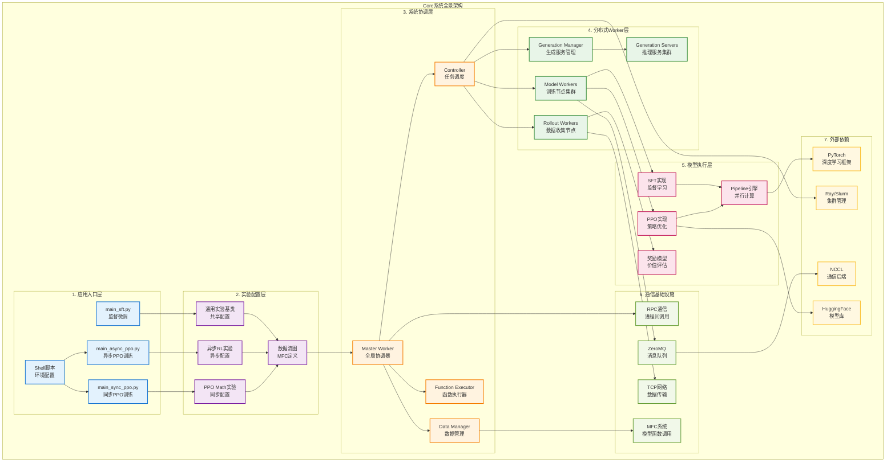
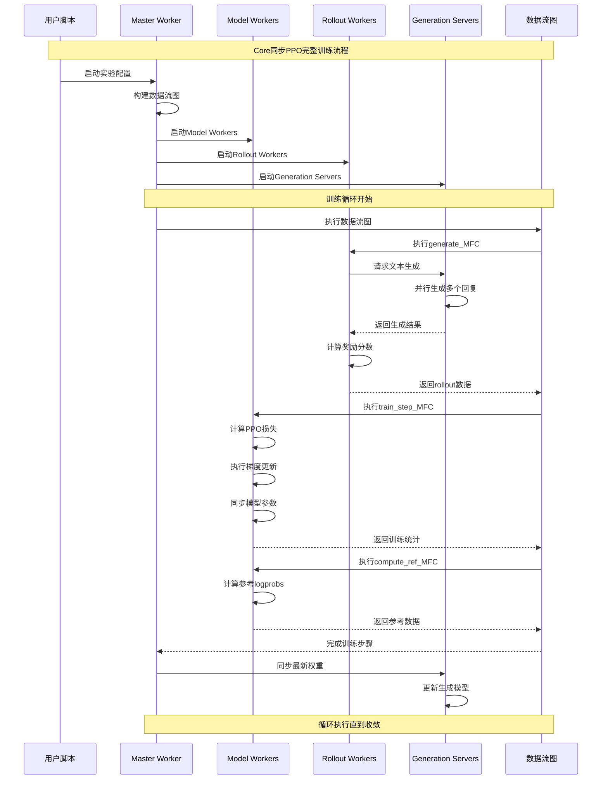
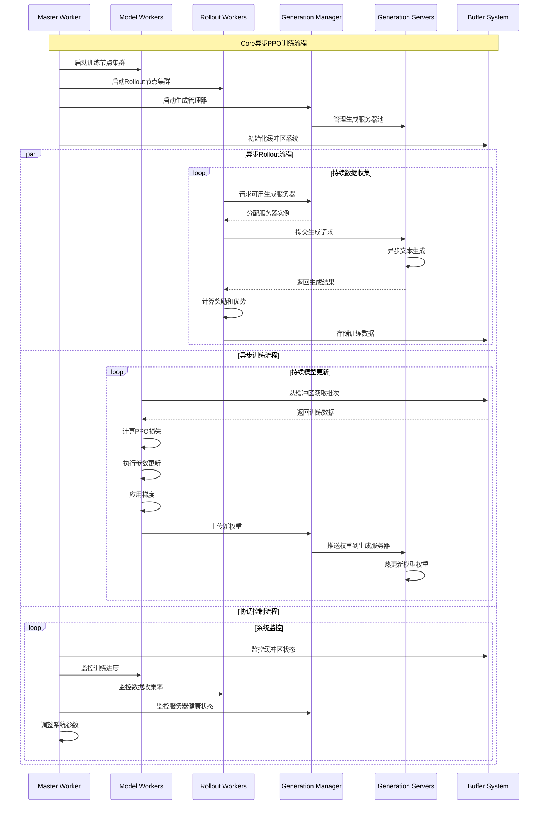
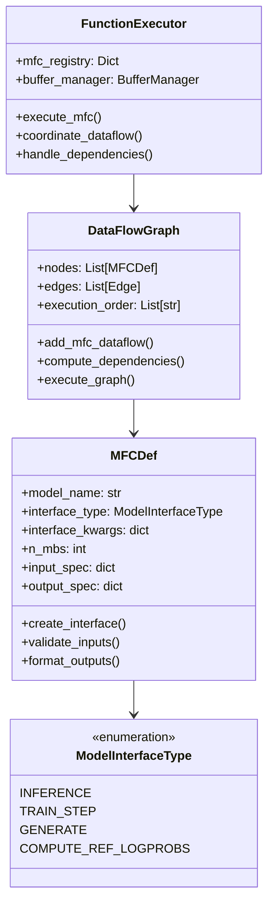
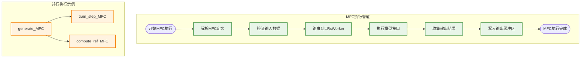
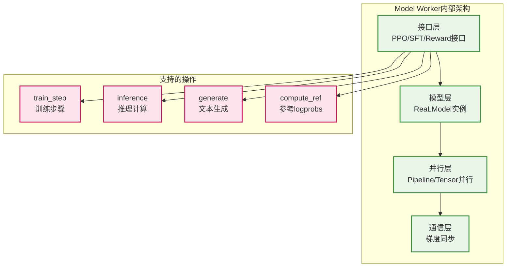
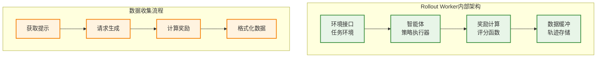
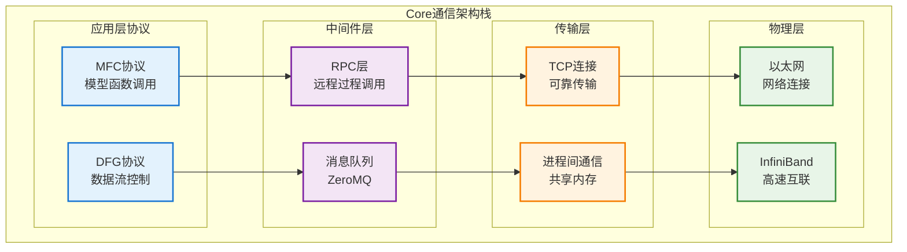
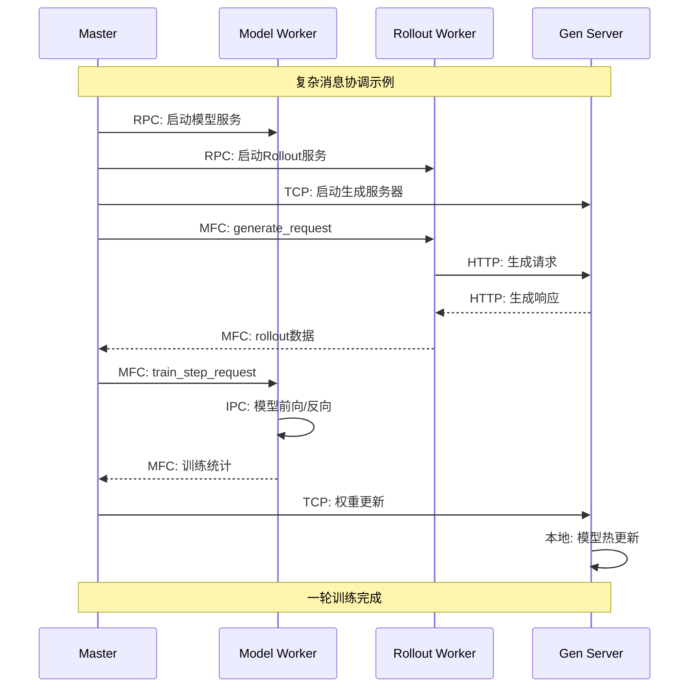
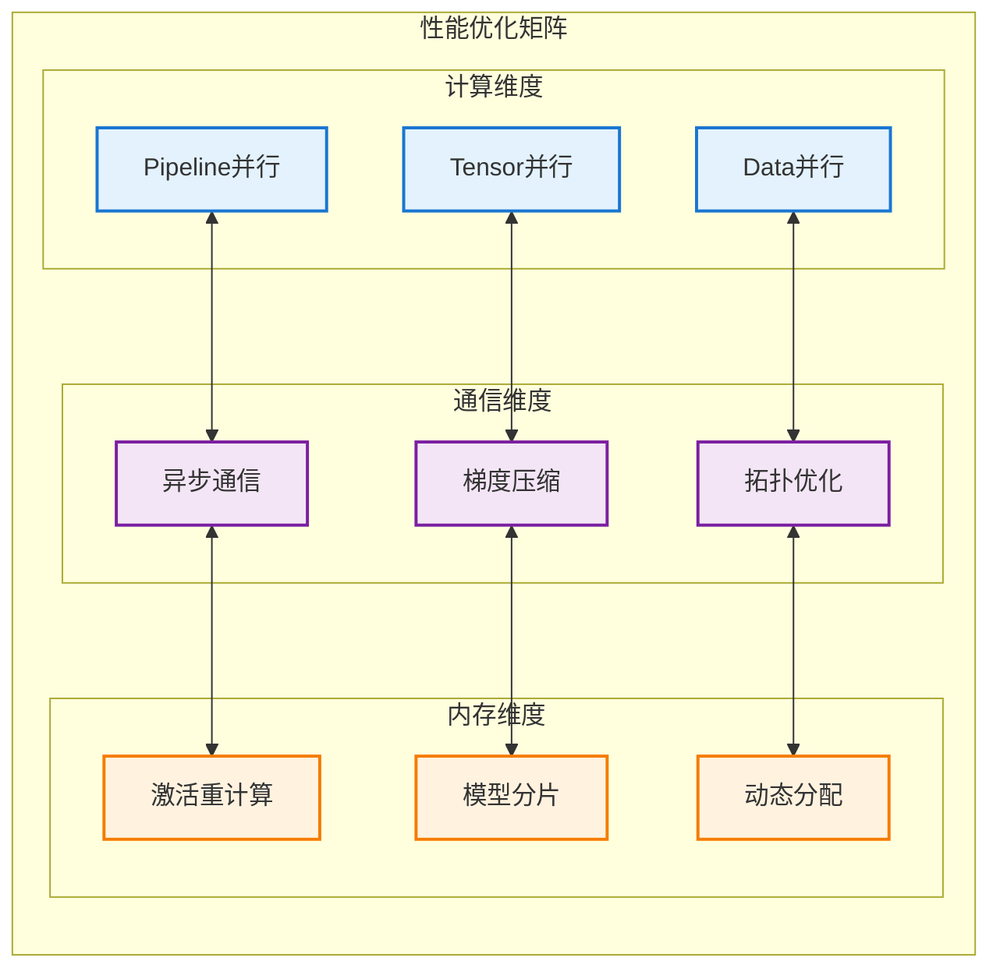

# Core系统架构概览

本文档提供AReaL Core系统的全面架构概览，采用视觉导向的方法展示其复杂的分布式架构设计。

## 系统架构概览

## 核心特征

### 1. 分布式架构设计
- **Master-Worker模式**: Master节点协调多个Worker节点
- **多类型Worker**: Model Worker、Rollout Worker、Generation Server
- **动态负载均衡**: 根据计算负载动态分配任务

### 2. 数据流图(DFG)驱动
- **MFC系统**: 模型函数调用抽象
- **依赖管理**: 自动处理计算依赖关系
- **异步执行**: 支持异步和同步两种执行模式

### 3. 高度可扩展性
- **多GPU支持**: 原生支持100+ GPU的大规模训练
- **灵活拓扑**: 支持多种集群拓扑结构
- **弹性伸缩**: 动态添加/移除计算节点

## 同步PPO训练流程

## 异步PPO训练流程

## MFC系统详解

### MFC定义结构

### MFC执行流程

## Worker节点详细架构

### Model Worker架构

### Rollout Worker架构

## 通信架构深度解析

### 多层通信栈

### 消息流示例

## 性能优化特性

### 1. 计算优化
- **Pipeline并行**: 模型层间流水线
- **Tensor并行**: 张量维度并行
- **Data并行**: 数据批次并行
- **混合精度**: FP16/BF16支持

### 2. 通信优化
- **梯度压缩**: 减少通信开销
- **异步通信**: 计算通信重叠
- **拓扑感知**: 网络拓扑优化
- **带宽聚合**: 多路径传输

### 3. 内存优化
- **激活重计算**: 内存换时间
- **梯度累积**: 减少内存峰值
- **模型分片**: 大模型分布存储
- **动态分配**: 按需内存管理

## Core系统优势

### 1. 企业级可靠性
- **容错机制**: 节点故障自动恢复
- **监控告警**: 全面系统监控
- **版本管理**: 模型版本控制
- **审计追踪**: 完整操作日志

### 2. 极致性能
- **大规模扩展**: 支持1000+ GPU
- **高效通信**: 优化的通信栈
- **智能调度**: 动态负载均衡
- **资源优化**: 最大化硬件利用率

### 3. 算法灵活性
- **多算法支持**: PPO、SFT、奖励建模
- **自定义接口**: 可扩展的算法框架
- **实验管理**: 复杂实验配置
- **A/B测试**: 多版本并行测试

这个Core架构文档展示了一个成熟的工业级分布式RLHF系统的复杂性和强大功能，为大规模语言模型训练提供了坚实的基础设施支持。
