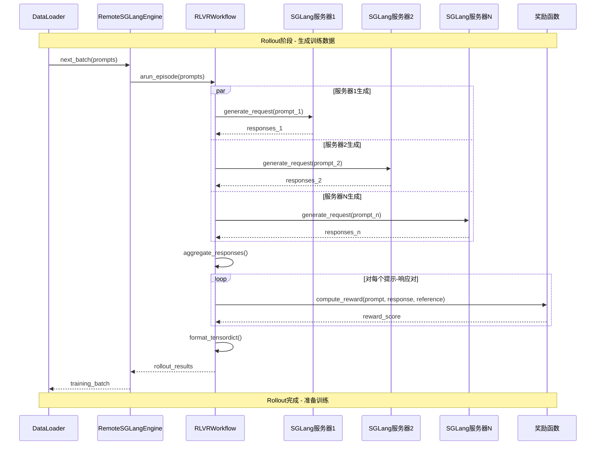
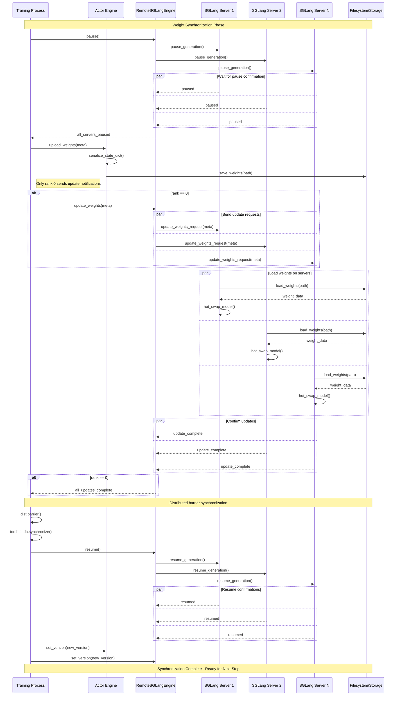
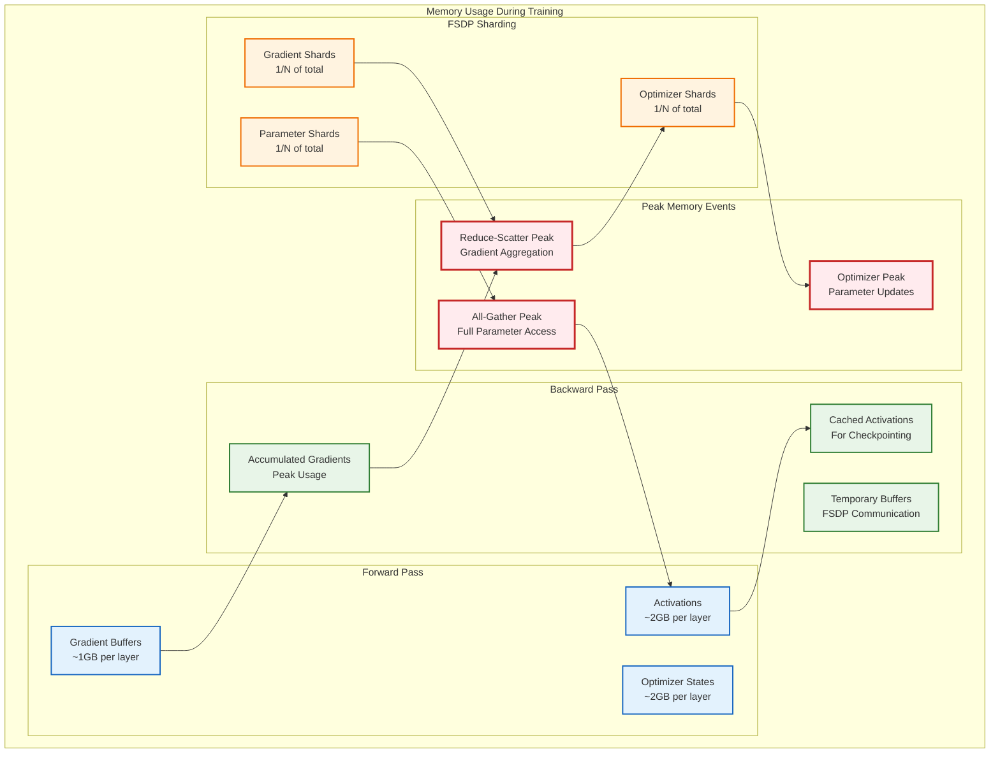
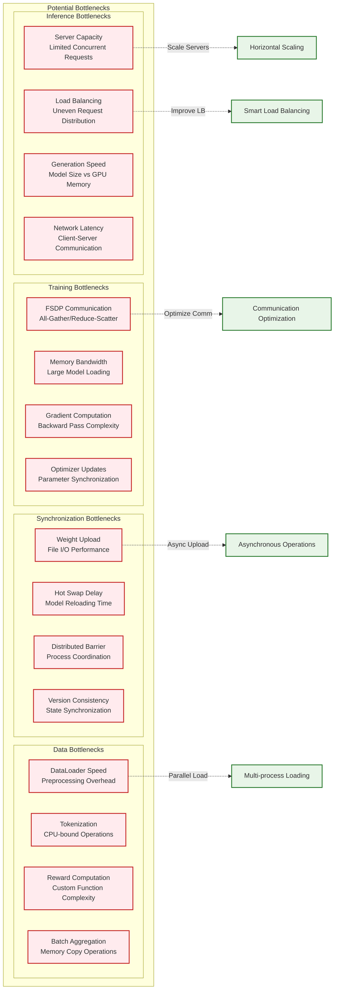

# AReaLite 执行流程和数据管道

本文档提供了数据在GRPO训练不同阶段如何流经AReaLite的详细视图，从初始化到权重更新。

## 完整训练循环流程

```mermaid
flowchart TD
    %% 初始化阶段
    subgraph "初始化阶段"
        START([开始训练])
        PARSE_CONFIG[解析配置<br/>GRPOConfig]
        INIT_DIST[初始化分布式<br/>torch.distributed]
        START_SERVERS[启动SGLang服务器<br/>启动器进程]
        INIT_ENGINES[初始化引擎<br/>Actor + Rollout]
        LOAD_DATA[加载数据集<br/>HuggingFace + DataLoader]
    end
    
    %% 主训练循环
    subgraph "主训练循环"
        LOOP_START([训练步骤开始])
        GET_BATCH[获取数据批次<br/>来自DataLoader]
        
        %% Rollout阶段
        subgraph "Rollout阶段"
            ROLLOUT_START[开始Rollout]
            SEND_PROMPTS[发送提示至<br/>SGLang服务器]
            GENERATE[生成回复<br/>每个提示多个回复] 
            COMPUTE_REWARDS[计算奖励<br/>任务特定函数]
            COLLECT_RESULTS[收集Rollout结果<br/>到TensorDict]
        end
        
        %% 训练阶段
        subgraph "训练阶段"
            COMPUTE_LOGP[计算对数概率<br/>Actor模型]
            COMPUTE_REF[计算参考LogP<br/>参考模型]
            COMPUTE_ADV[计算优势<br/>GAE算法]
            GRPO_UPDATE[GRPO更新<br/>策略 + 价值损失]
            UPDATE_LR[更新学习率<br/>调度器步骤]
        end
        
        %% 同步阶段
        subgraph "同步阶段"  
            PAUSE_ROLLOUT[暂停Rollout服务器]
            UPLOAD_WEIGHTS[上传新权重<br/>Actor → 服务器]
            WAIT_SYNC[等待同步<br/>所有服务器已更新]
            RESUME_ROLLOUT[恢复Rollout服务器]
            UPDATE_VERSION[更新模型版本<br/>一致性检查]
        end
        
        LOOP_END{Continue Training?}
        SAVE_CHECKPOINT[Save Checkpoint<br/>Optional]
    end
    
    FINISH([Training Complete])
    
    %% Flow Connections
    START --> PARSE_CONFIG
    PARSE_CONFIG --> INIT_DIST  
    INIT_DIST --> START_SERVERS
    START_SERVERS --> INIT_ENGINES
    INIT_ENGINES --> LOAD_DATA
    LOAD_DATA --> LOOP_START
    
    LOOP_START --> GET_BATCH
    GET_BATCH --> ROLLOUT_START
    
    ROLLOUT_START --> SEND_PROMPTS
    SEND_PROMPTS --> GENERATE
    GENERATE --> COMPUTE_REWARDS
    COMPUTE_REWARDS --> COLLECT_RESULTS
    
    COLLECT_RESULTS --> COMPUTE_LOGP
    COMPUTE_LOGP --> COMPUTE_REF
    COMPUTE_REF --> COMPUTE_ADV
    COMPUTE_ADV --> GRPO_UPDATE
    GRPO_UPDATE --> UPDATE_LR
    
    UPDATE_LR --> PAUSE_ROLLOUT
    PAUSE_ROLLOUT --> UPLOAD_WEIGHTS
    UPLOAD_WEIGHTS --> WAIT_SYNC
    WAIT_SYNC --> RESUME_ROLLOUT
    RESUME_ROLLOUT --> UPDATE_VERSION
    
    UPDATE_VERSION --> LOOP_END
    LOOP_END -->|Yes| SAVE_CHECKPOINT
    SAVE_CHECKPOINT --> LOOP_START
    LOOP_END -->|No| FINISH
    
    %% Styling
    classDef init fill:#e3f2fd,stroke:#1976d2,stroke-width:2px
    classDef rollout fill:#e8f5e8,stroke:#388e3c,stroke-width:2px
    classDef training fill:#fff3e0,stroke:#f57c00,stroke-width:2px
    classDef sync fill:#fce4ec,stroke:#c2185b,stroke-width:2px
    classDef decision fill:#f3e5f5,stroke:#7b1fa2,stroke-width:3px
    classDef endpoint fill:#e0f2f1,stroke:#00695c,stroke-width:3px
    
    class PARSE_CONFIG,INIT_DIST,START_SERVERS,INIT_ENGINES,LOAD_DATA init
    class ROLLOUT_START,SEND_PROMPTS,GENERATE,COMPUTE_REWARDS,COLLECT_RESULTS rollout
    class COMPUTE_LOGP,COMPUTE_REF,COMPUTE_ADV,GRPO_UPDATE,UPDATE_LR training
    class PAUSE_ROLLOUT,UPLOAD_WEIGHTS,WAIT_SYNC,RESUME_ROLLOUT,UPDATE_VERSION sync
    class LOOP_END decision  
    class START,FINISH endpoint
```

## 详细Rollout阶段流程



## GRPO Training Phase Details

```mermaid
flowchart TD
    %% Input Data
    subgraph "Input Data"
        BATCH[Training Batch<br/>Prompts + Responses + Rewards]
        INPUT_IDS[Input Token IDs<br/>Tokenized Sequences]
        ATTENTION_MASK[Attention Masks<br/>Valid Token Positions]
        REWARD_SCORES[Reward Scores<br/>Task Performance]
    end
    
    %% Log Probability Computation
    subgraph "Log Probability Phase"
        ACTOR_FORWARD[Actor Forward Pass<br/>Compute Logits]
        ACTOR_LOGP[Actor Log Probabilities<br/>Current Policy]
        REF_FORWARD[Reference Forward Pass<br/>Frozen Model]
        REF_LOGP[Reference Log Probabilities<br/>Initial Policy]
        PROX_LOGP[Proximal Log Probabilities<br/>Recomputed if needed]
    end
    
    %% Advantage Computation
    subgraph "Advantage Computation"
        KL_REWARDS[KL Regularized Rewards<br/>reward - β * KL(π||π_ref)]
        VALUE_EST[Value Estimation<br/>Critic Network]
        GAE_COMPUTE[GAE Computation<br/>Generalized Advantage Estimation]
        ADV_NORM[Advantage Normalization<br/>Group-wise if configured]
    end
    
    %% GRPO Loss Computation
    subgraph "GRPO Loss Computation"
        RATIO_COMPUTE[Importance Ratio<br/>exp(log_π - log_π_old)]
        CLIP_RATIO[Clipped Ratio<br/>clip(ratio, 1-ε, 1+ε)]
        POLICY_LOSS[Policy Loss<br/>-min(ratio*A, clipped_ratio*A)]
        VALUE_LOSS[Value Loss<br/>MSE(V, returns)]
        TOTAL_LOSS[Total Loss<br/>policy_loss + value_coeff * value_loss]
    end
    
    %% Parameter Update
    subgraph "Parameter Update"
        BACKWARD[Backward Pass<br/>Compute Gradients]
        GRAD_CLIP[Gradient Clipping<br/>Prevent Instability]
        OPTIMIZER_STEP[Optimizer Step<br/>Apply Parameter Updates]
        FSDP_SYNC[FSDP Synchronization<br/>All-Reduce Gradients]
    end
    
    %% Data Flow
    BATCH --> INPUT_IDS
    BATCH --> ATTENTION_MASK  
    BATCH --> REWARD_SCORES
    
    INPUT_IDS --> ACTOR_FORWARD
    INPUT_IDS --> REF_FORWARD
    ACTOR_FORWARD --> ACTOR_LOGP
    REF_FORWARD --> REF_LOGP
    ACTOR_LOGP --> PROX_LOGP
    
    REWARD_SCORES --> KL_REWARDS
    ACTOR_LOGP --> KL_REWARDS
    REF_LOGP --> KL_REWARDS
    
    KL_REWARDS --> VALUE_EST
    VALUE_EST --> GAE_COMPUTE
    GAE_COMPUTE --> ADV_NORM
    
    ADV_NORM --> RATIO_COMPUTE
    ACTOR_LOGP --> RATIO_COMPUTE
    PROX_LOGP --> RATIO_COMPUTE
    RATIO_COMPUTE --> CLIP_RATIO
    
    CLIP_RATIO --> POLICY_LOSS
    ADV_NORM --> POLICY_LOSS
    VALUE_EST --> VALUE_LOSS
    POLICY_LOSS --> TOTAL_LOSS
    VALUE_LOSS --> TOTAL_LOSS
    
    TOTAL_LOSS --> BACKWARD
    BACKWARD --> GRAD_CLIP
    GRAD_CLIP --> OPTIMIZER_STEP
    OPTIMIZER_STEP --> FSDP_SYNC
    
    %% Styling
    classDef input fill:#e3f2fd,stroke:#1565c0,stroke-width:2px
    classDef logp fill:#e8f5e8,stroke:#2e7d32,stroke-width:2px
    classDef advantage fill:#fff3e0,stroke:#ef6c00,stroke-width:2px
    classDef loss fill:#fce4ec,stroke:#ad1457,stroke-width:2px
    classDef update fill:#f3e5f5,stroke:#6a1b9a,stroke-width:2px
    
    class BATCH,INPUT_IDS,ATTENTION_MASK,REWARD_SCORES input
    class ACTOR_FORWARD,ACTOR_LOGP,REF_FORWARD,REF_LOGP,PROX_LOGP logp
    class KL_REWARDS,VALUE_EST,GAE_COMPUTE,ADV_NORM advantage
    class RATIO_COMPUTE,CLIP_RATIO,POLICY_LOSS,VALUE_LOSS,TOTAL_LOSS loss
    class BACKWARD,GRAD_CLIP,OPTIMIZER_STEP,FSDP_SYNC update
```

## Weight Synchronization Flow



## Memory Usage Patterns



## Performance Bottleneck Analysis



This execution flow documentation provides developers and researchers with detailed insights into how AReaLite orchestrates complex distributed GRPO training, enabling better optimization and debugging of the system.
