# AReaLite vs Core 架构对比

本文档提供AReaLite和Core架构的并排比较，重点展示它们的设计理念、权衡取舍和使用场景。

## 高层架构对比

```mermaid
graph TB
    subgraph "AReaLite架构 (1-64 GPU)"
        subgraph "AL_APP[应用层]"
            AL_SCRIPT[训练脚本<br/>gsm8k_grpo.py]
            AL_CONFIG[YAML配置<br/>简单设置]
        end
        
        subgraph "AL_EXEC[执行层]"
            AL_LAUNCHER[启动器<br/>local/ray/slurm]
            AL_SGLANG[SGLang服务器<br/>推理集群]
        end
        
        subgraph "AL_ALGO[算法层]"  
            AL_GRPO[GRPO Actor<br/>分组优化]
            AL_RLVR[RLVR工作流<br/>奖励计算]
        end
        
        subgraph "AL_ENGINE[引擎层]"
            AL_FSDP[FSDP引擎<br/>训练后端]
            AL_REMOTE[远程引擎<br/>推理代理]
        end
        
        subgraph "AL_INFRA[基础设施]"
            AL_FSDP2[FSDP2<br/>参数分片]
            AL_SGLANG_LIB[SGLang<br/>高性能推理]
        end
        
        AL_SCRIPT --> AL_LAUNCHER
        AL_CONFIG --> AL_LAUNCHER
        AL_LAUNCHER --> AL_SGLANG
        AL_SCRIPT --> AL_GRPO
        AL_SCRIPT --> AL_RLVR
        AL_GRPO --> AL_FSDP
        AL_RLVR --> AL_REMOTE
        AL_REMOTE --> AL_SGLANG
        AL_FSDP --> AL_FSDP2
        AL_SGLANG --> AL_SGLANG_LIB
    end
    
    subgraph "Core架构 (64+ GPU)"
        subgraph "C_APP[应用层]"
            C_SCRIPT[训练脚本<br/>main_async_ppo.py] 
            C_CONFIG[复杂配置<br/>实验设置]
        end
        
        subgraph "C_SYSTEM[系统层]"
            C_MASTER[主控Worker<br/>协调管理]
            C_MODEL[模型Workers<br/>训练进程]
            C_ROLLOUT[Rollout Workers<br/>生成进程]
            C_GSERVER[GServer管理器<br/>服务器管理]
        end
        
        subgraph "C_ALGO[算法层]"
            C_PPO[PPO接口<br/>标准PPO]
            C_MFC[MFC系统<br/>消息传递]
        end
        
        subgraph "C_ENGINE[引擎层]"
            C_TRAINER[训练引擎<br/>分布式训练]
            C_INFERENCE[推理引擎<br/>生成后端]
        end
        
        subgraph "C_INFRA[基础设施]"
            C_DIST[自定义分布式<br/>Worker系统]
            C_COMM[TCP通信<br/>Worker间消息]
        end
        
        C_SCRIPT --> C_MASTER
        C_CONFIG --> C_MASTER
        C_MASTER --> C_MODEL
        C_MASTER --> C_ROLLOUT
        C_MASTER --> C_GSERVER
        C_MODEL --> C_PPO
        C_ROLLOUT --> C_MFC
        C_PPO --> C_TRAINER
        C_MFC --> C_INFERENCE
        C_TRAINER --> C_DIST
        C_INFERENCE --> C_COMM
    end
    
    %% Styling
    classDef arealite fill:#e3f2fd,stroke:#1565c0,stroke-width:2px
    classDef core fill:#fff3e0,stroke:#ef6c00,stroke-width:2px
    
    class AL_SCRIPT,AL_CONFIG,AL_LAUNCHER,AL_SGLANG,AL_GRPO,AL_RLVR,AL_FSDP,AL_REMOTE,AL_FSDP2,AL_SGLANG_LIB arealite
    class C_SCRIPT,C_CONFIG,C_MASTER,C_MODEL,C_ROLLOUT,C_GSERVER,C_PPO,C_MFC,C_TRAINER,C_INFERENCE,C_DIST,C_COMM core
```

## 关键差异总结

| 方面 | AReaLite | Core |
|--------|----------|------|
| **目标规模** | 1-64 GPU | 64+ GPU |
| **设计理念** | AI为中心，简单 | 系统为中心，全面 |
| **算法** | GRPO (分组优化) | PPO (标准) |
| **架构层次** | 7层 | 6层 |
| **入口点** | 单个训练脚本 | 多种worker类型 |
| **配置** | 基于YAML | 复杂实验配置 |
| **推理后端** | SGLang服务器 | 自定义推理workers |
| **通信** | FSDP2 + HTTP | 自定义TCP + MFC |
| **部署** | 启动器管理 | Worker管理 |
| **复杂度** | 低到中等 | 高 |

## 详细组件对比

### 1. 算法实现

#### AReaLite: GRPO算法
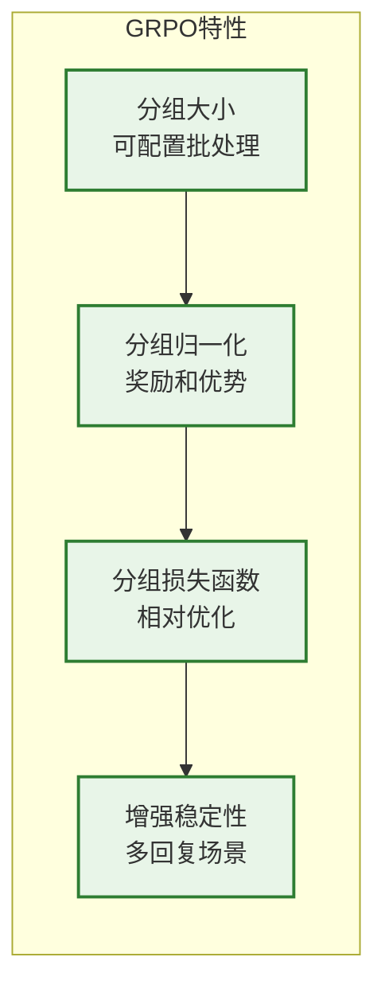

#### Core: 标准PPO
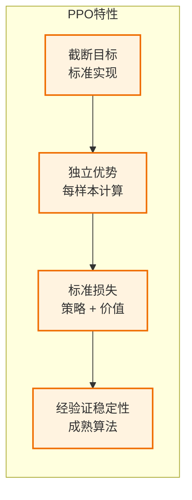

### 2. 基础设施对比

#### AReaLite基础设施
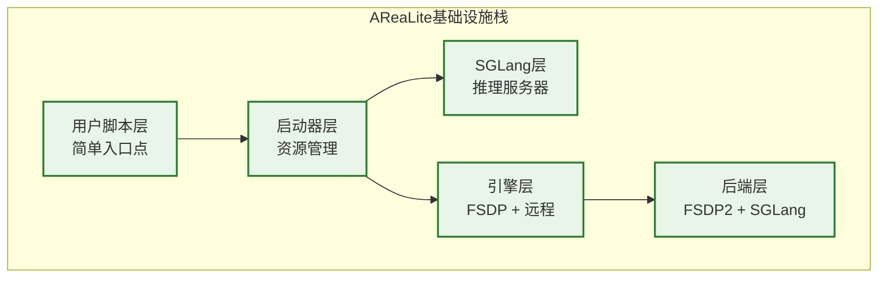

#### Core基础设施
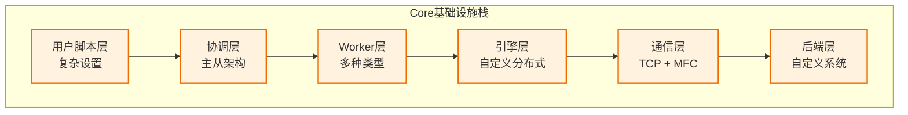

### 3. 通信模式

#### AReaLite通信
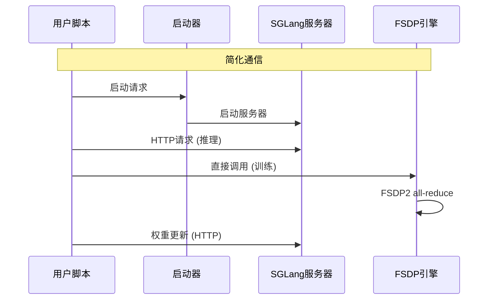

#### Core通信  
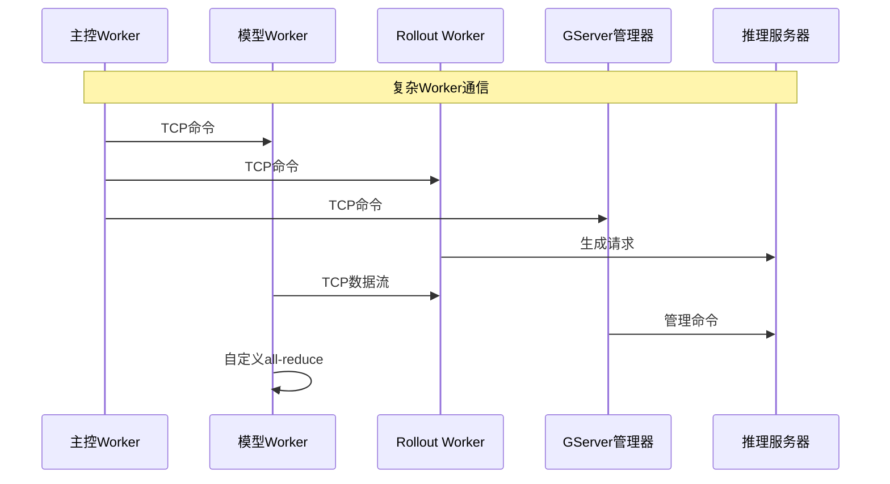

## 性能特征

### AReaLite性能特征
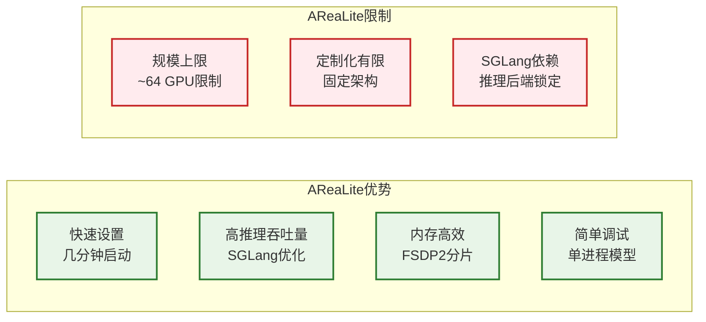

### Core性能特征
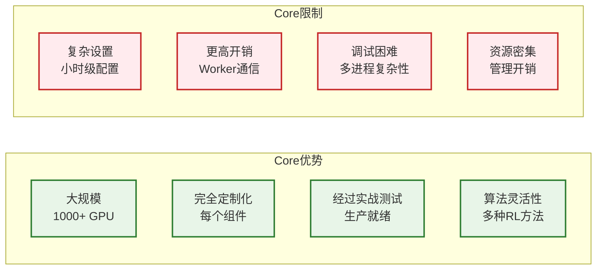

## 使用场景建议

### 何时选择AReaLite

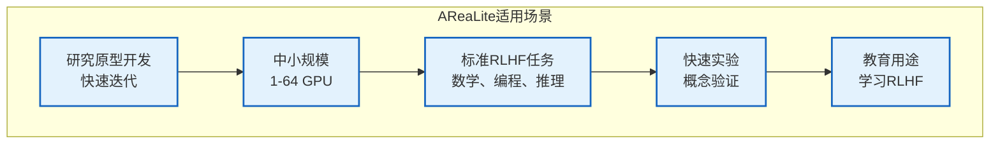

### 何时选择Core

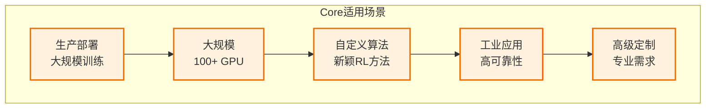

## 迁移路径

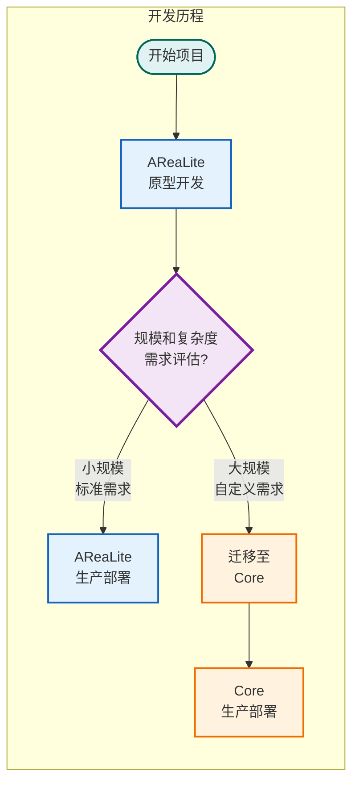

## 代码共享分析

两个系统在通用工具中共享大约25%的代码库：

### 共享组件
- **ReaLModel**: 基础模型实现
- **数学工具**: 奖励函数、验证逻辑  
- **统计跟踪**: 日志和监控系统
- **数据处理**: 分词和预处理工具

### 系统专用组件
- **AReaLite**: GRPO算法、FSDP引擎、SGLang集成
- **Core**: PPO接口、worker系统、MFC通信

这个架构对比帮助用户根据具体需求选择合适的系统，并理解简单性和可扩展性之间的权衡取舍。
