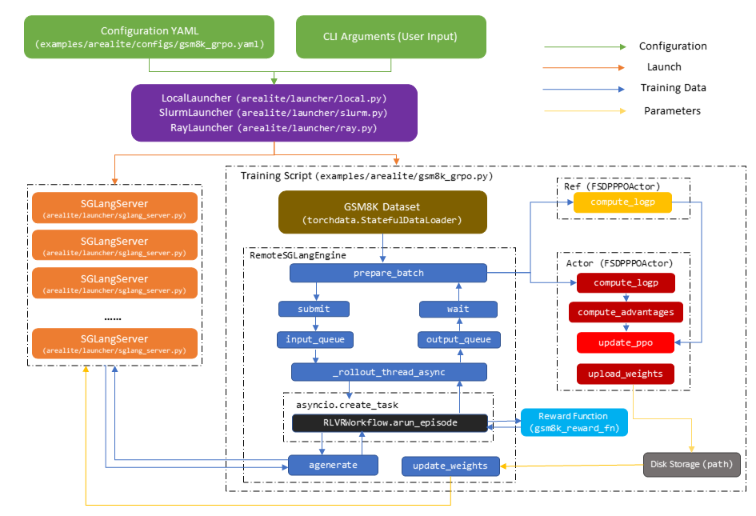

# Running GRPO on GSM8K Dataset

This guide introduces how AReaLite runs the GRPO algorithm on the GSM8K dataset, using
the training script
[examples/arealite/gsm8k_grpo.py](../../examples/arealite/gsm8k_grpo.py) and
configuration file
[examples/arealite/configs/gsm8k_grpo.yaml](../../examples/arealite/configs/gsm8k_grpo.yaml).

## How AReaLite Works

The following figure illustrates the launching and one asynchronous training step of the
GRPO algorithm on the GSM8K dataset on AReaLite. Compared with the old AReaL
implementation, AReaLite runs inference servers and a SPMD training script instead of a
bunch of various workers. In a training step, AReaLite:

1. Submits prompts from the dataset to `RemoteSGLangEngine`, who runs `RLVRWorkflow` in
   a streaming manner.
1. Completes `RLVRWorkflow` by interacting with remote `SGLangServer` instances to
   generate sequences, and computing rewards with the reward function.
1. Once there are enough outputs from `RLVRWorkflow`, aggregates them into a data batch
   for algorithm-specific training engine `FSDPPPOActor`.
1. Computes losses and update weights in `FSDPPPOActor`.
1. Transfers the updated weights to remote `SGLangServer` instances.



In the following sections, we will walk you through the code to explain concepts and
show you how these steps are done in details.

## Launching the Experiment

As shown in [Quickstart Guide](../tutorial/quickstart.md), experiments in AReaLite are
launched using standalone launchers with the following commands:

```
# Local Launcher
python -m arealite.launcher.local <training script> --config <configuration file> <cli args>
# Ray Launcher
python -m arealite.launcher.ray <training script> --config <configuration file> <cli args>
# Slurm Launcher
python -m arealite.launcher.slurm <training script> --config <configuration file> <cli args>
```

In AReaLite:

- The **training script** is an SPMD python script that serves as the experiment entry
  point.
- The launcher runs the training script with its distributed backend (`subprocess` for
  `LocalLauncher`, `ray.remote` for `RayLauncher`, `srun` for `SlurmLauncher`).
- The launcher also manages inference servers (currently only supporting
  `SGLangServer`). The number and parallelization strategies (e.g. tensor parallel) are
  determined by the option [allocation_mode](../../arealite/api/cli_args.py#L797).
- For distributed launchers (`RayLauncher` and `SlurmLauncher`), inference servers run
  with a wrapper
  [arealite/launcher/sglang_server.py](../../arealite/launcher/sglang_server.py) to
  handle addresses and ports in distributed settings.
- After `SGLangServer` instances are started, launchers collect their addresses and
  ports to set the `AREAL_LLM_SERVER_ADDRS` environment variable for training scripts to
  access these inference servers.

The **configuration file** is a YAML file that sets the options provided in
[arealite/api/cli_args.py](../../arealite/api/cli_args.py). It could be modified via CLI
arguments such as `actor.path=Qwen/Qwen3-1.7B` and `+sglang.attention_backend=triton`.
The training scripts parse the config with CLI arguments into the config class defined
in [arealite/api/cli_args.py](../../arealite/api/cli_args.py).

```
config, _ = load_expr_config(args, GRPOConfig)
config: GRPOConfig
```

## Loading and Preprocessing Dataset

We use the `datasets` and `torchdata` packages to load and preprocess the dataset into
our dataloader. First, we download `openai/gsm8k` from Huggingface and split it by data
parallel ranks, then map it to our desired format:

```python
def process_gsm8k_rl_dataset(dataset: Dataset):
    def process(sample):
        messages = [{"role": "user", "content": sample["question"]}]
        return {"messages": messages}
    dataset = dataset.map(process).remove_columns(["question"])
    return dataset

def get_gsm8k_dataset(split, rank, world_size):
    dataset = load_dataset(path="openai/gsm8k", name="main", split=split)
    dataset = split_dataset_by_node(dataset, rank=rank, world_size=world_size)
    return process_gsm8k_rl_dataset(dataset)
```

We then prepare training and evaluation dataloaders with `torchdata.StatefulDataLoader`:

```python
train_dataloader = torchdata.StatefulDataLoader(
    get_gsm8k_dataset("train", rank, world_size),
    batch_size=config.train_dataset.batch_size // world_size,
    shuffle=config.train_dataset.shuffle,
    num_workers=config.train_dataset.num_workers,
    collate_fn=lambda x: x,
    drop_last=config.train_dataset.drop_last,
)
valid_dataloader = ...
```

If you wish to use your own huggingface datasets or datasets on your local storage,
please refers to [Customization: Dataset](../customization/dataset.md) for further
details.

## Rollout

The data lifecycle is controlled by an `RLVRWorkflow`, which defines how data progresses
from prompts to complete rollout data containing all fields required for training. Our
example shows a single-turn RLVR workflow with a math reward function. The core logic of
the workflow is implemented in an async method `arun_episode`, which takes a prompt,
generate answers with `RemoteSGLangEngine`, computes rewards, and populates additional
fields to produce finalized training data.

```python
class RLVRWorkflow(RolloutWorkflow):
    def __init__(
        self, reward_fn, gconfig, tokenizer, ...
    ):
        self.reward_fn = reward_fn
        self.gconfig = gconfig
        self.tokenizer = tokenizer

    async def arun_episode(self, engine, data):
        # rollout data with inference engine
        input_ids = self.tokenizer.apply_chat_template(data["message"], ...)
        req = LLMRequest(rid=..., input_ids=input_ids, gconfig=self.gconfig.new(n_samples=1))
        resps = await asyncio.gather(
            *[engine.agenerate(req) for _ in range(self.gconfig.n_samples)]
        )
        # post process rollout responses
        results = []
        for resp in resps:
            reward = self.reward_fn(...)
            ... # other required fields for training
            res = dict(
                input_ids=...,
                rewards=...,
                ... # other required fields for training
            )
            results.append(res)
        # return padded `self.gconfig.n_samples` samples with prompt `data["message"]`
        return concat_padded_tensors(results)

def gsm8k_reward_fn(completions, answer):
    ...

tokenizer = load_hf_tokenizer(config.tokenizer_path)
workflow = RLVRWorkflow(
    reward_fn=gsm8k_reward_fn,
    gconfig=config.gconfig,
    tokenizer=tokenizer,
    ...
)
```

In AReaLite, generation tasks are offloaded to remote inference servers, which operate
on separate GPUs from those used for training. The `RemoteSGLangEngine` acts as a client
that interacts with the servers. `RemoteSGLangEngine` runs in a SPMD manner on every
training process, without occupying any GPUs.

`RemoteSGLangEngine` is responsible for managing the data streaming through rollout
workflows, and collates completed rollout data into batched training samples. When
initializing, it launches a rollout thread that runs rollout workflows as `asyncio`
tasks. The following code shows the simplified version of rollout thread implementation,
which iteratively:

- Checks available capacity. The capacity controls current number of rollout workflows
  to limit concurrency and data off-policyness.
- If there is capacity left and rollout is not paused for weight update, continuously
  obtains data from `input_queue` and creates `asyncio` tasks to run the workflows.
- Waits for rollout workflows to finish.
- Gathers data from finished workflows and puts them into `output_queue`

```python
class RemoteSGLangEngine(InferenceEngine):
    ...
    async def _rollout_thread_async(self):
        rid = 0
        try:
            while not self.exiting.is_set():
                # Check capacity
                capacity = self.get_capacity()
                # Create rollout tasks with data obtained from input_queue
                while (
                    capacity > 0
                    and not self.paused.is_set()
                    and self.input_queue.qsize() > 0
                ):
                    data, workflow = self.input_queue.get_nowait()
                    task = asyncio.create_task(
                        workflow.arun_episode(self, data), name=str(rid)
                    )
                    rollout_tasks[str(rid)] = task
                    self.rollout_stat.submitted += 1
                    self.rollout_stat.running += 1
                    capacity -= 1
                    rid += 1
                # Wait for rollout completion
                tasks = list(rollout_tasks.values())
                done = []
                if tasks:
                    done, _ = await asyncio.wait(
                        tasks,
                        timeout=ROLLOUT_POLL_WAIT_TIME,
                        return_when=asyncio.FIRST_COMPLETED,
                    )
                # Collect done results, put the results into output queue
                for task in done:
                    traj = await task
                    task_rid = task.get_name()
                    rollout_tasks.pop(task_rid)
                    self.rollout_stat.accepted += 1
                    self.output_queue.put_nowait(traj)
                    self.rollout_stat.running -= 1
                await asyncio.sleep(1)
    ...
```

With this rollout thread running, the training script (the main thread) submits prompts
into `input_queue` and collates rollout data from `output_queue` into training batches
with `prepare_batch` (for asynchronous RL) or `rollout_batch` (for synchronous RL). The
following code shows the implementation of `prepare_batch`:

```python
def prepare_batch(
    self,
    dataloader: StatefulDataLoader,
    workflow: "RolloutWorkflow",
):
    if not hasattr(self, "data_generator"):
        self.data_generator = iter(dataloader)
    assert dataloader.batch_size is not None
    while True:
        # Submit at least two batches to allow maximum overlap
        if (
            self.get_capacity() + dataloader.batch_size > 0
            and self.input_queue.qsize() + dataloader.batch_size
            < self.input_queue.maxsize
        ):
            try:
                data = next(self.data_generator)
            except StopIteration:
                self.data_generator = iter(dataloader)
                data = next(self.data_generator)
            for item in data:
                # submit data into input_queue
                self.submit(item, workflow=workflow)
        try:
            # wait for dataloader.batch_size data from output_queue
            return self.wait(dataloader.batch_size, timeout=1)
        except TimeoutError:
            pass
```

The usage of `RemoteSGLangEngine` in the training script is simple:

```python
rollout = RemoteSGLangEngine(config.rollout)
rollout.initialize()
eval_rollout = ...

data_generator = iter(train_dataloader)
for global_step in range(max_steps):
    # rollout batched training data for current step
    if config.async_training:
        batch = rollout.prepare_batch(train_dataloader, workflow=workflow)
    else:
        try:
            data = next(data_generator)
        except StopIteration:
            data_generator = iter(train_dataloader)
            data = next(data_generator)
        batch = rollout.rollout_batch(data, workflow=workflow)
```

If you want to use rollout workflows with custom reward functions or agentic tool
calling, see [Customization: Rollout Workflows](../customization/agent.md) for more
details.

## Training

After obtaining the training batch, we use `FSDPPPOActor` to calculate losses and update
weights. Each train engine corresponds to one model, therefore we need an additional
engine for the reference model. Note that `torch.distributed` process groups will be
lazily initialized using `init_process_group` when the first train engine is
initialized. The initialization of train engine will also load model weights from paths
specified by the configuration.

```python
actor = FSDPPPOActor(config=config.actor)
actor.initialize(None, ft_spec)
ref = None
if config.actor.kl_ctl > 0 and config.ref is not None:
    ref = FSDPPPOActor(config=config.ref)
    ref.initialize(None, ft_spec)
```

`FSDPPPOActor` is a high-level engine with algorithm-specific APIs, such as
`compute_logp`,`compute_advantages` and `ppo_update`. `FSDPPPOActor` is powered by the
lower-level train engine `FSDPEngine`, which use **pytorch FSDP2** to provide basic APIs
for the model such as `train_batch` and `forward`. The following code shows a GRPO
training step:

```python
logp = actor.compute_logp(batch)
batch["prox_logp"] = logp
if ref is not None:
    batch["ref_logp"] = ref.compute_logp(batch)
    log_gpu_stats("ref logp")
actor.compute_advantages(batch)
stats = actor.ppo_update(batch)
actor.step_lr_scheduler()
```

If you want to customize your own training algorithm, see
[Customize algorithms](../customization/algorithm.md) for more details.

## Transferring Weights to Inference Servers

After training, we transfer updated model weights to remote inference servers through
cooperation between `FSDPPPOActor` and `RemoteSGLangEngine`. We provide options to
transfer model weights from shared storage or NCCL. In our example training script, we
first prepare `WeightUpdateMeta` for NCCL backend on all training processes.

```python
# NOTE: Weight update meta only requires address and free port of rank 0,
# but `WeightUpdateMeta.from_fsdp_nccl` has to be executed on all ranks
# due to `engine.get_param_specs()`.
# Therefore, we create weight update meta on all ranks, then broadcast the one on rank 0.
weight_update_meta = [
    WeightUpdateMeta.from_fsdp_nccl(
        AllocationMode.from_str(config.allocation_mode), actor
    )
]
dist.broadcast_object_list(weight_update_meta, src=0)
weight_update_meta = weight_update_meta[0]
```

If you wish to transfer model weights from shared storage, you can use:

```python
weight_update_meta = WeightUpdateMeta.from_disk(config.saver)
```

After a training step is finished, we transfer new weights from actor engine to remote
inference servers with steps shown in the following code:

```python
# 1. Pause rollout on remote inference servers
rollout.pause()
# 2. Send requests to remote servers, tell them to update weights
if dist.get_rank() == 0:
    future = rollout.update_weights(weight_update_meta)
# 3. Actor begins to transfer weights
actor.upload_weights(weight_update_meta)
# 4. Wait for remote servers to return after finishing updates
if dist.get_rank() == 0:
    future.result()
# 5. Synchronize rollout processes for model version update
dist.barrier(device_ids=[actor.device.index])
torch.cuda.synchronize()
# 6. Resume rollout on remote inference servers
rollout.resume()
# 7. Set version, ensures versions on actor and rollout engine are identical
actor.set_version(global_step + 1)
rollout.set_version(global_step + 1)
```

Now a complete GRPO training step in AReaLite is done! The core logic of our example
training script can be summarized as:

```python
data_generator = iter(train_dataloader)
for global_step in range(max_steps):
    if config.async_training:
        batch = rollout.prepare_batch(train_dataloader, workflow=workflow)
    else:
        try:
            data = next(data_generator)
        except StopIteration:
            data_generator = iter(train_dataloader)
            data = next(data_generator)
        batch = rollout.rollout_batch(data, workflow=workflow)

    logp = actor.compute_logp(batch)
    batch["prox_logp"] = logp
    if ref is not None:
        batch["ref_logp"] = ref.compute_logp(batch)
        log_gpu_stats("ref logp")
    actor.compute_advantages(batch)
    stats = actor.ppo_update(batch)
    actor.step_lr_scheduler()

    rollout.pause()
    if dist.get_rank() == 0:
        future = rollout.update_weights(weight_update_meta)
    actor.upload_weights(weight_update_meta)
    if dist.get_rank() == 0:
        future.result()
    rollout.resume()
    actor.set_version(global_step + 1)
    rollout.set_version(global_step + 1)
```

## Utilities

In AReaLite, we provide a wide range of utilities for basic functionalities required for
observing and tuning your experiments.

### `Saver` and `Evaluator`

`Saver` ([arealite/utils/saver.py](../../arealite/utils/saver.py)) and `Evaluator`
([arealite/utils/evaluator.py](../../arealite/utils/evaluator.py)) manage the frequency
to save and evaluate the model with the train engine.

In our example, we call `saver.save` and `evaluator.evaluate` after every training step.
these two methods will automatically check if it is time to save or evaluate the model,
according to the experiment configuration.

### `stats_tracker`

`stats_tracker` ([realhf/base/stats_tracker.py](../../realhf/base/stats_tracker.py))
gathers training statistics across parallel ranks and reduce them.

1. **Scalar-type statistics** are recorded by `stats_tracker.scalar(key=value)` and will
   be averaged by the number of scalars with the same key when reduced.
1. **Tensor-type statistics** require `denominator` and `reduce_type` to decide how to
   reduce statistics under the same key.

- `denominator` is a bool tensor that masks the elements in the tensor that we do not
  want to record.
- `reduce_type` includes average, sum, min and max. By default, the average, min and max
  are all calculated.

For example, if we want to record the length of sequences with correct and incorrect
answers in a training batch:

```python
seqlens = ... # tensor of shape [#seqs,]
reward_score = ... # tensor of shape [#seqs,]

result_denominators = {
    "correct_n_seqs": (reward_score > 0).bool(),
    "incorrect_n_seqs": (reward_score <= 0).bool(),
}
# register the denominator
stats_tracker.denominator(**result_denominators)
# record the correct and incorrect sequence length
stats_tracker.stat(
    correct_seq_len=seqlens.float(), denominator="correct_n_seqs"
)
stats_tracker.stat(
    incorrect_seq_len=seqlens.float(), denominator="incorrect_n_seqs"
)
```

`stats_tracker` offers timer context to record time cost of a code block as a scalar.
And there is also a scope context to manage keys of statistics.

```python
with stats_tracker.record_timing("train_step"):
    # training step
    ...

with stats_tracker.scope("A"):
    stats_tracker.scalar(c=123) # key="A/c", value=123
    with stats_tracker.scope("B"):
        stats_tracker.scalar(c=234) # key="A/B/c", value=234
```

After recording sufficient data, e.g. after a `train_batch` is finished,
`stats_tracker.export` is called to aggregate all statistics and dump them into a
dictionary.

```python
stats = stats_tracker.export()
```

### `StatsLogger`

`StatsLogger` ([arealite/utils/stats_logger.py](../../arealite/utils/stats_logger.py))
logs gathered training data to recorders like `wandb` and `tensorboard` on rank 0. In
our example script, after finishing a training step,
`logger.commit(epoch, step, global_step, stats)` is called to record all statistics from
`stats_tracker` to print them as well as log them into the recorders set by the
configuration.

## Next Steps

- [Customize dataset](../customization/dataset.md)
- [Customize Agentic/RVLR rollout workflows](../customization/agent.md)
- [Customize algorithms](../customization/algorithm.md)
