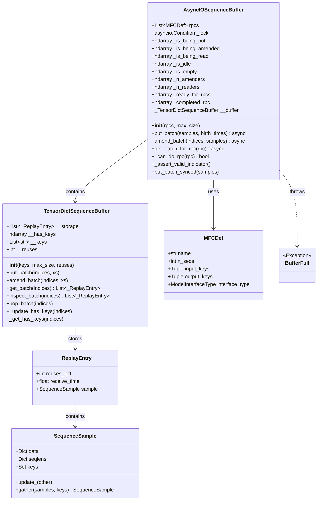
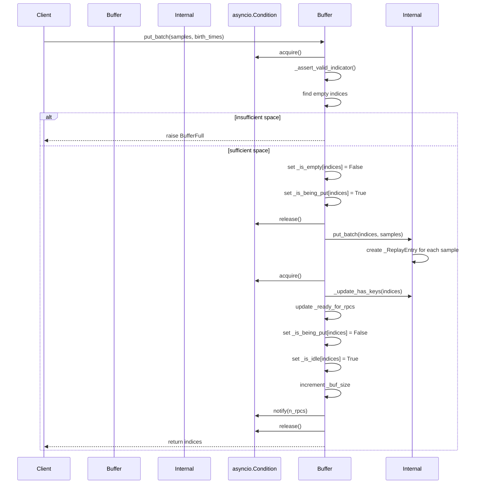
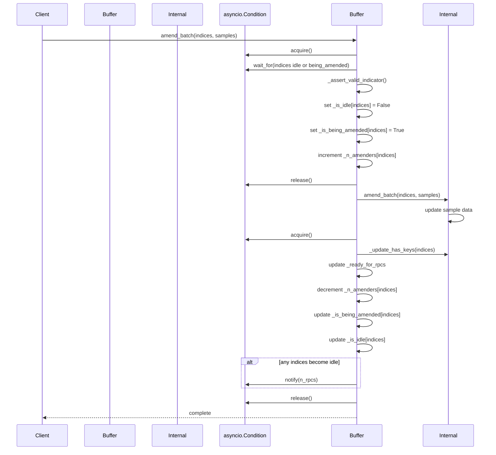
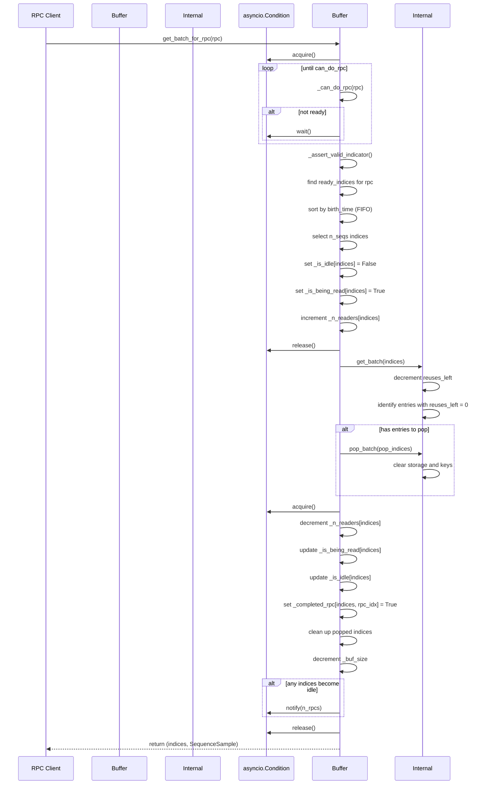

# ReplyBuffer (AsyncIOSequenceBuffer) 分析报告

## 概述

AReaL 中的 ReplyBuffer 实现主要基于 `AsyncIOSequenceBuffer` 类，这是一个用于异步强化学习系统的高性能缓冲区实现。该缓冲区支持并发的读者和修改者，并管理多个 RPC (Remote Procedure Call) 操作的数据流。

## 核心组件

### 1. 主要类结构

#### AsyncIOSequenceBuffer
- **作用**: 主要的异步序列缓冲区类
- **特点**: 
  - 支持异步操作和并发访问
  - 使用 numpy 数组管理缓冲区状态
  - 通过 asyncio.Condition 实现同步控制
  - 支持多个 RPC 操作的数据管理

#### _TensorDictSequenceBuffer  
- **作用**: 内部存储实现
- **特点**:
  - 线程不安全的内部缓冲区实现
  - 基于 Python 列表的固定大小存储
  - 管理数据键的可用性状态

#### _ReplayEntry
- **作用**: 单个缓冲区条目的数据结构
- **包含**: 重用次数、接收时间、序列样本数据

## 类图

## 状态管理

AsyncIOSequenceBuffer 使用多个 numpy 数组来管理缓冲区的状态：

- **_is_being_put**: 正在写入的条目
- **_is_being_amended**: 正在修改的条目  
- **_is_being_read**: 正在读取的条目
- **_is_idle**: 空闲的条目
- **_is_empty**: 空的条目

这些状态是互斥的，确保数据的一致性和线程安全。

## 主要操作时序图

### 1. put_batch 操作时序图

### 2. amend_batch 操作时序图

### 3. get_batch_for_rpc 操作时序图

## 关键特性

### 1. 并发控制
- 使用 `asyncio.Condition` 实现异步同步
- 支持多个读者和修改者并发访问
- 通过状态数组确保操作的原子性

### 2. 内存管理
- 基于重用计数的自动内存回收
- 固定大小的缓冲区避免动态内存分配
- 支持数据的就地更新

### 3. RPC 支持
- 智能的 RPC 就绪检测
- 基于数据键的依赖解析
- 支持多个 RPC 的并发执行

### 4. 数据优先级
- FIFO (First In, First Out) 数据处理策略
- 基于出生时间的数据排序
- 确保训练数据的时序一致性

## 总结

AsyncIOSequenceBuffer 是 AReaL 系统中的核心组件，通过精心设计的状态管理和并发控制，实现了高效的异步数据缓冲。其主要优势包括：

1. **高并发**: 支持多个读者和写者的并发访问
2. **内存效率**: 通过重用计数和固定大小缓冲区优化内存使用
3. **灵活性**: 支持动态的数据修改和多种 RPC 操作
4. **可靠性**: 完善的状态检查和异常处理机制

这个设计使得 AReaL 能够在分布式强化学习环境中提供稳定、高效的数据管理服务。