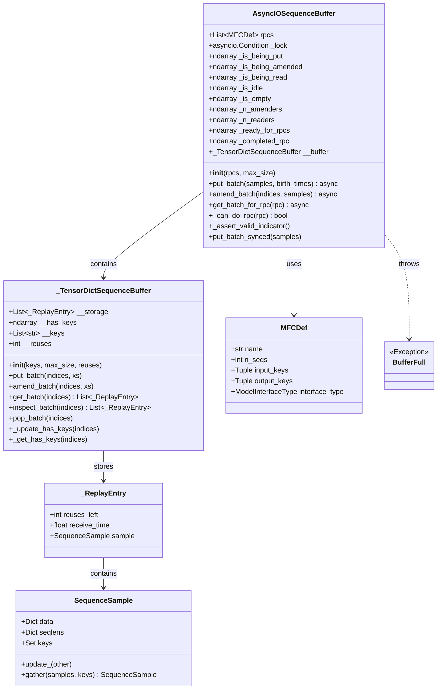
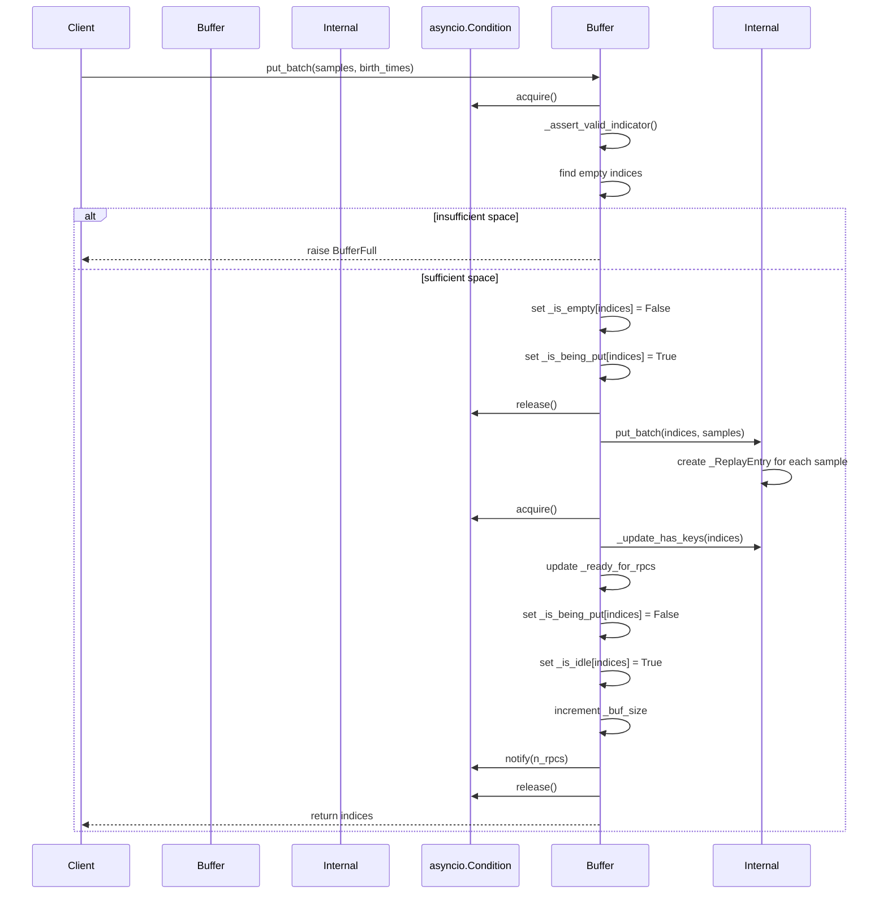
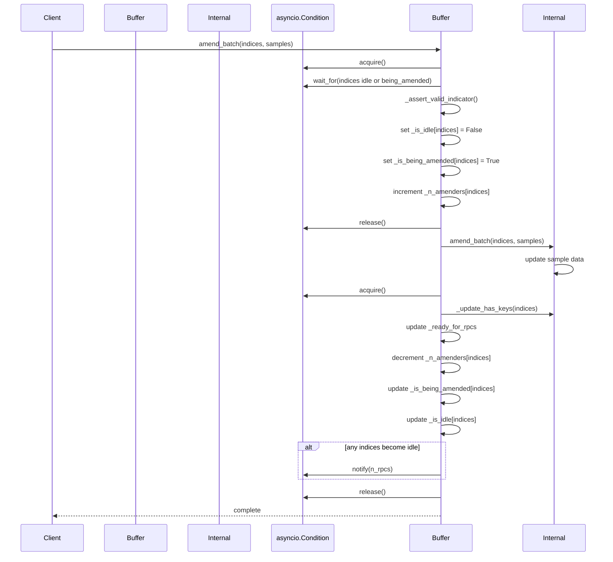
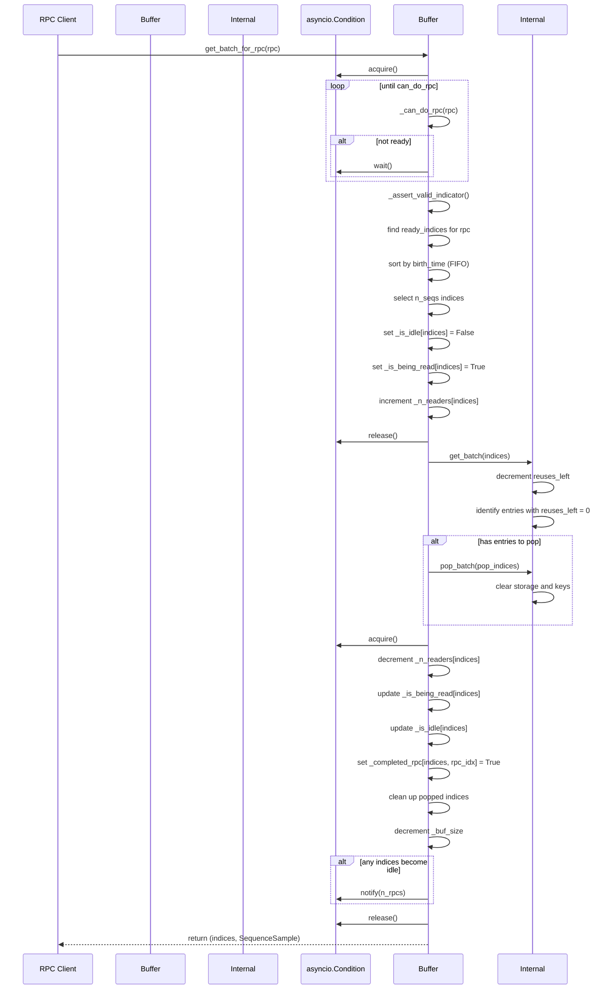

# ReplyBuffer (AsyncIOSequenceBuffer) Analysis Report

## Overview

The ReplyBuffer implementation in AReaL is primarily based on the `AsyncIOSequenceBuffer` class, which is a high-performance buffer implementation for asynchronous reinforcement learning systems. This buffer supports concurrent readers and modifiers, and manages data flow for multiple RPC (Remote Procedure Call) operations.

## Core Components

### 1. Main Class Structure

#### AsyncIOSequenceBuffer
- **Purpose**: Main asynchronous sequence buffer class
- **Features**: 
  - Supports asynchronous operations and concurrent access
  - Uses numpy arrays for buffer state management
  - Implements synchronization control via asyncio.Condition
  - Supports data management for multiple RPC operations

#### _TensorDictSequenceBuffer  
- **Purpose**: Internal storage implementation
- **Features**:
  - Thread-unsafe internal buffer implementation
  - Fixed-size storage based on Python lists
  - Manages data key availability states

#### _ReplayEntry
- **Purpose**: Data structure for individual buffer entries
- **Contains**: Reuse count, receive time, sequence sample data

## Class Diagram

## State Management

AsyncIOSequenceBuffer uses multiple numpy arrays to manage buffer states:

- **_is_being_put**: Entries being written
- **_is_being_amended**: Entries being modified  
- **_is_being_read**: Entries being read
- **_is_idle**: Idle entries
- **_is_empty**: Empty entries

These states are mutually exclusive, ensuring data consistency and thread safety.

## Key Operation Sequence Diagrams

### 1. put_batch Operation Sequence Diagram

### 2. amend_batch Operation Sequence Diagram

### 3. get_batch_for_rpc Operation Sequence Diagram

## Key Features

### 1. Concurrency Control
- Uses `asyncio.Condition` for asynchronous synchronization
- Supports multiple concurrent readers and modifiers
- Ensures atomic operations through state arrays

### 2. Memory Management
- Automatic memory reclamation based on reuse counting
- Fixed-size buffer avoids dynamic memory allocation
- Supports in-place data updates

### 3. RPC Support
- Intelligent RPC readiness detection
- Dependency resolution based on data keys
- Supports concurrent execution of multiple RPCs

### 4. Data Prioritization
- FIFO (First In, First Out) data processing strategy
- Data sorting based on birth time
- Ensures temporal consistency of training data

## Summary

AsyncIOSequenceBuffer is a core component in the AReaL system, achieving efficient asynchronous data buffering through carefully designed state management and concurrency control. Its main advantages include:

1. **High Concurrency**: Supports concurrent access by multiple readers and writers
2. **Memory Efficiency**: Optimizes memory usage through reuse counting and fixed-size buffers
3. **Flexibility**: Supports dynamic data modification and various RPC operations
4. **Reliability**: Comprehensive state checking and exception handling mechanisms

This design enables AReaL to provide stable, efficient data management services in distributed reinforcement learning environments.