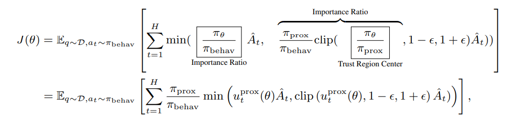

# Training Algorithm

An algorithm is encapsulated in a `ModelInterface`, which primarily defines three methods:

```python
# in realhf/api/core/model_api.py
class ModelInterface(abc.ABC):
    """An interface for model training, inference, and generation.

    This interface is designed to follow the dependency injection pattern.
    We pass the model to the interface and call its methods, ensuring that model APIs
    and algorithms are fully decoupled. For example, REINFORCE and PPO can exhibit
    different behaviors during training. Separate interfaces can be written for these
    algorithms while using the same model that provides basic forward-backward-update
    functionality (i.e., :class:`PipelinableEngine`).

    During runtime, the master worker requests model workers to execute a specific
    interface type (e.g., generate) on a specific model. The model worker locates
    the corresponding model, passes it into the requested interface, performs the
    computation, and returns the result.
    """

    def inference(
        self,
        model: Model,
        data: SequenceSample,
        mb_spec: MicroBatchSpec,
    ) -> SequenceSample | None:
        raise NotImplementedError()

    def generate(
        self,
        model: Model,
        data: SequenceSample,
        mb_spec: MicroBatchSpec,
    ) -> SequenceSample | None:
        raise NotImplementedError()

    def train_step(
        self,
        model: Model,
        data: SequenceSample,
        mb_spec: MicroBatchSpec,
    ) -> Dict | List[Dict]:
        raise NotImplementedError()
```

When the dataflow is fixed, it's usually sufficient to modify or add the file that defines the algorithm interface.

We provide two examples: (1) changing PPO's global advantage normalization to grouped normalization in GRPO, and (2) changing the original PPO loss to the decoupled PPO loss in AReaL's paper.

```{note}
We recommend using asynchronous RL, so that you can customize the generation behavior by [modifying your RL agent](agent.md) and don't need to modify the `generate` method of model interfaces.
```

## Grouped Advantage Normalization

The PPO algorithm is written in a single file `ppo_interface.py`. The method we are going to modify is the `train_step` method in `PPOActorInterface`. PPO's global advantage normalization looks like:

```python
@dataclass
class PPOActorInterface(ModelInterface):
    def train_step(
        self,
        model: Model,
        data: SequenceSample,
        mb_spec: MicroBatchSpec,
    ) -> Dict | List[Dict]:
        ...
        if self.adv_norm:
            advantages = masked_normalization(advantages, loss_mask)
        ...
```

### An Additional Note on Data Management

We need to explain how data in each batch is organized.

Usually, each data batch (i.e., the `data` variable) includes multiple prompts. The number of prompts is called "batch size". Additionally, each prompt may have multiple corresponding answers. The number of answers is called "group_size". Therefore, there are batch_size × group_size sequences in each batch.

These sequences have different lengths, but they are concatenated (or packed) together as a 1D tensor. The inner dimension is the "group" with the same prompt, and the outer dimension consists of answers from different prompts. Similar to flash-attention, we use `cu_seqlens` to mark the boundary of each sequence. `cu_seqlens` is the cumulative sum of sequence lengths across the batch.

Each token in the sequence has a corresponding reward and advantage, so `advantages` is also a packed 1D tensor just like the tokens (i.e., `packed_input_ids`). However, the "sequences" of advantages are all one step shorter than tokens due to the auto-regressive nature of LLMs. We can only compute the loss on tokens except for the first one in each sequence.

### Implementation

For grouped advantage normalization, we need to partition the advantages into groups and run normalization within the tensor chunk of each group:

```diff
@dataclass
class PPOActorInterface(ModelInterface):
+   group_adv_norm: bool = False

    def train_step(
        self,
        model: Model,
        data: SequenceSample,
        mb_spec: MicroBatchSpec,
    ) -> Dict | List[Dict]:
        ...
        if self.adv_norm:
-           advantages = masked_normalization(advantages, loss_mask)
+           if not self.group_adv_norm:
+               advantages = masked_normalization(advantages, loss_mask)
+           else:
+               n_samples = data.bs
+               adv_list = []
+               for i in range(0, n_samples, self.group_size):
+                   # Start and end of the chunk
+                   s = short1cu_seqlens[i]
+                   e = short1cu_seqlens[i + self.group_size]
+                   # Get advantages within each group of the same prompt
+                   adv = advantages[s: e]
+                   mask = loss_mask[s: e]
+                   # Run normalization
+                   advn = masked_normalization(adv, mask, all_reduce=False)
+                   adv_list.append(advn)
+               advantages = torch.cat(adv_list, 0)
        ...
```

### Modify Your Experiment Configuration

To make our new argument `group_adv_norm` effective in CLI args, we should make the following changes to the `PPOMathConfig` under `realhf/experiments/common/ppo_math_exp.py`:

```diff
@dataclasses.dataclass
class PPOMATHConfig(CommonExperimentConfig, PPOMATHExperimentOptions):
+   group_adv_norm: bool = False

    @property
    def rpcs(self):
        ...
        # interfaces
        actor_interface = ModelInterfaceAbstraction(
            "ppo_actor",
            args={
                **copy.deepcopy(self.ppo_kwargs),
+               "group_adv_norm": self.group_adv_norm,
                ...
            },
        )
```

## The Decoupled PPO Loss



As mentioned in AReaL's paper, we implement this loss by recomputing the probabilities before mini-batched updates, and use this value as π_prox to compute the above loss.

### Probability Recomputation

Recomputation involves a single forward pass, which has already been implemented by `PPOActorInterface.inference`. We need to call this method in the `train_step` method:

```diff
@dataclass
class PPOActorInterface(ModelInterface):
+   use_decoupled_loss: bool = False

    def train_step(
        self,
        model: Model,
        data: SequenceSample,
        mb_spec: MicroBatchSpec,
    ) -> Dict | List[Dict]:
+       if self.use_decoupled_loss:
+           s: SequenceSample = self.inference(model, data, mb_spec)
+           prox_logp = s.data["logprobs"]
        ...
```

Next, we need to pass `prox_logp` to loss computation:

```diff
@dataclass
class PPOActorInterface(ModelInterface):
    ...

    def train_step(
        self,
        model: Model,
        data: SequenceSample,
        mb_spec: MicroBatchSpec,
    ) -> Dict | List[Dict]:
        # Prepare data to be split into mini-batches.
        flat_data = dict(
            advantages=advantages,
            old_logp=old_logp,
            ppo_loss_mask=loss_mask,
            packed_input_ids=input_.data["packed_input_ids"],
            kl_rewards=kl_rewards,
        )
+       if self.use_decoupled_loss:
+           flat_data["prox_logp"] = prox_logp.float()

        flat_input = SequenceSample.from_default(
            ids=list(range(input_.bs * self.group_size)),
            data=flat_data,
            seqlens=[int(x) for x in input_lens.cpu().numpy().tolist()],
        )
        ...
        datas = flat_input.split_with_spec(spec)
        ...
        for mb_i, data in enumerate(datas):
            train_stat = module.train_batch(
                input_=data,
                mb_spec=mb_spec,
                version_steps=model.version.global_step,
                loss_fn=_loss_fn,
                loss_weight_fn=lambda x: x.data[
                    "ppo_loss_mask"
                ].count_nonzero(),
                token_normalize_scope=self.token_normalize_scope,
            )
```

The `flat_input` variable will be divided into mini-batches. Each mini-batch of data will be passed into the `train_batch` method to run distributed training. The data included in this `SequenceSample` object will all be passed into the `_loss_fn`. In this case, `_loss_fn` is a wrapper over `_ppo_actor_loss_from_model_outputs`:

```python
def _ppo_actor_loss_from_model_outputs(
    logits: torch.FloatTensor,  # [tot_seqlen, vocab_size]
    input_: SequenceSample,
    ...
) -> torch.Tensor:
    ...
```

`logits` is the output of model forward, and `input_` is exactly the `input_` we passed into `train_batch`. So now we can retrieve the `prox_logp` via:

```diff
def _ppo_actor_loss_from_model_outputs(
    logits: torch.FloatTensor,  # [tot_seqlen, vocab_size]
    input_: SequenceSample,
    ...
) -> torch.Tensor:
    ...
+   prox_logp = input_.data["prox_logp"]
    loss, ppo_stat = ppo_functional.actor_loss_fn(
        logprobs=logprobs,
        old_logprobs=old_logp,
        advantages=advantages,
        eps_clip=eps_clip,
        loss_mask=ppo_loss_mask,
        c_clip=c_clip,
+        proximal_logprobs=prox_logp,
        behav_imp_weight_cap=behav_imp_weight_cap,
    )
```

We have successfully recomputed the probability and passed it into the loss function. Next we should revise the loss computation code.

### Modifying the PPO Loss

```diff
def actor_loss_fn(
    logprobs: torch.FloatTensor,
    old_logprobs: torch.FloatTensor,
    advantages: torch.FloatTensor,
    eps_clip: float,
    loss_mask: Optional[torch.BoolTensor] = None,
    c_clip: Optional[float] = None,
+    proximal_logprobs: Optional[torch.FloatTensor] = None,
    behav_imp_weight_cap: Optional[torch.FloatTensor] = None,
) -> Tuple[torch.Tensor, Dict]:
    ...
+    if proximal_logprobs is not None:
+        denorm_logprobs = proximal_logprobs
+    else:
+        denorm_logprobs = old_logprobs
    ...
    loss_mask_count = loss_mask.count_nonzero() or 1
    # For numerical stability.
-    ratio = torch.where(loss_mask, torch.exp(logprobs - old_logprobs), 0)
+    ratio = torch.where(loss_mask, torch.exp(logprobs - denorm_logprobs), 0)
    ...
+    if proximal_logprobs is not None:
+        behav_kl = proximal_logprobs - old_logprobs
+        behav_imp_weight = behav_kl.exp()
+        behav_kl = torch.where(loss_mask, behav_kl, 0.0)
+        behav_imp_weight = torch.where(loss_mask, behav_imp_weight, 0.0)
+        pg_loss = pg_loss * behav_imp_weight
    ...
    return pg_loss, stat
```

### Modify the Experiment Configuration

```diff
@dataclasses.dataclass
class PPOMATHConfig(CommonExperimentConfig, PPOMATHExperimentOptions):
+   use_decoupled_loss: bool = False

    @property
    def rpcs(self):
        ...
        # interfaces
        actor_interface = ModelInterfaceAbstraction(
            "ppo_actor",
            args={
                **copy.deepcopy(self.ppo_kwargs),
+               "use_decoupled_loss": self.use_decoupled_loss,
                ...
            },
        )
```