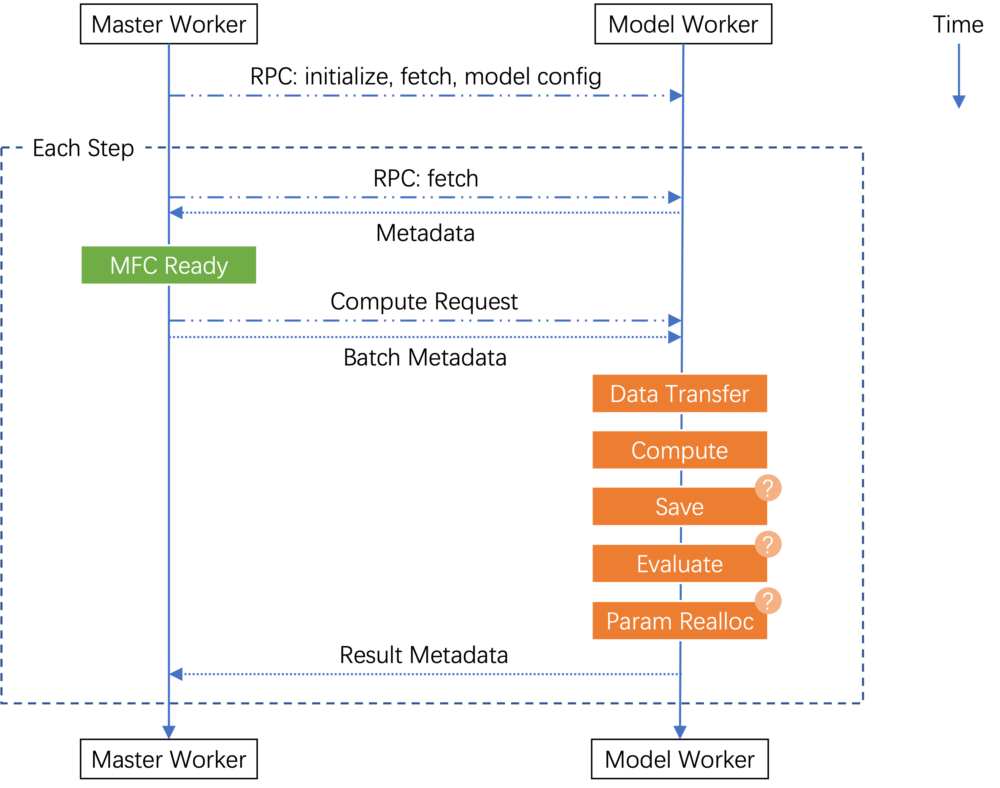

# Model Worker
## Master-Model Worker Interaction
The master worker sends remote procedure calls (RPCs) to model workers to execute actual computations like `actor_gen` and `actor_train`. The figure below illustrates their interaction throughout an experiment:

Model worker "compute" involves running a model interface with a specific backend (covered in detail later). For PPO algorithms, model workers sequentially execute:

+ `actor_gen`: `actor` model with SGlang backend + `PPOActorInterface.generate`
+ `rew_inf`: `reward` model (can be null for RLVR) + `MultiTaskRewardInterface.inference`  
+ `actor_train`: `actor` model with Megatron backend + `PPOActorInterface.train_step`

## Communication Protocol
### Request-Reply Pattern
The master worker and model workers communicate through a `request_reply_stream` channel that handles requests and metadata responses (actual data like `input_ids` transfers through other channels).

Master (client) can send these requests to model workers (servers):

+ **fetch**: Worker loads local dataset data and sends metadata (e.g., sequence length) to master for buffer storage
+ **spec**: Worker returns dataset specifications for master to calculate experiment steps
+ **model_config**: Worker provides transformer model configuration
+ **clear_data_cache**: Worker clears data transfer and GPU caches
+ **initialize**: Worker initializes parameters, gradient buffers, and optimizer states
+ **generate/inference/train_step**: Worker executes corresponding computation (note: "inference" refers to single forward pass)

### Request Hooks
Computation requests ("generate"/"inference"/"train_step") support pre- and post-hooks for:

+ Data transfer (pre-hook)
+ Evaluation
+ Offloading  
+ Parameter reallocation
+ Checkpointing (post-hooks)

These hooks often require NCCL communication/synchronization between workers. Implementing them as dedicated hooks prevents deadlocks that could occur if these operations interleaved with other NCCL communications.

### Request Types
+ **Blocking requests**: Long-running operations requiring NCCL synchronization. Workers can't execute immediately since concurrent blocking requests may need coordinated data transfers. Master sends a "flush" request to indicate all concurrent requests have been sent.
+ **Non-blocking requests**: Shorter operations without NCCL requirements that can execute immediately.

## Data Management
### Distributed Dataset Storage
Datasets distribute across model workers without overlap. For each model:

+ Processes with PP rank = -1 and TP rank = 0 serve as DP heads
+ Data stores on DP heads of the model used in the first MFC (e.g., actor model DP heads for PPO)

During "fetch" requests:

1. DP head worker loads data into local buffer
2. Sends metadata to master
3. Master tracks metadata and later instructs workers which data to use for each MFC via computation request hooks

### Data Transfer Process
For each MFC, the master:

1. Specifies which data to use
2. Provides data locations across workers
3. Workers redistribute data using:
    - `Redistributor`: Generates NCCL broadcast/gather/scatter communication plan  
    - `DataManager`: Executes the plan

After redistribution, workers with same DP rank receive identical input data.

### MFC Output Handling
Only workers with PP rank=-1 and TP rank=0 produce output data. These workers:

1. Store data locally
2. Notify master of data locations
3. Master generates new redistribution plans for subsequent MFCs based on this layout information

