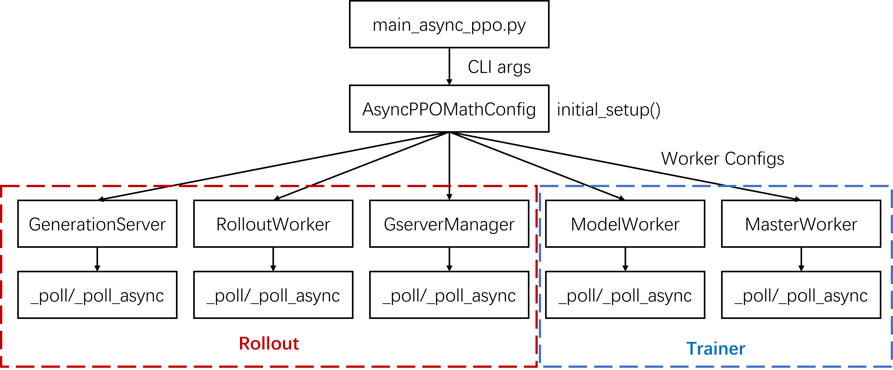

# Overview



In the launching script, the CLI arguments are first converted into an experiment configuration of type `AsyncPPOMathConfig`. We then call the `initial_setup` method of the experiment configuration to obtain the worker configurations required for the experiment. Next, we launch several types of workers.

Among these workers, `GenerationServer`, `RolloutWorker`, and `GserverManager` are responsible for rollout in asynchronous RL. `ModelWorker` and `MasterWorker` are responsible for training.

Workers independently execute the `_poll` or `_poll_async` method in a while loop, where the core logic of these workers is implemented.

```{note}
For SFT and synchronous PPO, only trainer workers are launched.
```

For asynchronous RL, the trainer side treats the rollout side as "datasets". The "dataset" does not load from disk but pulls data from a TCP socket, implemented in `stream_dataset.py`. This approach unifies offline training workflows (e.g., SFT) and online RL workflows (e.g., PPO) by simply specifying different dataset types.