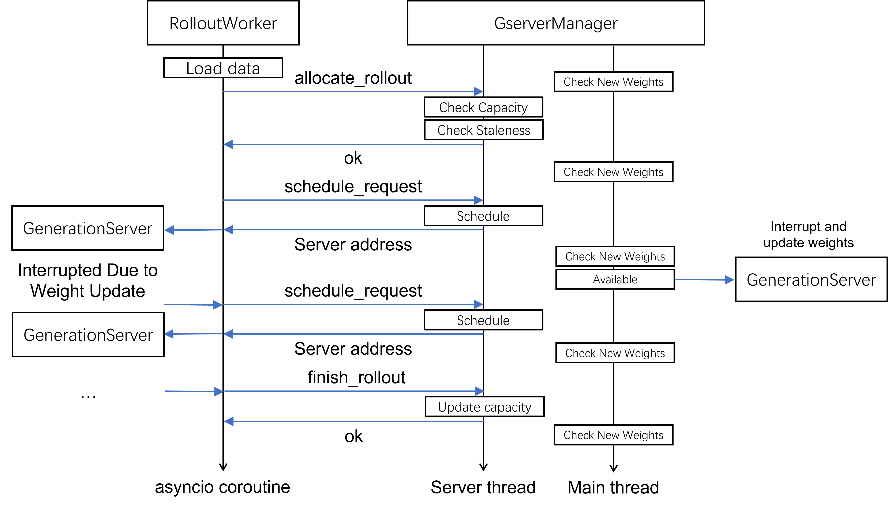

# Generation Server and Manager

## Server

The `GenerationServer` launches an SGLang subprocess during setup and writes the server's address to `name_resolve` so that other workers can discover it. It serves as a thin wrapper over SGLang's `launch_server` command.

Request scheduling and parameter versioning across different servers are managed by the `GserverManager`, which we'll introduce in the next section.

## Manager

### Server Thread

The `GserverManager` launches a `fastapi` server thread for rollout workers to invoke. There are three main types of APIs:

+ **allocate_request**: The manager decides whether to allow submission of a new rollout request based on capacity and data staleness
+ **schedule_request**: The manager routes initial or interrupted requests to a generation server address
+ **finish_rollout**: The manager releases the slot and allows allocation of new rollouts

Since the generation of each trajectory must pass through the centralized manager, we can conveniently control data staleness. For details on staleness control, refer to the `is_staled` method of `GserverManager`.

### Main Thread

The main thread of `GserverManager` executes the `_poll` method, which primarily checks whether new weights are available. When new weights are detected, it sends update weight requests to all generation servers to interrupt ongoing requests and update the weights to the latest version.