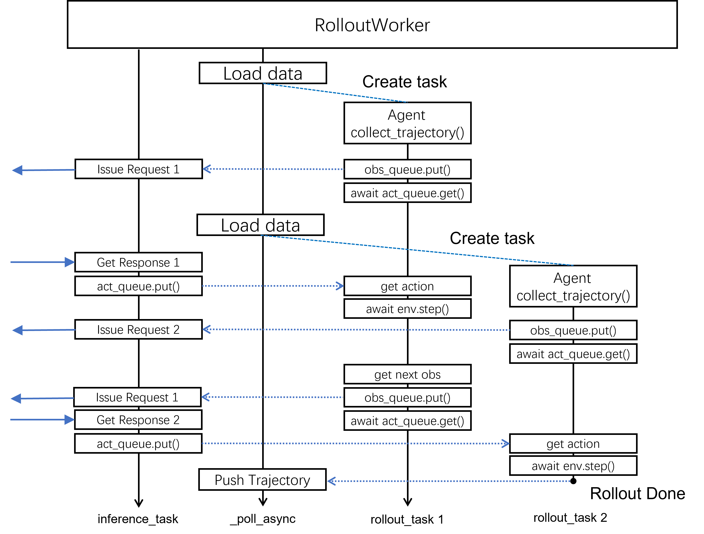

# Rollout Worker



The rollout worker runs these jobs in independent asyncio coroutines:

+ **Load and execute trajectories**: Load a new prompt and run `agent.collect_trajectory()`. The agent steps through the environment, pushes new observations into `obs_queue`, and waits for new actions from `act_queue`. The user can provide customized implementation for the agent.

+ **Process inference requests**: Handle requests produced by agents and obtained from `obs_queue`. After inference completes, it sends actions via `act_queue` back to the agent to continue the rollout.

+ **Submit completed trajectories**: Push complete trajectories to the trainer.

For each agent, the timeline is straightforward: it iteratively puts the latest observation into `obs_queue`, waits for an action from `act_queue`, and runs `env.step` to get the next observation until a full trajectory is collected. The rollout worker runs many agents concurrently, switching between them when some are idle and waiting for remote responses.

The rollout worker typically doesn't perform actual computation—it serves as a client for both the generation server and the environment service.

```{note}
Although we expect `EnvironmentService` to be a remote service, it can be implemented as a pure python function. In this case, the rollout worker process will handle the computation for `env.step`.
```