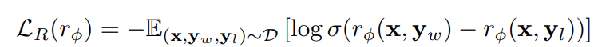
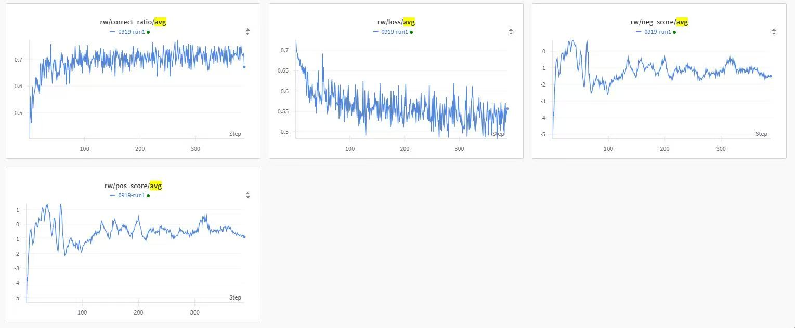

# Alignment with HHRLHF Dataset

This folder contains an example of reward model training using the `Anthropic/hh-rlhf`
dataset.

## What is Reward Model Training?

Reward modeling is a crucial step in aligning language models with human preferences.
The goal is to train a model that scores responses based on human preferences, which can
then guide policy optimization in reinforcement learning.

The Bradley-Terry reward modeling loss can be expressed as



## Quick Start

Launch the reward model training process using the provided configuration.

```bash
python3 -m areal.launcher.local hhrlhf_rw.py \
    --config hhrlhf_rw.yaml \
    experiment_name=hhrlhf-rw \
    trial_name=trial1 \
    model.path=Qwen/Qwen2.5-7B \
    train_dataset.path=Anthropic/hh-rlhf \
    valid_dataset.path=Anthropic/hh-rlhf \
    stats_logger.wandb.mode=online # Set to 'disabled' if you don't use Weights & Biases
```

## Training Curves


