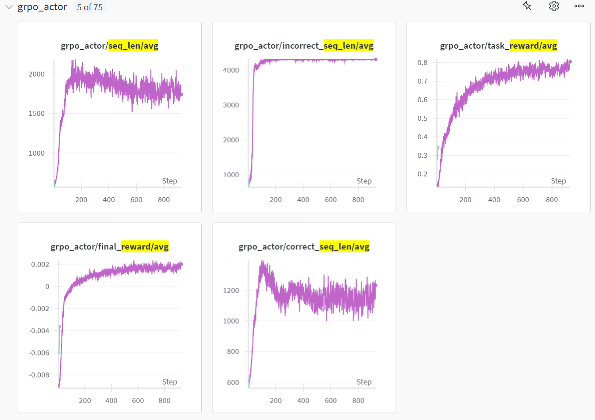

# LLM Training for the Countdown Numbers Game

This repository contains an example of using **AReaL-Lite** to train a Large Language
Model (LLM) to play the Countdown numbers game (a generalization of the "24 Points"
game).

## 🎯 What is the Countdown Numbers Game?

The goal of the game is to use basic arithmetic operations (addition `+`, subtraction
`-`, multiplication `*`, division `/`) on a set of given numbers to reach a specific
target number. Each number can be used at most once.

**Example:**

- **Numbers:** 3, 5, 7, 8
- **Target:** 24
- **Possible Solution:** `(7 - (5 - 3)) * 8 = 24`

This project fine-tunes a Qwen model using GRPO to generate valid and correct solutions
for this puzzle.

## 📋 Prerequisites

Before you begin, ensure you have met the following requirements:

- You have installed **AReaL**. Please follow the official
  [AReaL installation guide](https://inclusionai.github.io/AReaL/tutorial/installation.html).
- You have access to the `Qwen/Qwen2.5-3B-Instruct` model on the Hugging Face Hub (or
  have it downloaded locally).

## 🚀 Quick Start

### 1. Prepare the Dataset

First, generate the training and evaluation data for the Countdown game.

```bash
# Create a directory for the data
mkdir -p data/countdown/qwen

# Run the dataset creation script
python3 countdown.py
```

This will generate the required `train_e.jsonl` and `test_e.jsonl` files in the
`data/countdown/qwen/` directory.

### 2. Launch the Training

Launch the local AReaL training process using the provided configuration.

```bash
python3 -m areal.launcher.local train.py \
    --config train_config.yaml \
    experiment_name=countdown-grpo \
    trial_name=trial1 \
    actor.path=Qwen/Qwen2.5-3B-Instruct \
    train_dataset.path=data/countdown/qwen/train_e.jsonl \
    valid_dataset.path=data/countdown/qwen/test_e.jsonl \
    stats_logger.wandb.mode=online # Set to 'disabled' if you don't use Weights & Biases
```

**Key Arguments Explained:**

- `experiment_name`: A name for your experiment.
- `trial_name`: A name for this specific training run.
- `actor.path`: The Hugging Face model ID or local path to the base model.
- `stats_logger.wandb.mode`: Enable (`online`) or disable (`disabled`) logging to
  Weights & Biases.

## 🧠 Core Implementation

This example is adapted from the GSM8K example in AReaL, with key modifications for the
Countdown game:

### Reward Function (`reward_score.py`)

The core of the reinforcement learning loop is the reward function in `reward_score.py`.
The `compute_score` function evaluates the correctness of a model-generated solution
string against the ground truth.

```python
def compute_score(solution_str, ground_truth, method='strict', format_score=0.1, score=1.):
    # ... logic to parse the solution and check its arithmetic validity ...
    # Returns a reward
```

### Training Workflow (`train.py`)

In the `CountDownWorkflow` class, the trainer generates multiple solutions (`n_samples`)
for each problem and computes a reward for each one.

```python
async def arun_episode(self, engine: InferenceEngine, data):
    # ...
    for resp in resps:
        completions_str = self.tokenizer.decode(resp.output_tokens)
        reward = compute_score(completions_str, data['answer'])
    # ...
```

### Dataset Loading

The dataset loader is customized to read the JSONL files created by `countdown.py`.

```python
def get_countdown_dataset(dataset_path, rank, world_size):
    dataset = load_dataset(path="json", split="train", data_files=dataset_path)
    return split_dataset_by_node(dataset, rank=rank, world_size=world_size)
```

## Training Curves



## 📁 Project Structure

```
.
├── countdown.py          # Script to generate training data
├── train.py             # Main training script & workflow definition
├── train_config.yaml    # AReaL training configuration
├── reward_score.py      # Implementation of the reward function
└── README.md            # This file
```

## 🤝 Contributing

Contributions to improve this example are welcome! Please feel free to open an issue or
submit a pull request.
