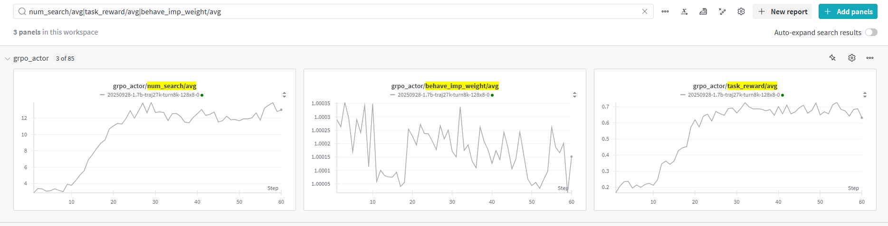

# Training with Tongyi-DeepResearch Agent Workflow in AReaL

Files in this folder presents an example that train Tongyi-DeepResearch agent workflow
with slight modification from
[its open-source code](https://github.com/Alibaba-NLP/DeepResearch), using AReaL's
`ArealOpenAI` APIs and its `concat` mode to organize training data.

The example trains Qwen3 1.7B model with
[ASearcherLRM35k data](https://huggingface.co/datasets/inclusionAI/ASearcher-train-data/viewer/default/ASearcherLRM35k),
and only uses search and visit tools.

# To run the example

1. Install dependencies for this example:

```bash
pip install -r examples/search-agent/tongyi_deepresearch/requirements.txt
```

2. Launch LLM judge SGLang servers.

```bash
python3 -m areal.launcher.ray --config examples/search-agent/tongyi_deepresearch/config.yaml \
    experiment_name=llm-judge trial_name=trial0 \
    actor.path=Qwen/Qwen2.5-72B-Instruct
```

3. Run the experiment:

```bash
python3 -m areal.launcher.ray examples/search-agent/tongyi_deepresearch/train.py \
    --config examples/search-agent/tongyi_deepresearch/config.yaml \
    experiment_name=train-tongyi-deepresearch trial_name=trial0 \
    judge_engine.experiment_name=llm-judge trial_name=trial0 \
    launcher.trainer_env_vars=SERPER_KEY_ID=<your serper key>,JINA_API_KEYS=<your jina key>
```

## Reward Curve


