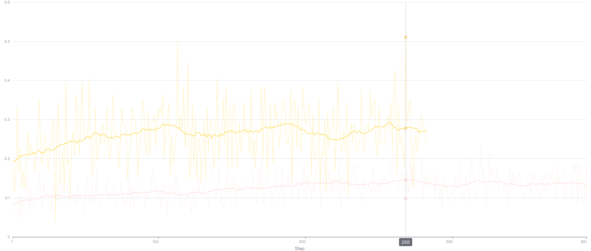
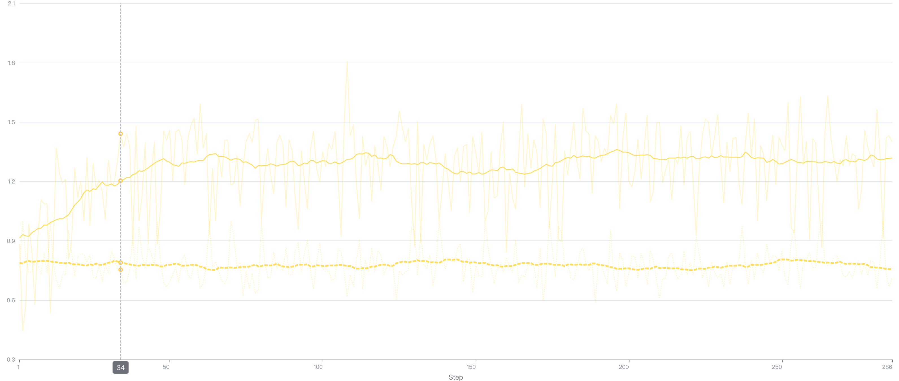

# Tool-Integrated Reasoning (TIR) Agent

## Overview

This project implements a Tool-Integrated Reasoning agent that can solve complex
problems through multi-turn tool calls during mathematical reasoning. The agent uses
tools such as Python code execution and mathematical calculations, and is trained
end-to-end through reinforcement learning.

## Code Architecture

### 1. Core Components

#### 1.1 TIRWorkflow (`tir_workflow.py`)

- **Function**: Core workflow that manages multi-turn reasoning processes
- **Key Features**:
  - Inherits from AReaL's `RolloutWorkflow` base class
  - Supports multi-turn tool calling reasoning processes
  - Implements streaming generation and tool call detection
  - Integrates reward function calculation

#### 1.2 ToolManager (`tool_manager.py`)

- **Function**: Tool manager responsible for coordinating tool calls
- **Supported Tools**:
  - **Python Executor**: Executes Python code for mathematical calculations
  - **Calculator**: Basic mathematical operations
- **Key Features**:
  - Tool registration and routing mechanism
  - Secure code execution environment
  - Unified tool calling interface

#### 1.3 Tool Implementation (`tools/`)

- **BaseTool** (`tools/base.py`): Tool base class that defines tool interfaces
- **PythonTool** (`tools/python_tool.py`): Python code execution tool
- **CalculatorTool** (`tools/calculator_tool.py`): Mathematical calculation tool

#### 1.4 Training Script (`train_tir.py`)

- **Function**: Complete training pipeline implementation
- **Features**:
  - Integrates AReaL's GRPO training framework
  - Supports distributed training

### 2. Tool Calling Mechanism

#### 2.1 Tool Calling Format

Execute Python code

```python
# Initialize the count of concave numbers
count = 0

# Iterate over all possible values for A (hundreds place)
for A in range(2, 10):
    # For each A, iterate over all possible values for B (tens place)
    for B in range(0, A):
        # For each B, iterate over all possible values for C (ones place)
        for C in range(B + 1, A):
            # Increment the count for each valid concave number
            count += 1

# The final count of distinct three-digit concave numbers
print(count)
```

```python
output: 120
```

Mathematical calculation

```
<calculator>1 + 2 * 3</calculator>
```

```python
output: 6
```

#### 2.2 Streaming Generation and Tool Call Detection

Main process:

- Model pauses when generating to tool call markers
- Detect and parse tool call content
- Execute tools in a secure environment
- Integrate tool results into the conversation
- Continue generating subsequent content

Core logic can be found in `examples/tir/tir_workflow.py`

## How to Use

### 1. Setup

- Follow `docs/tutorial/installation.md` for basic environment installation
- Install qwen_agent: `pip install qwen_agent`

### 2. Data Preparation

The project uses mathematical reasoning datasets. Using the ToRL dataset as an example,
the data format is as follows:

```json
{"messages": [{"role": "user", "content": "What is 15 + 27?"}], "answer": "42"}
{"messages": [{"role": "user", "content": "Calculate 3 * 4 + 2 * 5"}], "answer": "22"}
```

### 3. Training Configuration

Edit the `tir_config.yaml` configuration file:

```yaml
# Model configuration
actor:
  path: /path/to/your/model
  dtype: bfloat16

# Dataset configuration
train_dataset:
  path: /path/to/train/data.parquet
  batch_size: 64

valid_dataset:
  path: /path/to/valid/data.parquet
  batch_size: 64

# TIR related configuration
tir:
  max_turns: 2
  max_length: 3000
  tool_timeout: 30
  enable_tools: python;calculator
```

### 4. Start Training

**Single-machine Multi-GPU Training**

```bash
python3 -m areal.launcher.local \
  examples/tir/train_tir.py \
  --config examples/tir/tir_config.yaml
```

**Multi-machine Multi-GPU Training**

TODO

## Training Results

### 1. Experimental Setup

- Training used [Qwen2.5-Math-1.5B](https://huggingface.co/Qwen/Qwen2.5-Math-1.5B) as
  the base model.
- Reward is based solely on whether the result is correct.
- Training prompts reference [ToRL](https://arxiv.org/pdf/2503.23383), only hinting that
  the model can use programming tools. See `examples/tir/prompts.py` for details.

### 2. Training Curves

Key metric changes during training:

- **Reward Curve**:

  **grpo_actor/task_reward**

  

  The yellow line shows TIR's reward, demonstrating approximately 15% accuracy advantage
  over pure GRPO training.

- **Tool Usage Frequency**:

  

  Changes in tool call count and success rate. As training progresses, the number of
  tool calls per answer increases from 0.9 to 1.2, while tool call success rate shows no
  significant change.

## File Structure

```
examples/tir/
├── README.md                   # Project documentation
├── tir_workflow.py             # Core workflow implementation
├── tool_manager.py             # Tool manager
├── tir_config.yaml             # Configuration file
├── train_tir.py                # Training script
├── test_tir.py                 # Test script
├── tools/                      # Tool implementations
│   ├── __init__.py
│   ├── base.py                 # Tool base class
│   ├── python_tool.py          # Python executor
│   └── calculator_tool.py      # Calculator
├── data/                       # Data files
│   └── sample_math.jsonl       # Sample data
└── utils/                      # Utility functions
    └── __init__.py
```

## TODOs

- [ ] Evaluation script
- [ ] Support for asynchronous tool calls
- [ ] Support for multi-machine training
- [ ] Fine-tuning, provide prompt templates for instruction models
